# PynamicMesh: Dynamic Mesh Modeling & Analysis Tool Box


<p>
  
  
  <a href="https://github.com/RobinMagnet/pyFM">
    
  </a>
  
  
</p>

**PynamicMesh** turns a time-lapse of 3-D surfaces (one triangle mesh per time point, e.g. a segmented cell, an organ or an animal in motion) into a quantitative description of *how the shape moves and changes*. It finds which point of one frame corresponds to which point of the next, follows every point through time, measures how the surface stretches, bends, grows and changes its topology, extracts skeletons and protrusions, and reports everything as csv tables, plots, interactive 3-D viewers and GIF animations.

<center>
<h1>⚠️Note⚠️</h1>

<br/>
<span style="color: yellow;"> This Repo is under construction, future analysis and implementations will be added soon...</span>
</center>


| You want to know … | Section |
|---|---|
| How the global size and shape evolve? (area, volume, curvature, connected pieces …) | [Global Geometry](#global-geometry) |
| Which point of a frame corresponds to which point of the next? | [Functional Map](#functional-map) |
| The skeleton of the shape and when it branches, splits or merges? | [Reeb Graph](#reeb-graph), [Graph Similarity](#graph-similarity) |
| The protrusions (number, size, birth, growth, retraction, fusion) | [Morse–Smale Complex](#morse-smale-complex) |
| A compact, comparable description of every shape? | [Spherical Parametrization & SPHARM](#spherical-parametrization) |
| The path of every surface point and smooth motion between frames? | [Trajectories & Interpolation](#trajectories) |
| Skeleton that moves with the surface? | [Graph Animation](#graph-animation) |
| Flows, stretching, shape modes and moments of change? | [Dynamic Analysis](#dynamic-analysis) |
| Which branch of the skeleton is born, retracts or reorganises, and when? | [Reeb Graph Dynamics](#reeb-graph-dynamics) |
| How it moves vs deforms, where it grows, when things happen, its periods? | [Motion Analysis](#motion-analysis) |
| The real time between frames (seconds, minutes) in the results? | [Time Between Frames](#time-between-frames) |
| To look at the results or make GIFs | [Visualization & GIF Animations](#visualization) |
| To run everything from a script, the command line or a YAML file | [Running the Pipeline](#running-the-pipeline) |
| To use one or many GPUs / a cluster | [Compute Resources](#compute-resources) |

<details>
<summary><strong><span style="font-size:25px;">How to Install</span></strong></summary>

Create a new [conda environment](https://docs.conda.io/projects/conda/en/latest/user-guide/tasks/manage-environments.html#creating-an-environment-with-commands) or a [virtual environment](https://docs.python.org/3/library/venv.html) with **Python 3.10+**:

```bash
conda create -y -n PynamicMesh -c conda-forge python=3.11
conda activate PynamicMesh
```

Clone the repository and install it:

```bash
git clone https://github.com/MMV-Lab/PynamicMesh
cd PynamicMesh

# installation with CPU support only
pip install .

# installation with GPU support (choose the option that matches your CUDA / ROCm drivers)
pip install ".[gpu-12x]"
pip install ".[gpu-13x]"
pip install ".[rocm-7-0]"

# editable installation for developers
pip install -e .
```

Optional extras, combinable with the options above (e.g. `pip install ".[gpu-12x,spectral]"`):

| extra | adds | used by |
|---|---|---|
| `spectral` | [`torch-harmonics`](https://github.com/NVIDIA/torch-harmonics) | GPU spherical harmonic transforms (high-degree SPHARM, spherical spectra); without it the same transforms run with NumPy |
| `topology` | `ripser` | persistent homology of the [Dynamic Analysis](#dynamic-analysis); skipped with a message without it |
| `all` | both | |

```bash
pip install ".[gpu-12x,all]"        # GPU + every optional analysis
```

**PyTorch with GPU support.** PyTorch is a dependency of the project and torch-harmonics uses the installed PyTorch as it is: on Linux the default `torch` wheel already supports CUDA, on **Windows the default wheel is CPU-only**. For GPU transforms on Windows (or a specific CUDA version), install PyTorch from the PyTorch index first, then the project:

```bash
pip install torch --index-url https://download.pytorch.org/whl/cu126   # pick the index of your CUDA version on pytorch.org
pip install ".[gpu-12x,spectral]"
```

Check the installation with `python -c "import torch, torch_harmonics; print(torch.cuda.is_available())"`; after a run, `Parametrization/SPHARM_HD/hd_info.json` reports the backend (`torch` / `numpy`) and the device used.

Everything runs on the CPU; with a GPU (CuPy) the heavy dense algebra and the spectral nearest-neighbour searches are accelerated, and several GPUs can process several scenes at the same time (see [Compute Resources](#compute-resources)). 
</details>

<details>
<summary><strong><span style="font-size:25px;">Quick Start</span></strong></summary>

# Example Data

All the following examples can be replicated with the [meshes](./examples/Mesh_models/) and the example files provided [here](./examples); the syntax of every call is summarized in the provided [code](./examples/execution_examples.py).

The computations and the graphical tools are independent: the whole pipeline runs on a node without display (e.g. a high-performance computing cluster), and the viewers / GIFs can be produced afterwards from the stored results.

**1. Organize the data.** One folder per time-lapse (a *scene*), one mesh per time point (`.obj` or `.mat`), named so that the natural order is the time order (`frame_1.obj`, `frame_2.obj`, …, `frame_10.obj`):

```
📂 Mesh_models/            <- path_str
├──📂 scene1/
│   ├──📄 model_0.obj
│   ├──📄 model_1.obj
│   └── ...
└──📂 scene2/
    └── ...
```

**2. Run the pipeline** from Python (all the options are listed in the corresponding sections; [`execution_pipeline.py`](./examples/execution_examples.py) contains a complete, commented example):

```python
from PynamicMesh.core.pipelines import run_pipeline

run_pipeline(
    path_str='./Mesh_models',
    compute_basicGeo=True,                 # global geometry
    matrix_tranformation=True,             # functional maps (point correspondences)
    compute_reeb=True,                     # Reeb graphs (skeletons)
    compute_mscomplex=True,                # protrusions (Morse–Smale complex)
    compute_trajectories=True,             # trajectories + interpolation
    time_params={'frame_interval': 30.0},  # optional: 30 s between frames
    gif=True,                              # optional: GIF animations of every stage
)
```

or from the command line with a YAML configuration (see [Running the Pipeline](#running-the-pipeline)):

```bash
run_pynamic --config ./examples/config.yaml
```

**3. Read the results** in `Results/<scene>/`, next to the mesh folder: one sub-folder per stage with csv tables, `plots/` and, when requested, `gif/` (see the [Results Folder Reference](#results-folder-reference)).

**4. Explore them** in the interactive viewers (press **`i`** in any viewer for its instructions, **space** to record a GIF of the current view):

```python
from PynamicMesh.utils.visualizers import visualize_ms_complex
visualize_ms_complex('./Mesh_models/scene1', './Results/scene1/MSComplexAnalysis')
```
</details>

<details>
<summary><strong><span style="font-size:25px;">How to Read this Documentation</span></strong></summary>

Every analysis has the same structure, so you can stop at the depth you need:

* **General Overview** — what the method does and what it is useful for in a very general accesible way;
* **Mathematical / Theoretical Description** — the precise construction, for readers who want to understand or extend the method;
* **Parameters** — every option, its default and when to change it;
* **Results** — the files written and how to read them.


The stages build on each other; a stage needs the ones above it (on disk from an earlier run is enough):

```
meshes ──┬── Global Geometry
         ├── Functional Maps ──┬── Physical Fields, isometry / heat-map analyses
         │                     ├── Morse–Smale region tracking
         │                     ├── Spherical Parametrization (temporal alignment)
         │                     └── Trajectories ──┬── Graph Animation (+ Reeb / Morse–Smale graphs)
         │                                        └── Dynamic Analysis (+ SPHARM coefficients)
         ├── Reeb Graphs ── time analysis, graph similarity
         └── Morse–Smale Complex ── protrusions, critical-point graphs
```
</details>

# Project Overview

Given a family of meshes $\mathscr{M} = \{ M_{t_i} \mid 0 \leqslant i \leqslant T \}$ where each mesh $M_{t_i}$ encodes the spatial configuration of the shape at time $t_i$, the deformation $M_{t_0} \to M_{t_1} \to \dots \to M_{t_T}$ is a full geometrical encoding of the dynamics of the underlying process.


PynamicMesh offers general pipelines based on Topology, Differential Geometry and Physics to model the dynamics encoded in this transformation, extracting features that characterize and help to understand the process.

For a detailed and applied introduction to meshes as manifolds and triangulations, the following [Jupyter Notebook](https://github.com/JairMathAI/Understanding_Persistent_Homology/blob/main/Persistent_Homology.ipynb) might interest you.

<a id="mesh-visualization"></a>
<details>
<summary><strong><span style="font-size:25px;">Mesh visualization</span></strong></summary>

The project works with meshes in `.obj` or `.mat` format (one file per time point, one folder per scene). Every viewer shows the meshes in the same (aligned) orientation used by the computations; press **`i`** in any viewer for a detailed usage instructions.

To visualize a sequence of `.obj` / `.mat` meshes run:

```python
from PynamicMesh.utils.visualizers import  visualize_obj_sequence

print('Mesh sequence Visualization...') 
visualize_obj_sequence('mesh/obj/folder')
```
To visualize `.mat` meshes / images with their own viewer run:

```python
from PynamicMesh.utils.mat_files import MatViewer 
from pathlib import Path

folder_path = Path('path/to/image_or_mesh/.mat/folder')
viewer = MatViewer(folder_path)
viewer.show()
```

To convert `.mat` meshes / images to `.obj` / `.tiff` respectively run:

```python
from PynamicMesh.utils.mat_files import mat_file_converter 
from pathlib import Path

folder_path = Path('path/to/image_or_mesh/.mat/folder')
mat_file_converter(folder_path)
```


</details>

<a id="global-geometry"></a>
<details>
<summary><strong><span style="font-size:25px;">Global Geometry</span></strong></summary>

<details>
<summary><span style="font-size:23px;">General Overview</span></summary>

The first, model-free description of the time-lapse: how the size, the shape, the curvature and the topology of the whole object evolve. It needs nothing but the meshes and is the natural first look at a new data set (growth, rounding, elongation, a part splitting off …).

It writes a csv (`features_computed.csv`) with the metric values of every frame and a dashboard with the evolution of each one (`mesh_evolution_summary.png`) in `./Results/<scene>/Basic_Geometry/`; when the number of connected pieces changes, `component_events.csv` lists every split and merge. Size-normalised copies (`size` $=\sqrt{A}$, `area_rel`, `volume_rel`, `cm_displacement_rel`) make different objects and experiments comparable. With known [frame times](#time-between-frames) the plots use a time axis, the centre-of-mass displacement becomes a **speed** and the relative growth rates $\tfrac{1}{A}\tfrac{dA}{dt}$, $\tfrac{1}{V}\tfrac{dV}{dt}$ are added.

</details>

To track the global geometry, run:

```python
from PynamicMesh.core.pipelines import run_pipeline
run_pipeline(
    path_str='base/path',
    compute_basicGeo = True,
    metrics = 'all',
    plot_basicGeo = True
    )
```

or set the parameters in the [yaml](./examples/config.yaml) file (section `Basic_Geometry`) and run in the PynamicMesh environment:

```bash
run_pynamic --config /path/to/the/config.yaml
```
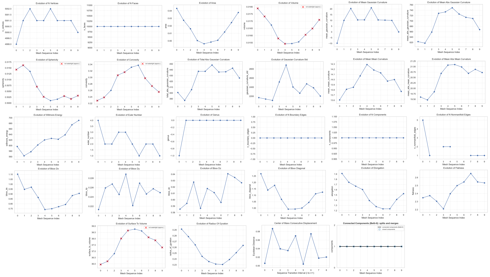

<b>Note:</b>

The volume based metrics (```volume```, ```sphericity```, ```convexity```, ```surface_to_volume```) are always computed with the divergence theorem on the original faces of the mesh, and the column ```is_watertight``` reports whether the mesh is closed and manifold at that time step. When it is not, the values are the approximation for an almost closed surface and the frame is marked with a red cross on the corresponding graphs; use the ```topology``` metrics (```n_boundary_edges```, ```n_components```) to see why. The mesh is never modified before measuring it: welding coincident vertices (as some libraries do by default) turns touching parts of the shape (legs, belly) into non-manifold edges and silently breaks the volume computation of a perfectly closed mesh.

<details>
<summary><span style="font-size:23px;">Global Geometry Parameters</span></summary>

Path to the root folder that contains the scenes:
```python 
path_str (str) 
```   

Flag to indicate the execution:
```python 
compute_basicGeo (bool)
```  

Flag to indicate the plot of the metrics:
```python 
plot_basicGeo (bool)
```

Desired metrics to track:
```python 
metrics (str) | (list)
```
<details>
<summary><span style="font-size:21px;">Available metrics</span></summary>

Compute and report all the available metrics :

```python 
metrics (str) : 'all'
```

Compute just the selected set of metrics :

```python 
metrics (list) : ['n_vertices', 'n_faces', 'area', 'volume', 'sphericity', 'convexity', 'center_mass', 'gaussian_curvature', 'mean_curvature', 'topology', 'components', 'bounding_box', 'shape']
```

Some metrics produce several columns in the csv (e.g. ```center_mass``` -> ```cm_x```, ```cm_y```, ```cm_z```); an unknown metric name raises an error instead of being silently ignored.


<b>Mesh Detail:</b>

```n_vertices``` and  ```n_faces```  captures the structural resolution of the mesh (the total number of points and connecting triangles), constant values mean the object is changing shape or moving without altering its basic blueprint. 
Changing values mean the model is actively gaining or losing detail (e.g., tearing, merging, or adaptive rewriting).

<b>Surface Area:</b> 

```area``` captures the total amount of  outside covering for the mesh, tracks stretching and compression. If the surface area spikes while the overall size remains constant, it indicates that the object is wrinkling, crumpling, or becoming highly textured.

<b>Volume:</b> 

```volume```  captures the total relative amount of physical space enclosed inside the object, tracks inflation and deflation. A steady volume means the object is maintaining its physical mass/size while it moves or bends. It comes with the flag ```is_watertight```: ```True``` means the mesh is closed and manifold and the volume is exact; ```False``` means the value is the approximation for an almost closed surface (open boundary or non-manifold edges, see <b>Topology</b>).

<b>Sphericity:</b>

```sphericity``` captures the roundness score from 0 to 1, evaluating how closely the object resembles a perfect ball (1 being a perfect sphere).  A rising score means the object is compacting or pulling itself together into a ball shape. 
A falling score means it is stretching out, flattening, or growing irregular limbs.

<b>Convexity:</b> 

```convexity```  captures a "bulginess" score measuring how many hollows, indents, or valleys the object has.  A high score indicates a smooth, rounded object. A decreasing score means the object is actively folding in on itself, developing deep cavities, or sprouting appendages.

<b>Surface Curvature:</b> 

```gaussian_curvature``` computes the discrete Gaussian curvature at every vertex (angle deficit $K_i = (2\pi - \sum_j \theta_{ij})/A_i$) and reports:

```mean_gaussian_curvature```  the area weighted average texture profile of the surface, distinguishing between dome-like features ($K>0$) and saddle-like curves ($K<0$). For a closed mesh the Gauss-Bonnet theorem fixes it to $4\pi(1-g)/A$, so it mainly tracks the size and the topology of the object.

```mean_abs_gaussian_curvature``` and ```total_abs_gaussian_curvature``` ($\int |K| dA$, scale invariant) serve as global bumpiness trackers: they grow when the smooth skin of the object turns wavy, creased, or sprouts appendages, regardless of the sign of the bumps. ```gaussian_curvature_std``` measures how uneven the texture is over the surface.

```mean_curvature``` computes the discrete mean curvature of every vertex (cotangent formula, $H_i = (Wx)_i \cdot n_i / 2A_i$) and reports ```mean_mean_curvature```, ```mean_abs_mean_curvature``` and the ```willmore_energy``` $\int H^2 dA$, a scale invariant bending energy that equals $4\pi$ for a sphere and grows with every fold, limb or wrinkle of the surface.

<b>Topology:</b> 

```topology``` reports the ```euler_number``` $\chi = V - E + F$, the ```genus``` (number of handles; only defined for closed meshes, `NaN` otherwise), the ```n_boundary_edges``` (0 for a closed surface; holes and tears appear here) and the ```n_components``` (disconnected pieces, counted over the vertices that belong to faces). It also reports the Betti numbers of the surface: ```betti_0``` (connected pieces), ```betti_2``` (closed pieces) and ```betti_1``` from Euler's relation $\beta_0-\beta_1+\beta_2=\chi$ ($2g$ for closed surfaces, plus the boundary loops otherwise): one sphere is $(1,0,1)$, two spheres $(2,0,2)$, a torus $(1,2,1)$. Constant values mean the shape deforms without changing its structure; a change flags a topological event (tearing, merging, splitting) or a mesh defect, and explains a ```False``` in ```is_watertight```.

<b>Connected components:</b>

```components``` follows the pieces of the surface: ```n_components```, ```n_closed_components```, ```largest_component_area_fraction``` and the area / volume of every piece (```component_areas```, ```component_volumes```, largest first). Splits (▲) and merges (▼) are marked on all the plots and listed in `component_events.csv` — e.g. a cell dividing in two or two objects fusing.

<b>Extent and Shape:</b> 

```bounding_box``` reports the extents ```bbox_dx```, ```bbox_dy```, ```bbox_dz``` and the ```bbox_diagonal``` of the axis aligned bounding box: the overall size of the object in each direction (depends on the orientation of the frames).

```shape``` reports orientation independent shape descriptors from the area weighted principal axes of the surface: ```elongation``` (ratio between the first and second principal extents, 1 for an isotropic object, growing as it stretches along one direction), ```flatness``` (ratio between the second and third principal extents, growing as the object becomes plate-like), ```surface_to_volume``` (skin per unit of enclosed volume, the inverse compactness) and ```radius_of_gyration``` (spread of the surface around its centroid).

<b>Relative Movement Speed:</b>

```center_mass``` captures the straight-line distance traveled by the object's center of gravity from one time frame to the next. Tracks overall speed. A flat line near zero means the object is stationary (even if it is spinning or shaking in place).
Sudden spikes indicate a sudden leap or fast global movement across space. The center of gravity is the volume based center of mass for closed meshes and the area weighted centroid of the surface otherwise.

</details>
</details>
</details>

<a id="functional-map"></a>
<details>
<summary><strong><span style="font-size:25px;">Functional Map</span></strong></summary>

<details>
<summary><span style="font-size:23px;">General Overview</strong></summary>

The functional map $(\mathscr{FM})$ allows us to compute a matrix representation $C$ of an unknown transformation function between meshes with whatever amount of vertices and a vector $v$ thar represent the vertex to vertex or the region to region transformation over the mesh.

<div style="display: flex; flex-direction: row; justify-content: center; align-items: center; gap: 10px; flex-wrap: wrap;">
  
  
</div>

In order to understand the dynamics of the deformation we can compute this matrix and vector in every time step $t_i$


At the end we can use this representations to have a lot of features, those are defined and explained on the correspondig <b>Functional Map Implementation Usage and Analysis</b> section.
</details>

<details>
<summary><span style="font-size:23px;">Mathematical Construction Details</span></summary>

Given two consecutive time step meshes $M_{t_{i-1}}$ and $M_{t_{i}}$, we can think about them in terms of their respective vertices (points) and faces (triangles): $\{\mathcal{V},\mathcal{F}\}_{t_{i-1}}$ and $\{\mathcal{V},\mathcal{F}\}_{t_{i}}$.

The goal is to find a representation of the unknown transformation function $\varphi_n : M_{t_{i-1}} \to M_{t_{i}}$ that describes how the mesh is transformed in space.

We can use a scalar function defined over each mesh $\psi_{t_{i-1}}: M_{t_{i-1}} \to \mathbb{R}$ and $\psi_{t_i}: M_{t_i} \to \mathbb{R}$ which produces the relation $\psi_{t_i} = \psi_{t_{i-1}} \circ \varphi_n^{-1} = \psi_{t_{i-1}}(\varphi_n^{-1})$.

In our case we use as descriptors the point signatures built from the spectrum of the Laplace-Beltrami operator: for a spectral filter $g$ the signature of a point is $\displaystyle S_g(x) = \sum_k g(\lambda_k)\,\phi_k(x)^2$. Three families of filters are available, each evaluated at `n_descr` scales:

<b>WKS</b> (wave kernel, wave propagation function): $g_e(\lambda) \propto \exp\left(-\frac{(e-\log\lambda)^2}{2\sigma^2}\right)$ for log-spaced energies $e$.

<b>HKS</b> (heat kernel, heat diffusion function): $g_t(\lambda) = e^{-t\lambda}$ for log-spaced times $t$.

<b>MKS</b> (Matérn kernel): $g_l(\lambda) = \left(\frac{2\nu}{l^2} + \lambda\right)^{-\left(\nu + \frac{d}{2}\right)}$ with $d=2$, for log-spaced lengthscales $l$.

Where:

$\lambda_k$ represents the eigenvalues of the mesh's Laplace-Beltrami operator.

$l$ is the lengthscale (by default the range is mesh-adaptive, $\left[\sqrt{2\nu/\lambda_{K}},\ \sqrt{2\nu/\lambda_{1}}\right]$, where the filter transitions).

$\nu$ governs the smoothness of the resulting field.

These kernels respect the surface geometry of the shape. Mathematically, they generalize the Laplace-Beltrami operator's spectral properties via the relationship with its eigenvalues. Any weighted sum of these families can be used as descriptor (see <b>Functional Map Parameters</b>), together with two <b>extrinsic</b> families that are aware of the symmetries of the shape (<b>XYZ</b>, <b>NRM</b>; see <b>Symmetry-Aware Mapping</b>).


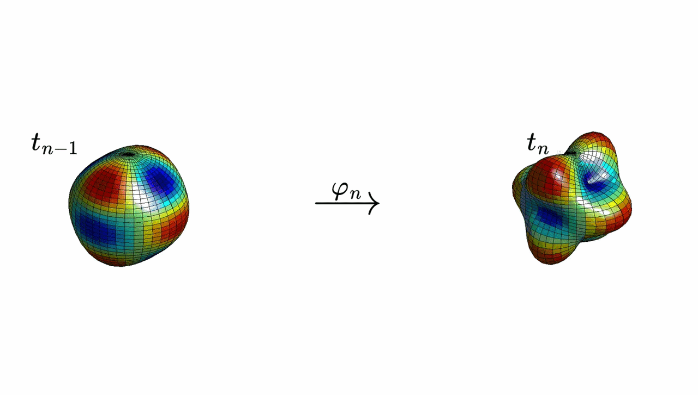


The composition $\psi_{t_{i-1}}(\varphi_n^{-1})$ induce a linear functional, such that for every function $f:M_{t_{i-1}} \to \mathbb{R}$ we have $\mathcal{F}_{\varphi_n}(f) = f(\varphi_n^{-1})$, so we have the functional transformation $\mathcal{F}_{\varphi_n} : \mathcal{L}(M_{t_{i-1}},\mathbb{R}) \to \mathcal{L}(M_{t_{i}},\mathbb{R})$ where the task to find $\varphi_n$ now means finding a representation for the functional $\mathcal{F}_{\varphi_n}$.

As the linear function spaces $\mathcal{L}(M_{t_{i-1}},\mathbb{R})$ and $\mathcal{L}(M_{t_{i}},\mathbb{R})$ are vector spaces, so they should have a basis of functions $\displaystyle \{\phi_j ^{M_{t_{i-1}}}\}_{j\in J}$ and $\displaystyle \{\phi_k^{M_{t_{i}}}\}_{k\in K}$ so let's find it using the Laplace-Beltrami operator.

If we apply the [ Finite Element Method (FEM)](https://en.wikipedia.org/wiki/Finite_element_method#Discretization) to the Laplace-Beltrami equation of a function $f$ on a triangle mesh $\Delta f = - div( \nabla f)$.

Means that we want to compute the gradient of a function defined on a triangle, but locally the function varies linearly within each triangle $\Delta f = |f(v_j)-f(v_i)|$ . When we integrate the squared gradient over the surface $\displaystyle \frac{1}{2}\sum |f(v_j)-f(v_i)|^2 $, the result simplifies to a weighted sum of the differences between neighboring vertex values.

$$\frac{1}{2}\sum_{ij} w_{ij} [f(v_j)-f(v_i)]$$

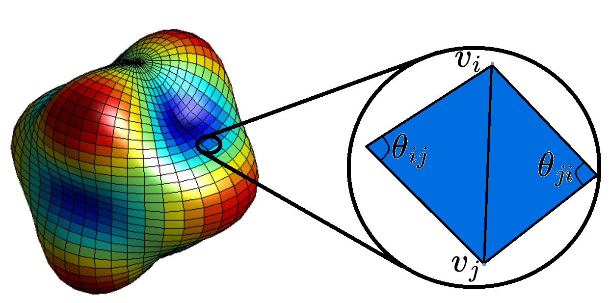

We can contruct the Connectivity matrix or the [Cotan-Laplace operator](https://en.wikipedia.org/wiki/Discrete_Laplace_operator)

The "connectivity" is encoded in the adjacency of the mesh. The Laplacian matrix $L$ is constructed as:

$$L_{ij} = \left\{ \begin{array}{cl}
-w_{ij} & : v_i\to v_j \text{conected}\\
0 & : \text{ no conexion} \\
\end{array} \right.$$

For the diagona the sum of weights of all edges connected to $v_i$

$$ L_{ii} = \sum w_ii $$

This matrix $L$ effectively describes how the Dirichlet energy (heat, or waves) flows from vertex i to its neighbors. Because it is built using the cotangents of the actual angles in the mesh, it is geometry-aware it accounts for the shape and skewness of the triangles, not just the connectivity.

Then for every vertex $v_i$ on the mesh we can compute the Barycentric Area (one-third of the sum of the areas of all triangles T that are connected to that $v_i$) $\displaystyle A_{i} = \frac{1}{2}\sum_{T\in\mathcal{F}(i)} Area(T) $ where $\displaystyle Area(T)=\frac{1}{2}||(v_2-v_1)\times(v_3-v_1)||$ and $(v_3,v_2,v_3)$ are the vertex of a triangle. We can construct the diagonal matrix:

$$W_{ij} = \left\{ \begin{array}{cl}
A_i & : i=j\\
0 & \text{ other case} \\
\end{array} \right.$$

This matrix essentially encode the surface area contribution of each vertex. Because a mesh is made of triangles, the "area" of a vertex is defined by the triangles that share it.

Then we can solve the generalized eigenvalue decomposition for a matrix $\Phi$

$$L\Phi=W\Lambda\Phi$$

Only for the first $k$ eigenvectors we do not compute all the eigenvectors (which would be computationally expensive). Since functional maps typically work on the first $k$ "low-frequency" eigenfunctions (the "spectral footprint").

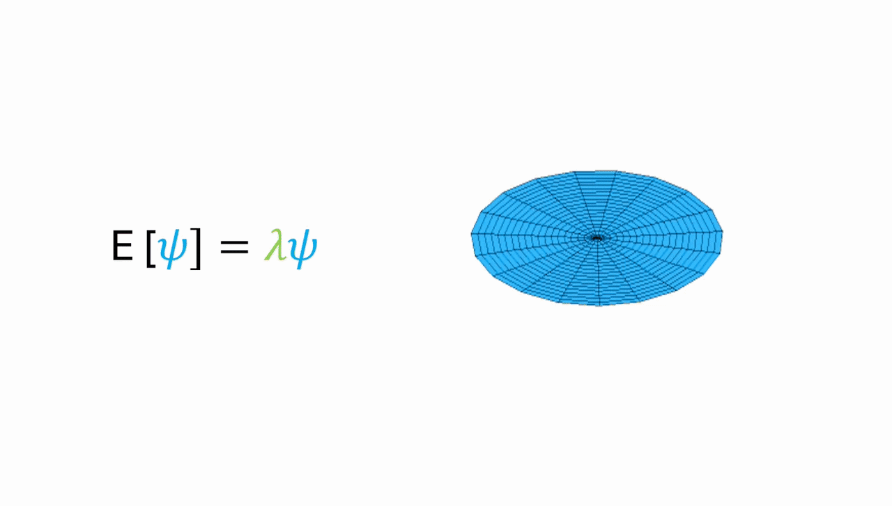


Once solved, each column $\phi_j$​ of the matrix $\Phi$ contains the values of the $j$-th eigenfunction at every vertex of the mesh.

We can obtain this matrix for the $t_{i-1}$ mesh  $\Phi^{M_{t_{i-1}}}$ and the $t_i$ mesh $\Phi^{M_{t_{i}}}$ to obtain the respective basis from the domain and the codomain of $\varphi_n$.

In theory this basis allows to express our fucntional as a linear combination: 

$$\mathcal{F}_{\varphi_n}(f) = \sum_k\sum_j a_jc_{jk}\phi_k^{M_{t_{i}}}$$

This provide a matrix representation $\mathcal{C}$ determined by the coefficents $c_{jk}$ 

We can express this coeficents using a inner product to project the tranformation represented on the domain base into the codomain base: 

$$\displaystyle c_{jk}= \left\langle \mathcal{F}_{\varphi_n}(\phi_k^{M_{t_{i}}}) , \phi_j ^{M_{t_{i-1}}} \right\rangle$$

But now we have a matrix representation $c_{jk}$ but it depens on $\varphi_n$ which is unknow and to describe $\varphi_n$ somehow we need to find $c_{jk}$

We can use our descriptors in order to get a clue:

Each descriptor function $\Psi_m$ is evaluated on mesh $M_{t_{i-1}}$ and on mesh $M_{t_{i}}$ and projected on the respective basis to obtain the spectral coefficient vectors:

$$ A_m =  \Phi_1^{T} W_1 \Psi_m^{t_{i-1}} \hspace{6mm} B_m =  \Phi_2^{T} W_2 \Psi_m^{t_{i}}  $$

When several descriptor families are combined, every family $j$ is normalized so that the total energy of its functions $\sum_{m\in j}\|\Psi_m\|^2_{L^2(M)}$ equals a weight $w_j$ (the weights are renormalized to sum to one, so ```'WKS+HKS'``` means equal shares and ```'0.7*WKS+0.3*HKS'``` means $70\%/30\%$). The descriptor term is therefore the weighted sum of the energies of the families, and its global balance against the other terms is controlled by $\lambda_{desc}$.

The functional map matrix $\mathcal{F}_{\varphi_n} = C_{t_{i-1} \to t_{i}} \in \mathbb{M}_{k_2 \times k_1}(\mathbb{R})$ that we seek now is given for the one that minimizes the following objective function:

$$
\min_{C} E(C) = \underbrace{\lambda_{desc}\sum_{j} w_j \sum_{m \in j} \| C A_m - B_m \|^2}_{E_{desc}} + \underbrace{\lambda_{reg} \| C \Lambda_1 - \Lambda_2 C \|^2}_{E_{reg}} + \underbrace{\lambda_{comm} \sum_{m} \| C D^{1}_m - D^{2}_m C \|^2}_{E_{comm}} + \underbrace{\lambda_{orient} \sum_{m} \| C G^{1}_m - G^{2}_m C \|^2}_{E_{orient}}
$$


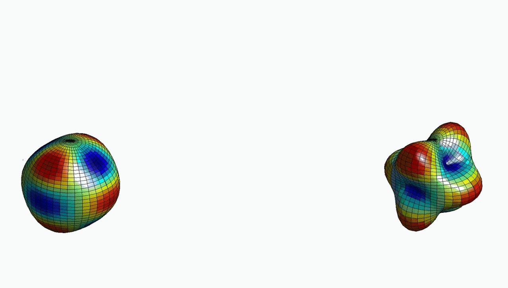


Were:

$A_m, B_m:$ Spectral coefficients of the $m$-th descriptor function on Mesh $t_{i-1}$ and Mesh $t_i$.

$\Lambda_1,\Lambda_2:$ Diagonal matrices of eigenvalues for Mesh $t_{i-1}$ and Mesh $t_i$.

$D^{1}_m, D^{2}_m:$ Multiplicative operators associated with the $m$-th descriptor on each mesh.

$G^{1}_m, G^{2}_m:$ Orientation operators associated with the $m$-th descriptor on each mesh (Ren et al. 2018).

$\lambda_{desc},\lambda_{reg},\lambda_{comm},\lambda_{orient}:$ Scalar weighting parameters to balance the influence of the energy terms (`fit_params`: `w_descr`, `w_lap`, `w_dcomm`, `w_orient`).

$E_{desc} :$ Forces the map to align the chosen descriptors.

$E_{reg}:$ Enforces the spectral consistency (commutativity with the Laplace-Beltrami operator) of the transformation, i.e. a near-isometry.

$E_{comm}:$ Enforces the map to behave like a point-to-point map (commutativity with the descriptor operators).

$E_{orient}:$ Penalizes orientation-reversing maps. A left/right reflection of the shape reverses the orientation of the surface, so this term discards the mirrored solution <b>without any landmark</b> (it is only active when `symmetry_mode` includes `'orientation'`).

<b>Landmarks.</b> A known correspondence $(x_l,y_l)$ between the meshes enters the map through additional <i>landmark-localized descriptors</i>: for the selected spectral filter $g$, $\displaystyle L_l(x) = \sum_k g(\lambda_k)\,\phi_k(x_l)\,\phi_k(x)$ on $M_{t_{i-1}}$ and the analogous function centered at $y_l$ on $M_{t_i}$. These functions peak at the landmark and decay with the geodesic distance to it, so they take different values on the two symmetric halves of the shape and anchor the map (the classical landmark term $E_{land}$ is a particular case of $E_{desc}$).

This optimal matrix $C$ contain the spectral map representation (egenfunction domain). To recover the spatial tranformation vector (vertex domain) $\vec{v}\in \mathbb{N}^k$ where $v_i=j$ describe de correspondance vertex to vertex transformation:

We need to take the basis representation of a point $x_j\in M_{t_{i-1}}$​, which is simply the $j$-th row of $\Phi_1$, denoted $\Phi_1(j, :)$.

And then transform it to the spectral domain of $M_{t_{i}}$: 
$$b_{x_j}=C\Phi_1(j, :)^\top$$

Take the vertex $k$ in $M_{t_{i}}$ that is closest to this transformed representation that is, we perfrom a Nearest Neighbor Search ( For every vertex on the source mesh, you look for the vertex on the target mesh that is "closest" in this spectral embedding space)

$$v_j = \arg \min_{k \in \text{Vertices}(M_{t_{i}})} \| \Phi_2(k, :)^\top - C \Phi_1(j, :)^\top \|^2$$

</details>

<details>
<summary><span style="font-size:23px;">Functional Map Implementation Usage and Analysis</span></summary>

The computations are executed and managed through the syntax:

```python
from PynamicMesh.core.pipelines import run_pipeline
run_pipeline(**args)
```

In order to compute the Functional Map transformations, run:

```python
from PynamicMesh.core.pipelines import run_pipeline
run_pipeline(
    path_str='base/path',
    matrix_tranformation=True,
    diagonal_analysis=True,
    isometric_analysis=True,
    k_eigenfunctions=(10,10),
    k_eigenvalues=100,
    descriptor='0.6*WKS + 0.4*MKS',
    landmarks='auto',
    fm_params={'symmetry_mode': 'landmarks+orientation+extrinsic'},
    compute_physic_fields=True,
)
```

or set the parameters in the [yaml](./examples/config.yaml) file (section `Functional_Map`) and run in the PynamicMesh environment:

```bash
run_pynamic --config /path/to/the/config.yaml
```

The spectra of the meshes are computed in parallel worker processes and the spectral nearest-neighbour searches (map → point-to-point map, ZoomOut / ICP refinement) run on the GPU when available, with results identical to the CPU computation (see [Compute Resources](#compute-resources)).


<details>
<summary><span style="font-size:21px;"> Functional Map Parameters</span></summary>

Path to the root folder that contains the scenes:
```python 
path_str (str) 
```   

Flag to indicate the model execution:
```python 
matrix_tranformation (bool)
```  

Flag to indicate the isometry analysis execution within the loop:
```python 
isometric_analysis (bool)
```

Flag to indicate the diagonal analysis execution within the loop:
```python 
diagonal_analysis (bool)
```

Flag to indicate the computation and storage of the physical fields (once); if it is false, the visualizer will compute them during execution time every time.
```python 
compute_physic_fields (bool)
```
    
Descriptor families used on the pipeline and the share of the descriptor energy assigned to each one: WKS (wave propagation kernel), HKS (heat diffusion kernel), MKS (Matérn kernel), XYZ (aligned coordinates, symmetry-aware) and NRM (surface normals, symmetry-aware). Families are combined with `+`; an optional weight multiplies each family and the weights are renormalized to sum to one (families without weight share the remaining energy). Lists and dictionaries are also accepted.
```python 
descriptor (str|list|dict): 'WKS' | 'HKS' | 'MKS' | 'WKS+HKS+MKS' | '0.7*WKS + 0.3*MKS' | '0.5*WKS + 0.3*MKS + 0.2*XYZ' | {'WKS': 0.7, 'HKS': 0.3}
```

Size of the functional map $C \in \mathbb{M}_{k_2 \times k_1}$ (number of eigenfunctions of each mesh used on the map). An integer $k$ means $(k,k)$:
```python 
k_eigenfunctions (int|tuple) : k | (k1,k2)
```

Number of low-frequency eigenvalues $\lambda_i$ (eigenpairs) computed on each mesh; it must be at least $\max(k_1,k_2)$ plus the ZoomOut growth (the pipeline extends it automatically when needed):

```python 
k_eigenvalues (int) 
```   

Vertex indices indicators for symmetry restriction (see <b>Landmark Options</b>):
```python 
landmarks (None|str|list): None | 'precomputed' | 'auto' | [...]
```

Dictionary with the advanced options of the map (symmetry handling, automatic landmarks, descriptor and optimization parameters). Every key is optional:
```python 
fm_params (dict)
```

<details>
<summary><span style="font-size:19px;">fm_params keys</span></summary>

Symmetry handling strategy; several strategies can be combined with `+` (see <b>Symmetry-Aware Mapping</b>):
```python 
fm_params['symmetry_mode'] (str): 'none' | 'landmarks' | 'orientation' | 'extrinsic' | 'landmarks+orientation+extrinsic'
```

Number of spectral filters (scales) per descriptor family, and column subsampling of the point-signature blocks (recommended `3-5` when landmarks are used, since each landmark adds `n_descr` columns):
```python 
fm_params['n_descr'] (int) : 100
fm_params['subsample_step'] (int) : 1
```

Options of the automatic landmark selection and of the landmark block (see <b>Landmark Options</b>):
```python 
fm_params['landmark_params'] (dict)
```

Descriptor options:
```python 
fm_params['descr_params'] (dict)
```

`nu` (float, `1.5`): Smoothness parameter of the Matérn kernel. Lower values (e.g., $\nu = 0.5$) correspond to an Exponential kernel and create a rougher, highly localized field that responds aggressively to fine geometric fluctuations. Higher values (e.g., $\nu = 2.5$ or higher) smooth out noise; use them if the input meshes have sensor noise or surface artifacts to ignore.

`min_l`, `max_l` (float, `None`): Spatial bounds of the geometric features captured by the Matérn kernel. The min should be small enough to capture fine-grained local parts and the max should approach the bounding box diameter of the shape to capture global posture configurations. By default the range is mesh-adaptive $\left[\sqrt{2\nu/\lambda_K},\ \sqrt{2\nu/\lambda_1}\right]$.

`k_smooth` (int, `30`): Number of Laplace-Beltrami eigenfunctions used to low-pass filter the extrinsic descriptors XYZ and NRM.

`xyz_weight` (float, `0.3`): Energy share of the XYZ block added automatically by `symmetry_mode='extrinsic'`.

Weights of the energy terms of the objective function (see <b>Mathematical Construction Details</b>):
```python 
fm_params['fit_params'] (dict) : {'w_descr': 1e-1, 'w_lap': 1e-3, 'w_dcomm': 1.0, 'w_orient': 1.0}
```

Map refinement: `'auto'` selects the ZoomOut parameters from the meshes (ZoomOut 30 × 2 when both meshes have at most 10000 vertices and their sizes differ by at most 1.5×, ICP otherwise), `'icp'` uses ICP refinement, a tuple `(nit, step)` fixes the ZoomOut iterations and step, and `'zoomout_auto'` refines **every** pair with ZoomOut up to a larger final map:
```python 
fm_params['refine'] (str|tuple) : 'auto' | 'icp' | (nit, step) | 'zoomout_auto'
```

`'zoomout_auto'` (optional, the default stays `'auto'`) grows the map to `zoomout_k_final` × `zoomout_k_final` (default 100, the basis size used by Ovsjanikov et al.; the accuracy of a functional map keeps improving with the size of the basis, their Figure 3) in steps of `zoomout_step` (2). Large or size-mismatched pairs, for which `'auto'` falls back to ICP at the initial size, are refined on `zoomout_subsample` points (`'auto'`: 3000 when a mesh has more than 10000 vertices or the sizes differ by more than 1.5×). The eigenpairs are computed once, before the map is fitted, and the number of iterations is set from the actual size of the fitted map.

```python 
fm_params['zoomout_k_final'] (int) : 100
fm_params['zoomout_step'] (int) : 2
fm_params['zoomout_subsample'] (str|int) : 'auto'
```

Measured on a camel (5002 vertices) deformed non-isometrically (anisotropic growth + bending) and re-sampled, with known ground truth (error = distance to the true position, % of the bounding-box diagonal):

| pair | refinement | mean error | 90th percentile | time / pair (CPU) |
|---|---|---|---|---|
| same size (5002 vertices) | `'auto'` (ZoomOut to 70 × 70) | 0.96 % | 2.43 % | 15 s |
| same size | `'zoomout_auto'` (100 × 100) | 0.79 % | 1.86 % | ≈ 20 s |
| 20002 vs 5002 vertices | `'auto'` (ICP at the initial size) | 4.65 % | 8.63 % | 5 s |
| 20002 vs 5002 vertices | `'zoomout_auto'` (100 × 100, subsampled) | 1.53 % | 3.24 % | 38 s |

Evaluated and not adopted: ICP after ZoomOut (increased the error), the adjoint conversion of the map (identical results) and precise barycentric maps (Ezuz & Ben-Chen; slightly larger error, since the remaining error comes from the map, not from the snapping to vertices).

Uniform time step between consecutive meshes, used only when the real frame times are unknown (see [Time Between Frames](#time-between-frames), which also handles irregular acquisitions):
```python 
fm_params['dt'] (float) : 1.0
```

Print the descriptor plan and the landmarks kept for every pair of meshes:
```python 
fm_params['verbose'] (bool) : False
```
</details>

<details>
<summary><span style="font-size:19px;">Landmark Options</span></summary>

No symmetry restrictions applied:   
```python 
landmarks : None
``` 
A priori known indices of the $n$ symmetrical vertices (when the same works for all transformations):
```python
landmarks (list) : [1,2,3,4,..,n] -> (n,)
``` 

A priori known indices of the symmetrical vertices (one per considered transformation). If the list contains fewer sets of vertices than the pairs of meshes, the remaining computations will perform without restrictions.
```python 
landmarks (list) : [[1,..,n1],..,[1,..,nk]] -> (n,m)
``` 

A priori known pair indices of the symmetrical vertices; here $[j,k]$ means that the $v_j$ vertex of the mesh $M_{t_{i-1}}$ is related to the $v_k$ vertex of the mesh $M_{t_i}$ (the same pair applied to every transformation).
```python 
landmarks (list) : [[1,2],...,[j,k]] -> (2,n)
``` 

A priori known pair indices of the symmetrical vertices (one set of relations considered per transformation). If the list contains fewer sets of vertex relations than the pairs of meshes, the remaining computations will perform without restrictions.
```python 
landmarks (list) : [[[1,2],...,[j,k]],...,[[1,2],...,[l,m]]]] -> (m,2,n)
```

<b>Note:</b>

The independent function `precompute_landmarks(root_path,'FM')` can be used along with the graphical tool to click over the vertex selection for every scene in the project. Alternatively, the function `visual_selection_edition(path_to_meshes,'FM')` is included to precompute or edit existing landmarks for a specific scene. Both functions will generate a `landmark.npy` file with the corresponding selected vertex relations, and this option will check for this precomputed `.npy` file during execution.

```python 
landmarks (str) : 'precomputed'
``` 

<b>Automatic landmarks.</b> A robust set of landmarks is selected for every pair of consecutive meshes without any manual intervention:

```python 
landmarks (str) : 'auto'
``` 

1. Geodesic farthest-point sampling on $M_{t_{i-1}}$ produces `n_landmarks` well spread candidates, starting from the extremities (legs, head, tail), which are exactly the points that disambiguate the symmetries.
2. Each candidate is matched on $M_{t_i}$: with `'hybrid'` the best match in descriptor space among the vertices within a spatial radius of the landmark (the frames of a sequence are aligned), with `'extrinsic'` the nearest vertex in space, and with `'identity'` the same vertex index (meshes sharing the connectivity).
3. Unreliable pairs are rejected: displacement larger than `max_rel_dist` times the bounding-box diagonal, duplicated targets, and pairs that break the geodesic-distance consistency between landmarks by more than `max_distortion` (relative, removed iteratively worst-first). If fewer than `min_landmarks` pairs survive, the pair of meshes is processed without landmarks (a warning is issued).

The landmarks actually used are stored as `landmarks_T0000_T0001.npy` (one `(m,2)` array per transformation) within the folder `./PynamicMesh/Results/scene1/Landmarks/`. The selection is controlled with:

```python 
fm_params['landmark_params'] (dict) : {
    'n_landmarks': 12,          # farthest-point samples on M_{t-1}
    'match': 'hybrid',          # 'hybrid' | 'extrinsic' | 'identity'
    'max_rel_dist': 0.15,       # max displacement (fraction of the bounding-box diagonal)
    'max_distortion': 0.25,     # max relative geodesic distortion between landmarks
    'min_landmarks': 4,         # minimum surviving pairs to use landmarks
    'search_rel_radius': 0.10,  # spatial search radius for 'hybrid' (fraction of the diagonal)
    'weight': 1.0,              # energy of the landmark block relative to the point-signature blocks
    'descriptor': 'WKS',        # spectral filter localized at the landmarks (default: first spectral family)
}
```

The keys `weight` and `descriptor` also apply to explicit and `'precomputed'` landmarks. Setting `symmetry_mode='landmarks'` with `landmarks=None` is equivalent to `landmarks='auto'`.
</details>
</details>

<details>
<summary><span style="font-size:21px;">Symmetry-Aware Mapping</span></summary>

Intrinsic descriptors (WKS, HKS, MKS) are invariant under the intrinsic symmetries of a shape: if a body has a left/right isometry, the two front legs have identical signatures, and the map is determined only up to that symmetry. No purely intrinsic point descriptor can break such a symmetry, so three complementary mechanisms are provided and selected with `fm_params['symmetry_mode']` (combinable with `+`):

You can take a look for the usage example code [here](./examples/execution_examples.py)

<b>Landmarks</b> ```'landmarks'``` : landmark-localized descriptors anchored at known or automatically selected correspondences (see <b>Landmark Options</b>).

<b>Orientation term</b> ```'orientation'``` : adds $E_{orient}$ to the objective. A reflection reverses the orientation of the surface, so the mirrored map is penalized without any landmark. It cannot distinguish orientation-preserving near-isometries (e.g. a $180^\circ$ rotation of a body of revolution), so it is best used as a complement of the other two.

<b>Extrinsic descriptors</b> ```'extrinsic'``` : adds the aligned coordinates of the vertices (family `XYZ`, low-pass filtered with `k_smooth` eigenfunctions) as a descriptor block with energy `xyz_weight`. Because consecutive frames of a sequence are spatially aligned (`load_aligned_mesh`) and the motion between them is small with respect to the distance between symmetric parts, the coordinates take different values on the two halves of the shape and anchor the map. The surface normals (family `NRM`) play the same role and both families can be written directly in the descriptor string with their own weights, e.g. ```descriptor='0.5*WKS + 0.3*MKS + 0.2*XYZ'```.

Typical configurations:

```python
# a) baseline: no landmarks, intrinsic descriptors only (symmetric flips possible)
run_pipeline(base_mesh_path, matrix_tranformation=True, descriptor='WKS+HKS+MKS', landmarks=None,
             fm_params={'symmetry_mode': 'none'})

# b) precomputed (manually selected) landmarks only
run_pipeline(base_mesh_path, matrix_tranformation=True, descriptor='WKS+HKS+MKS', landmarks='precomputed',
             fm_params={'symmetry_mode': 'landmarks'})

# c) automatic landmarks only
run_pipeline(base_mesh_path, matrix_tranformation=True, descriptor='WKS+HKS+MKS', landmarks='auto',
             fm_params={'symmetry_mode': 'landmarks', 'landmark_params': {'n_landmarks': 12}})

# d) symmetry-aware descriptors only, no landmarks
run_pipeline(base_mesh_path, matrix_tranformation=True, descriptor='0.6*WKS + 0.4*MKS', landmarks=None,
             fm_params={'symmetry_mode': 'orientation+extrinsic'})

# recommended default for sequences with bilateral symmetry
run_pipeline(base_mesh_path, matrix_tranformation=True, descriptor='0.6*WKS + 0.4*MKS', landmarks='auto',
             fm_params={'symmetry_mode': 'landmarks+orientation+extrinsic', 'subsample_step': 4})
```

<b>Note:</b>
The `extrinsic` and `landmarks` mechanisms rely on the alignment of the frames; if the meshes of a sequence are not aligned (or the motion between frames is comparable to the size of the symmetric parts), use `'precomputed'` landmarks.

</details>

<details>
<summary><span style="font-size:21px;">Landmarks Graphical Selection</span></summary>

For the precomputed landmarks:

```python
from PynamicMesh.utils.visualizers import precompute_landmarks

precompute_landmarks("./PynamicMesh/Mesh_models",'FM')
```

Vertices are chosen by clicking over them and unmarked by clicking again over the selected vertex. When the selection is ready, just close the window in order to pass to the next mesh and the pipeline is the same.

The vertex selection should be performed in the same order for each mesh so the right related pairs are formed. The selected vertices should roughly correspond to the same related regions of the meshes.

At the end, the `.npy` file with our vertex selection on each frame will be stored in the path `./PynamicMesh/Results/scene1/landmark.npy`.


If we use the other function:

```python
from PynamicMesh.utils.visualizers import visual_selection_edition

visual_selection_edition("./PynamicMesh/Mesh_models/scene1",'FM',source='auto')
```

Where :
```python
source (str): 'legacy' / 'auto' # for the .npy file of manualy selection / for the automatically generate files under Results/Scene/Landmarks
```


The visualizer is going to show the specific mesh dynamics and the landmarks created previously, giving the chance to edit them or also create them if they do not exist.

In this case, in order to change among meshes in time, use the arrow keys on the keyboard. When the edition is finished, just close the window and it will be stored. 


</details>

<details>
<summary><span style="font-size:21px;"> Physical Features and Map Transformation Models </span></summary>

We can run our matrix transformation computing; at the end of the run, the pipeline will save one matrix per transformation (`FMC_T0000_T0001.npy`, $C_{t_0 \to t_1}$) and the corresponding vector of vertex transformations (`FMV_T0001_T0000.npy`; the entry $j$ is the vertex of $M_{t_0}$ matched to the vertex $j$ of $M_{t_1}$) within the folder `./PynamicMesh/Results/scene1/Transform_Matrices/`. The indices are zero padded so that the files sort in time order.

Let us first run the pipeline without landmarks to see the results.

```python
from PynamicMesh.core.pipelines import run_pipeline
run_pipeline(base_mesh_path, matrix_tranformation=True, descriptor='WKS+HKS', landmarks=None, k_eigenfunctions=(10,10),k_eigenvalues=100)
```

Compute the physical fields and visualize them with:

```python
from PynamicMesh.utils.visualizers import visualize_physics
visualize_physics("./PynamicMesh/Mesh_models/scene1", "./PynamicMesh/Results/scene1/Transform_Matrices/", on_time=False)
```

The parameter `on_time` indicates if it needs to compute the physical field during execution or just look for the precomputed and stored results created during `run_pipeline` (`compute_physic_fields=True`).
```python
on_time(bool)
```

The fields are stored as one `frame_0000.npz`, `frame_0001.npz`, ... file per time step (the vertices, faces and every field listed below) together with the CSV `global_physical_metrics.csv` of integrated quantities, within the folder `./PynamicMesh/Results/scene1/Physical_fields/`. The meshes are loaded with the same aligned loader used for the maps, so the fields do not include the rigid alignment of the frames.

The viewer organizes the fields in two pages: <b>Up/Down</b> (or <b>p</b>) switch the page and <b>Left/Right</b> step the frames. The first frame is the reference frame, where all the fields are trivial by construction (zero strains, unit stretches). Colour ranges are common to all frames (robust percentiles), so the animation is comparable in time.


All the fields are computed per vertex of $M_{t_i}$ from the point-to-point map: the displacement $\vec{d}_j = \vec{v}^{\,t_i}_j - \vec{v}^{\,t_{i-1}}_{p2p(j)}$ and, for the deformation measures, the triangles of $M_{t_i}$ pulled back to $M_{t_{i-1}}$ through the map (reference configuration). Elements whose reference triangle collapses (two vertices matched to the same source vertex) are excluded from the averages instead of producing spurious infinite strains; their fraction is reported in the global metrics.

<b>Page 1: Kinematics & classic strains</b>

<b>$\Delta$-Color transfer</b>: 

Showing with different colors which region of the mesh $M_{t_{i-1}}$ is transformed into which over the mesh $M_{t_{i}}$. The panel also reports the global metrics of the transition.

<b>$\Delta\vec{v}$ Vertex velocity displacement</b> (`velocity`): 

Showing the map over the mesh about the velocity ratios of change with respect to the vertex mapping (euclidean velocity of displacement) $||\vec{d}_j||/\Delta t$; that means coloring the regions of faster change.

<b>Acceleration</b> (`acceleration`): 

Change of the displacement of the <i>same material point</i> between two consecutive transitions, $||\vec{d}^{\,t_i}_j - \vec{d}^{\,t_{i-1}}_{p2p(j)}||/\Delta t^2$. Highlights the regions where the motion starts, stops or changes direction (zero for a uniform motion).

<b>Linear (edge) strain</b> (`strain`): 

Plot the result of the finite elements pipeline to compute the zones of stretch and compression with respect to the edges (1D), $\varepsilon = (l_{t_i} - l_{t_{i-1}})/l_{t_{i-1}}$ averaged on the vertices, that is where the coefficient $\varepsilon > 0 \to$ stretch edges and $\varepsilon < 0 \to$ contraction edges.

<b>Area (Face) strain</b> (`area_strain`): 

Plot the result of the finite elements pipeline to compute the zones of stretch and compression with respect to the faces (2D), $\varepsilon_A = (A_{t_i} - A_{t_{i-1}})/A_{t_{i-1}}$, that is where the coefficient $\varepsilon_A > 0 \to$ stretch areas and $\varepsilon_A < 0 \to$ contraction areas.

<b>Normal protrusion flow $\vec{v}|| \vec{N}$</b> (`normal_flow`): 

Signed component of the displacement along the vertex normal of $M_{t_i}$, $\vec{d}_j \cdot \vec{N}_j$. That is the "outward" or "inward" direction relative to the surface (areas where the mesh is actively pushing out or pulling in).

<b>Tangent flow $\vec{v} \hookrightarrow \vec{T}$</b> (`tangential_flow`): 

Subtracts the normal component from the total displacement to isolate the lateral movement, $||\vec{d}_j - (\vec{d}_j \cdot \vec{N}_j)\vec{N}_j||$, representing the lateral or crawling flow across the surface. This captures how the mesh material slides or shifts across the surface without necessarily changing the local thickness or volume.

<b>Normal rotation</b> (`normal_rotation`): 

Angle (radians) between the normal of a vertex of $M_{t_i}$ and the normal of its matched vertex on $M_{t_{i-1}}$, $\arccos(\vec{N}^{\,t_i}_j \cdot \vec{N}^{\,t_{i-1}}_{p2p(j)})$. Isolates bending and twisting of the surface from its translation.

<b>Mean curvature change</b> (`curvature_change`): 

$\Delta H_j = H^{t_i}_j - H^{t_{i-1}}_{p2p(j)}$, with the discrete mean curvature obtained from the cotangent Laplacian. Positive values mean the surface is becoming more convex at that point, negative values more concave (flexural deformation).

<b>Page 2: Continuum mechanics (deformation gradient)</b>

For every triangle the deformation gradient $F$ maps the reference triangle (on $M_{t_{i-1}}$, through the map) onto the deformed one (on $M_{t_i}$). The right Cauchy-Green tensor $\mathbf{C} = F^{T}F$ has eigenvalues $\lambda_1^2 \geqslant \lambda_2^2$, the squared <b>principal stretches</b>; the Green-Lagrange strain is $\mathbf{E} = \frac{1}{2}(\mathbf{C} - I)$. The per-triangle quantities are averaged on the vertices weighted by the reference area.

<b>Principal stretches</b> (`stretch_max`, `stretch_min`): 

$\lambda_1$ and $\lambda_2$; a value of $1$ means no deformation along the corresponding principal direction, $>1$ elongation and $<1$ compression. Unlike the edge strain, they separate the two independent directions of the in-plane deformation.

<b>Green-Lagrange principal strains</b> (`principal_strain_max`, `principal_strain_min`): 

$\varepsilon_i = \frac{1}{2}(\lambda_i^2 - 1)$, the finite-strain counterpart of the linear strain (exact for large deformations).

<b>Shear anisotropy</b> (`shear_anisotropy`): 

$\log(\lambda_1/\lambda_2)$; zero for a pure dilation (isotropic growth or shrinkage) and growing with the amount of shearing. Distinguishes regions that change size from regions that change shape.

<b>Maximum shear strain</b> (`max_shear_strain`): 

$\frac{1}{2}(\varepsilon_1 - \varepsilon_2)$, the largest shear strain over all in-plane directions.

<b>Elastic energy density</b> (`elastic_energy_density`): 

$(\lambda_1 - 1)^2 + (\lambda_2 - 1)^2$ (As-Rigid-As-Possible / Saint-Venant-type energy per unit reference area). Highlights where the deformation departs from a rigid motion; its integral over the surface is reported as the total elastic energy of the transition.

<b>Area ratio and dilatation</b> (`area_ratio`, `dilatation_log`): 

$\lambda_1\lambda_2 = A_{t_i}/A_{t_{i-1}}$ and its logarithm, which is symmetric for growth and shrinkage ($\log 2$ for a doubling, $-\log 2$ for a halving).

<b>Global metrics</b> (`global_physical_metrics.csv`, one row per transition $t_{i-1} \to t_i$):

`area_ratio` and `volume_ratio` (total surface area and enclosed volume of $M_{t_i}$ relative to $M_{t_{i-1}}$; the volume is meaningful for closed meshes), `mean_speed` (area-weighted) and `max_speed`, `total_elastic_energy` and `mean_elastic_energy_density`, `mean_abs_strain`, `mean_abs_area_strain`, `mean_shear_anisotropy`, `mean_normal_flow`, `mean_tangential_flow`, `mean_normal_rotation_deg`, `mean_abs_curvature_change`, and two quality indicators of the map: `p2p_injectivity` (fraction of the vertices of $M_{t_{i-1}}$ reached by the map; $1$ for a bijection) and `collapsed_faces_fraction` (triangles excluded from the deformation measures). A drop of the injectivity or a rise of the collapsed fraction flags a transition where the functional map (and hence the physical fields) should not be trusted.

<b>Plote</b>
The physical feature analysis automatically writes a profile of the integrated (global) quantities per transition, `global_physical_metrics.csv`, and its plots under `./Results/<scene>/Physical_fields/plots`. With known [frame times](#time-between-frames) every transition uses its own interval: velocities and accelerations are in physical units (exact also for irregular acquisitions), and the csv gains `Time`, `Dt` and the rates of area and volume change.

These plots can also be generated independently 

```python
from PynamicMesh.core.physic_model import plot_global_physical_metrics
plot_global_physical_metrics('Path\to\global_physical_metrics.csv')
```


<b>Note:</b>

The Camel is almost symmetric by the middle; due to this, the $\Delta$-Color transfer shows that the Functional mapping captures well the transformation of the front legs—that is, during all times $t$, the right front leg is blue and the left front leg is purple. But in the case of the hind legs, we can see that in the transitions $t_0 \to t_1$ and $t_6 \to t_7$, the legs and the half hind body swap colors. This is because the intrinsic descriptors can't capture the symmetries, meaning that our matrix representation is not correct there. However, using our landmarks (or the landmark-free strategies of <b>Symmetry-Aware Mapping</b>) we can see that this error is corrected. We can run:

The precomputed landmarks are provided [here](./examples/landmarks.npy).

```python
from PynamicMesh.core.pipelines import run_pipeline
from PynamicMesh.utils.visualizers import visualize_physics

run_pipeline(base_mesh_path, matrix_tranformation=True, descriptor='WKS+HKS', landmarks='precomputed', k_eigenfunctions=(10,10),k_eigenvalues=100)
visualize_physics("./PynamicMesh/Mesh_models/scene1", "./PynamicMesh/Results/scene1/Transform_Matrices/", on_time=False)
```


The same correction is obtained without any manual selection with `landmarks='auto'` or with `fm_params={'symmetry_mode': 'orientation+extrinsic'}`.

</details>

<details>
<summary><span style="font-size:21px;">Isometry Transformation Tracking</span></summary>

Beside the animations and computations, within the folder (`./PynamicMesh/Results/scene1/Diagonal_analysis`) the Heatmap of the matrix representation in each time step will be reported. This heatmap $C_{t_{i-1} \to t_{i}}$ codifies the nature of the transformation: if the heatmap is diagonal, the transformation is close to an isometry (the topology remains intact and the transformation is a rotation or shift); if the values of the heatmap are sparse (far from the diagonal), it means that the topology underwent significant deformations during the transformation.

In our camel example, changes to the topology are not too aggressive (mostly just the legs changing positions), so the matrices stay close to the diagonal. In order to track the diagonality of the heatmaps over time, we track three metrics and report the results in a CSV file:

<b>Moment of Inertia Metric: </b> 

$$MI(C_{t_{i-1} \to t_i}) = 1 - \frac{\sum_{i,j}|i - j|^2\, c_{ij}^2}{d_{\max}^2 \sum_{i,j} c_{ij}^2}$$

where $d_{\max} = \max(k_1,k_2) - 1$ is the largest possible distance to the diagonal, which represents $1 - \text{inertia}$ of the energy distribution $c_{ij}^2$.

If $MI(C_{t_{i-1} \to t_i}) \to 1$, the energy is concentrated directly on or immediately next to the main diagonal.

If $MI(C_{t_{i-1} \to t_i}) \to 0$, it indicates energy has escaped to the upper or lower corners of the matrix.

<b>Note:</b>
This metric is highly sensitive to far-away outliers, meaning even a small amount of energy in the far corners will cause this metric to drop significantly.

<b>Exponential Decay Metric: </b> 

$$ED(C_{t_{i-1} \to t_i}) = \frac{\sum_{i,j} c_{ij}^2\, e^{-0.5|i-j|}}{\sum_{i,j} c_{ij}^2}$$

If $ED(C_{t_{i-1} \to t_{i}}) \to 1$, it confirms that the energy is resting inside a tight, focused band along the diagonal.

If $ED(C_{t_{i-1} \to t_{i}}) \to 0$, it indicates a highly diffused, blurry, or scattered functional map where the diagonal is poorly preserved.

<b>Cumulative Distribution Function Bandwidth: </b>

The function loops through every possible bandwidth radius $k$ (from 0 up to the maximum dimension of the matrix). At each step, it accumulates the percentage of total energy contained within a diagonal band of thickness $k$: 

$$CDF(C_{t_{i-1} \to t_i}, k) = \frac{\sum_{|i-j| \leqslant k} c_{ij}^2}{\sum_{i,j} c_{ij}^2}$$

Exact percentage of total energy sitting directly on the core main diagonal line.

If the plotted curve shoots up vertically and hits 1.0 at a very low bandwidth ($k=2$ or $3$), the matrix is tightly bounded around the diagonal.

If the curve scales up gradually as a slow diagonal line, it indicates that the spectral energy is leaking into wide off-diagonal frequencies.

<div style="display: flex; gap: 10px; flex-wrap: wrap;">
  
  
</div>

</details>

<details>
<summary><span style="font-size:21px;">Heatmaps Similarity Metrics</span></summary>

A comparison among $C_{t_{i-1} \to t_{i}}$ vs $C_{t_{i} \to t_{i+1}}$ through the Cross Heatmaps Similarities is provided. This comparison means looking at the derivative of the deformation:

<b>Jensen-Shannon Divergence: </b> 

Treats the squared matrix as an "energy distribution" and measures how much the allocation of energy changes between the two mappings (base-2 logarithm, so the value lies in $[0,1]$). A spike in JSD indicates a sudden phase shift in the physical deformation. When the ZoomOut refinement produces maps of different sizes, the common top-left block is compared. 

For example, if a mesh was smoothly expanding over time, but suddenly starts twisting or turning, the energy distribution across the matrix will dramatically change, and JSD will spike.

<b>Pearson & Spearman Correlation: </b> 

Measures how linearly aligned (Pearson) and structurally ranked (Spearman) the cells of $C_{t_{i-1} \to t_{i}}$ are to $C_{t_{i} \to t_{i+1}}$. 

High correlation means the "nature" or "pattern" of the deformation is steady and consistent. If a mesh is undergoing a continuous, prolonged stretch in one direction over several frames, the FMs will look structurally identical. A drop in correlation means the mesh has started a new, different movement.

<b>Manhattan $L_1$​ and Euclidean $L_2$ Distances: </b>

Measures the raw geometric difference between the specific coefficient values of the two matrices.

This acts as a measure of acceleration or intensity change. If the deformation is speeding up or becoming more drastic between frames, the coordinate distances will increase, even if the general shape of the matrix (the correlation) stays roughly the same.


</details>
</details>
</details>

<a id="reeb-graph"></a>
<details>
<summary><strong><span style="font-size:25px;">Reeb Graph</span></strong></summary>

<details>
<summary><span style="font-size:23px;">General Overview</span></summary>

The Reeb Graph ($\mathscr{RG}$) is a powerful tool that allows computing a graph representation of a mesh (topology skeleton) using Morse theory (level curves or contour lines of the mesh).

This is possible by assigning a vertex in the graph to each level curve, which generates a graph based on the local geometric structures.


In order to understand the dynamics of the deformation we can compute this graophs in every time step $t_i$


At the end we can use this representations to have a lot of features, those are defined and explained on the correspondig <b>Reeb Graph Usage and Analysis</b> section


</details>

<details>
<summary><span style="font-size:23px;">Mathematical Construction Details</span></summary>

Given a real scalar field over the mesh $f:M_{t_{i}} \to \mathbb{R}$ and the following equivalence relation: $x_1,x_2 \in M_{t_{i}}$ are related $x_1 \sim x_2$ if and only if they belong to the same level set: $x_1,x_2 \in f^{-1}(c)$.

Then the Reeb graph is the topological quotient space induced by the relation, endowed with the quotient topology $(M_{t_{i}}/\sim,\tau_{\sim})$.

Even when the definition can be abstract, the idea is very intuitive. Think about the scalar field $f:M_{t_{i}} \to \mathbb{R}$ as the map that tells how to travel through the mesh.

The condition $x_1,x_2 \in f^{-1}(c_i)$ means that $f(x_1)=f(x_2)=c_i$ for a specific value $c_i$. This tells us that on the level $c_i$ of the travel, we need to cut a slice of the surface $M_{t_{i}}$; this is the level curve or contour line of the mesh on the level $c_i$.

Defining the equivalence relation means that we need to look at how many points of the surface $x \in M_{t_{i}}$ on that slice take the value $c_i$, that is $f(x)=c_i$. Then suppose that in that level we have $k$ different points that take this value $\displaystyle x^i_1,...,x^i_k$. Taking the "equivalence relation" means that we are going to think now about all these points as "the same single thing", that is as a single point $\displaystyle v_{c_i} = [c_i] =\{x^i_1,...,x^i_k\}$. This simply means that we are identifying these points with a single vertex on our graph construction.

Saying that the graph has the quotient topology means that the graph captures the topology relationships of the mesh.

The idea is easy to follow graphically: 

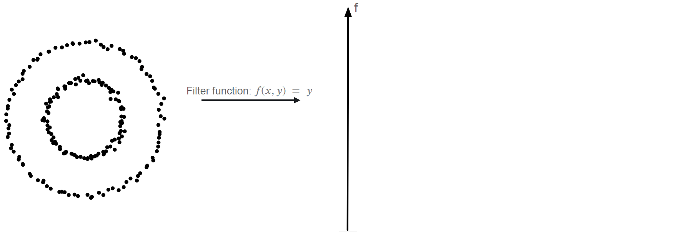

</details>

<details>
<summary><span style="font-size:23px;">Topological Control and Genus–Loop Diagnostic</span></summary>

The graph is built from `bins` slabs of the scalar field. Without control, a slab can **hide topology** (Biasotti et al. 2008): a handle lying inside one slab is never cut by a level set, and two regions of consecutive slabs that touch along two separate interfaces are joined by a single edge — in both cases a loop of the shape is missing from the graph. Following the Extended Reeb Graph, every slab region is checked:

* its genus from the Euler formula of the region, $g = (2c - \chi - b)/2$ ($\chi = V - E + F$, $c$ components, $b$ boundary loops) — $g > 0$ means a hidden handle;
* the number of connected components of its interfaces with the neighbouring regions — more than one means a merged loop;

and only the offending slabs are split (bisection, repeated up to 6 times), so the number of slabs stays comparable between frames.

The controlled graphs are a **complement**: the Reeb graphs of the pipeline (uniform slabs, used by the viewers, the GIFs, the time analysis, the similarity and the graph animation) are never modified. The controlled graphs are written to `Reeb_Graphs/Topology_Controlled/` with their scalar fields, and can be viewed and compared with the same viewer:

```python
visualize_graphs(mesh_path, './Results/scene1/Reeb_Graphs/Topology_Controlled', graph='reeb')
```

The control only acts when the graph **misses loops of the surface** ($\beta_1(K) <$ genus, the criterion of Biasotti et al.): the local tests are used to locate where to refine, never to trigger a refinement on their own. On a genus-0 surface (cells, animals without tunnels) no handle can be hidden, so the controlled graph is identical to the graph of the pipeline. Boundary loops of a region are counted as loops (cycle rank of the boundary), so a region whose boundary loops touch at a vertex — where a level set nearly closes on itself, e.g. around a hoof or a thin protrusion — is not mistaken for a handle.

With `gif=True` the controlled graphs get their own GIF (`Reeb_Graphs/gif/reeb_graph_topology_controlled.gif`), and they can be included in the graph analyses and the graph animation by naming them `'reeb_controlled'` in `analysis_graphs` (time analysis and similarity in `Graph_analysis/Topology_Controlled/`) and in `graph_animation_params['graphs']`.

**Genus–loop diagnostic** (Biasotti et al., Table 1): for an orientable surface without boundary the number of loops of the Reeb graph equals the genus, $\beta_1(K) = g$; with $b$ boundary loops, $g \le \beta_1(K) \le 2g + b - c$. Every graph (the pipeline's and the controlled one) stores the genus of its surface and whether the relation holds; `Graph_analysis/topology_per_frame.csv` reports per frame, for the graph of the pipeline, `Surface_Genus`, `Boundary_Loops`, `Beta1_Expected_Min / Max`, `Genus_Consistent`, `N_Slabs` and `Hidden_Handles` (handles not represented by the graph — usually tiny handles such as self-contacts or defects of the mesh, below the resolution of the slabs), and for the controlled graph `Nodes_Controlled`, `Beta1_Controlled`, `Genus_Consistent_Controlled`, `Hidden_Handles_Controlled`, `Refinements_Controlled`, `N_Slabs_Controlled`. Every node also carries its type (`node_type`: minimum, maximum, split saddle, merge saddle, multiple saddle, regular), derived from its arcs above and below as in Reeb's degree–index relations.

</details>

<details>
<summary><span style="font-size:23px;"> Reeb Graph Usage and Analysis</span></summary>

The computations are executed and managed through the syntax:

```python
from PynamicMesh.core.pipelines import run_pipeline
run_pipeline(**args)
```

In order to compute the Reeb Graph run:

```python
from PynamicMesh.core.pipelines import run_pipeline
run_pipeline(
    path_str='base/path', 
    compute_reeb=True,
    time_graph_analysis=True,
    reeb_scalar="geodesic",
    bins=30,
    **scalar_fields_args 
)
```

Or you can set your parameters on the [yaml](./examples/config.yaml) file, and in the PynamicMesh environment run on the command line:

```bash
run_pynamic --config /path/to/the/config.yaml
```

<details>
<summary><span style="font-size:21px;"> Reeb Graph Parameters</span></summary>

Path to the root folder that contains the scenes:
```python 
path_str (str) 
```   

Flag to indicate the model execution:
```
compute_reeb (bool)
```  
Number of level sets used for the graph computing:
```python 
bins (int)
```

Topological control (see <b>Topological Control and Genus–Loop Diagnostic</b>): also computes the topology-controlled graphs (slabs hiding a handle refined locally) in `Reeb_Graphs/Topology_Controlled/`, as a complement — the Reeb graphs of the pipeline are never changed; `False` skips them:
```python 
reeb_topology_control (bool) : True
```

Scalar field used to compute the graph:
```python 
reeb_scalar (str)
```

Parameters related to the selection of Scalar Fields `param_name = param_value`:
```python 
**scalar_fields_args (dict)
```

Two options are common to every scalar field. `equalize_histogram` replaces the field by its normalized rank in $[0,1]$: the Reeb graph only depends on the ordering of the field, so the graph is unchanged, but the level sets become equally populated and the node levels comparable among frames (default `True` for `heat_diffusion` and `matern_kernel`, `False` otherwise). `geodesic_solver` selects the geodesic solver for `geodesic` and `mass_center_geodesic`: `'heat'` (heat method, with an automatic fallback to Dijkstra when it fails) or `'dijkstra'` (exact on the edge graph, stable among frames):
```python 
equalize_histogram (bool)
geodesic_solver (str) : 'heat' | 'dijkstra'
```

<b>Automatic reference points.</b> The fields measured from a point — `geodesic` (`vertex_ref_index`), `heat_diffusion` and `matern_kernel` (`source_idx`), `harmonic` (`source_idx`, `sink_idx`) — can choose it automatically, in the same spirit as the automatic landmarks of the functional maps:

* `'auto_center'` — the **intrinsic centre**: the vertex of smallest average geodesic distance to the surface (estimated from farthest-point samples, Hilaga et al.). It always lies on the surface and does not depend on the pose, unlike `'mass_center'` (the vertex closest to the Euclidean centroid, which falls outside strongly non-convex shapes). Radial fields from it make the protrusions their far ends (cells);
* `'auto_extremity'` — the tip of the shape farthest from the intrinsic centre: fields from it sweep the shape along its main axis (elongated shapes, animals);
* `'auto'` — the natural choice of the field: the centre for `geodesic`, `heat_diffusion`, `matern_kernel`; for `harmonic` the source at the extremity and the sink at the farthest point from the source.

**Consistency through time.** The meshes of the frames have different vertices, so a fixed index is a different point in every frame. The automatic reference of frame $t-1$ is transported to frame $t$ through the point-to-point map of the functional maps (or by its position, without maps; a map that would move it by more than a quarter of the size is ignored) and the criterion is re-applied **near** it: the same far part of the shape is followed (its tip is taken again), and among nearly equally central vertices the one closest to the previous centre. On a 25-frame quadruped sequence the extremity stays on the same leg tip (largest move 0.06 × size between frames), while choosing it independently in every frame jumps between tips (up to 1.05 × size). The chosen vertices are written to `Reeb_Graphs/auto_reference.json` (and `MSComplexAnalysis/MS_Complex/auto_reference.json` when the Morse–Smale complex computes its own field); the [Reeb Graph Dynamics](#reeb-graph-dynamics) choose them once on the reference frame of the tracked mesh.

`scalar_args['reference_transport']` chooses how the reference is carried from frame to frame: `'auto'` (default: through the point-to-point map, ignored when it would move the reference by more than a quarter of the size), `'map'` (always the map: large motion between frames, reliable maps) or `'position'` (aligned frames with small motion between them, e.g. cell time-lapses: immune to symmetric flips of the maps).

Accuracy of the intrinsic centre: compared with the exact centre (average geodesic distance computed from every vertex) on a quadruped mesh, the estimate is 0.013 × size away and its average distance only 0.04 % above the exact minimum; more samples do not improve it (the default of 8 farthest-point samples is kept).

Flag to indicate if the analysis should be run within the loop; this will run the analysis over the raw computed graphs. If you need to run the analysis on the graphs after a modification, you can run it independently over the modified graphs.
```python 
time_graph_analysis (bool)
```

<details>
<summary><span style="font-size:19px;"> Available Scalar Fields</span></summary>

## Spatial Based

<b>$(x,y,z)$-Level sets:</b>  

```python 
reeb_scalar="x" | reeb_scalar="y" | reeb_scalar="z"
```

<b>Distance from the center of mass:</b> 

```python 
reeb_scalar="dist_centroid"
```

<b>Signed distance relative to parallel planes crossing the centroid:</b> 

```python 
reeb_scalar="signed_dist_x" | reeb_scalar="signed_dist_y" | reeb_scalar="signed_dist_z"
```

<b>Absolute distance to specified axis:</b> 

```python 
reeb_scalar="dist_x_axis" | reeb_scalar="dist_y_axis" | reeb_scalar="dist_z_axis" 
```

## Geometric/Topology based

<b>Geometric mean curvature:</b> 

```python  
reeb_scalar="mean_curvature"
```

<b>Gaussian curvature:</b> 

```python 
reeb_scalar="gaussian_curvature"
```

<b>Shape base index:</b> 

```python  
reeb_scalar="shape_index"
```

<b>Curve base index:</b> 

```python  
reeb_scalar="curvedness"
```
 
<b>Protrusion mapping based on mesh $M_{t-1}$:</b> 

```python 
reeb_scalar="normal_displacement"
```

<b>Spectral mapping based on $n$ Laplace-Beltrami eigenfunctions:</b> 

```python 
reeb_scalar="lb_eigen_n" 
```

<b>Geodesic path to the center of mass:</b> 

```python 
reeb_scalar="mass_center_geodesic"
```

<b>Multi scalar field maps combination through Mapper Lens construction (PCA feature extraction):</b> 

```python  
reeb_scalar="multi_pca", fields=["f1","f2",..,"fn"] 
```

<b>Matérn Kernel:</b> 

Apply Matérn Kernel where:

Smoothness Parameter ```nu```  Controls how "differentiable" the kernel surface is.

Lower values (e.g., $nu = 0.5$): Corresponds to an Exponential kernel. It creates a rougher, highly localized field that responds aggressively to fine geometric fluctuations.
Higher values (e.g., $nu = 2.5$ or higher): Smooths out noise. Use higher values if your input 3D scans have sensor noise or surface artifacts you want to ignore.

A singular landmark ```source_idx``` on the mesh is selected as the source point. The Matérn kernel measures how strongly information "diffuses" or correlates from that source point out to every other vertex.

The ```lengthscale``` referst to the spatial bounds of the geometric features to capture.

A small lengthscale isolates the scalar field strictly around your source vertex.
A large lengthscale allows the correlation field to gracefully cascade over the entire body structure, giving the Reeb graph a more stable structural backbone.

```python 
reeb_scalar="matern_kernel" , nu=0.15, source_idx=i, lengthscale=1.0  
```
<details>
<summary><span style="font-size:17px;"> source_idx options</span></summary>

```python 
source_idx (str|list|int)
```
```source_idx``` can codify different options:

Apply the same source point ($v_n$) for all the meshes:

```python 
source_idx (int): n
```

Apply the mesh mass center $(x,y,z)$ for all the meshes:

```python 
source_idx (str): 'mass_center'
```

Automatic reference point ('auto' = the intrinsic centre), kept on the same part of the shape through time — see <b>Automatic reference points</b>:

```python 
source_idx (str): 'auto' | 'auto_center' | 'auto_extremity'
```

Apply the source point $v_i$ for the mesh $M_i$. If $n$ is less than the number of meshes, for the rest the default value `source_idx=0` will be applied:
```python 
source_idx (list): [0,1,2,3,...,n]
```

Apply the source point $v_i$ for the mesh $M_i$. For the meshes in the None position, the default value `source_idx=0` will be applied:

```python 
source_idx (list): [0,None,None,3,...,n]
```

Visual selection, in the same fashion as in the case of the functional map (see section Landmarks graphical selection for functional maps):

```python 
source_idx (str): "precomputed"
```

</details>

<b>Spectral mapping based on Heat diffusion, source point (vertex index $i$) $v_i$ and time $t$:</b> 

```python 
reeb_scalar="heat_diffusion", source_idx=i, t='auto' 
```

<details>
<summary><span style="font-size:17px;"> source_idx options</span></summary>

```python 
source_idx (str|list|int)
t (float|str) : 'auto'
```
The diffusion time is not scale independent: a fixed value gives an almost constant field on meshes with small eigenvalues and a Dirac-like field on meshes with large ones. `t='auto'` (default) selects $t = 1/\sqrt{\lambda_1\lambda_K}$, the geometric mean of the resolvable diffusion times; a numeric $t$ is applied as given and remains the same for every mesh of the scene. `source_idx` can codify different options (a list of several indices for the same mesh yields the heat emitted by all of them):

Apply the same heat source ($v_n$) for all the meshes:

```python 
source_idx (int): n
```
Apply the mesh mass center $(x,y,z)$ for all the meshes:

```python 
source_idx (str): 'mass_center'
```

Automatic reference point ('auto' = the intrinsic centre), kept on the same part of the shape through time — see <b>Automatic reference points</b>:

```python 
source_idx (str): 'auto' | 'auto_center' | 'auto_extremity'
```

Apply the heat source $v_i$ for the mesh $M_i$. If $n$ is less than the number of meshes, for the rest the default value `source_idx=0` will be applied:
```python 
source_idx (list): [0,1,2,3,...,n]
```

Apply the heat source $v_i$ for the mesh $M_i$. For the meshes in the None position, the default value `source_idx=0` will be applied:

```python 
source_idx (list): [0,None,None,3,...,n]
```

Visual selection, in the same fashion as in the case of the functional map (see section Landmarks graphical selection for functional maps):

```python 
source_idx (str): "precomputed"
```

</details>

<b>Spectral mapping based on Harmonic with boundary conditions injection flow in vertex $v_i$ and leaving flow in vertex $v_t$: </b> 

```python 
reeb_scalar="harmonic", source_idx=i, sink_idx=t 
```

<details>
<summary><span style="font-size:17px;"> source_idx options</span></summary>

While in the case of `source_idx=i, sink_idx=j` we refer to the boundary conditions injection flow in vertex $v_i$ and leaving flow in vertex $v_j$, `source_idx` can codify different options:

```python 
source_idx (str|list|int)
sink_idx (int) 
```

Use the pair $(i,j)$ as boundary condition $v_i$, $v_j$ for all the meshes.

```python 
source_idx (int)
sink_idx (int) 
```

Use every pair $(i,j)$ in the list as boundary condition $v_i$, $v_j$ `source_idx=i, sink_idx=j` for each mesh. If there are fewer pairs than meshes, for the rest the default value `source_idx=min(index), sink_idx=max(index)` will be applied.

```python 
source_idx (list): [[1,2],[3,4],...,[i,j]]
```

Use every pair $(i,j)$ in the list as boundary condition $v_i$, $v_j$ `source_idx=i, sink_idx=j` for each mesh. For the None positions, the default value `source_idx=min(index), sink_idx=max(index)` will be applied.

```python 
source_idx (list): [[1,2],None,...,[i,j]]
```

Visual selection, in the same fashion as in the case of the functional map (see section Landmarks graphical selection for functional maps).

Automatic source and sink — the two ends of the shape: the source at the farthest point from the intrinsic centre, the sink at the farthest point from the source (a fair harmonic function with few critical points, Ni et al. 2004), both kept on the same parts of the shape through time — see <b>Automatic reference points</b>:

```python 
source_idx (str): 'auto'
sink_idx (str): 'auto'
```

```python 
source_idx (str): "precomputed"
```
</details>

<b>Geodesic mapping based on vertex landmarks $[v_0,...,v_n] \in M_t$:</b>

```python 
reeb_scalar="geodesic", vertex_ref_index=[0,1,2,n] 
```

<details>
<summary><span style="font-size:17px;"> vertex_ref_index options</span></summary>

The parameter `vertex_ref_index` can codify different options:

```python 
vertex_ref_index (str|list)
```
Apply the mesh mass center $(x,y,z)$ for all the meshes:

```python 
vertex_ref_index (str): 'mass_center'
```

Automatic reference point ('auto' = the intrinsic centre), kept on the same part of the shape through time — see <b>Automatic reference points</b>:

```python 
vertex_ref_index (str): 'auto' | 'auto_center' | 'auto_extremity'
```

Apply the set of reference vertices $[v_0,...,v_n]$ for every mesh.

```python 
vertex_ref_index (list): [0,1,2,3,...,n] 
```

Apply each set of reference vertices $[v_0,...,v_n]$ for each mesh. In the case of having fewer reference sets, for the rest the default value `vertex_ref_index=[0]` will be applied.

```python 
vertex_ref_index (list): [[0,...,n1],[0,...,n2],...,[0,...,nk]] 
```

Apply each set of reference vertices $[v_0,...,v_n]$ for each mesh. In the case of None positions, the default value `vertex_ref_index=[0]` will be applied.

```python 
vertex_ref_index (list): [[0,...,n1],None,...,[0,...,nk]]
```

Visual selection, in the same fashion as in the case of the functional map (see section Landmarks graphical selection for functional maps).

```python 
vertex_ref_index (str): "precomputed"
```
</details>

<details>
<summary><span style="font-size:17px;"> Visual reference notes</span></summary>

In each case of the Heat diffusion, Harmonic, and Geodesic based scalar maps, the optional reference point can be selected graphically with the execution of the corresponding code:
```python 
from PynamicMesh.utils.visualizers import visual_selection_edition, precompute_landmarks


################################ Sources Vertex index precompute visual tools for 'heat_diffusion' in Reebs #############################################################
print('Visualizing or editing Sources Vertex index for RG...')
visual_selection_edition(mesh_path,'heat_diffusion')

print('Precomputing Sources Vertex index for RG...')
precompute_landmarks(base_mesh_path,'heat_diffusion')

################################ Source-sink Vertex index precompute visual tools for 'harmonic' in Reebs #############################################################
print('Visualizing or editing Source-sink Vertex index for RG...')
visual_selection_edition(mesh_path,'harmonic')

print('Precomputing Source-sink Vertex index for RG...')
precompute_landmarks(base_mesh_path,'harmonic')

################################# Vertex index reference precompute visual tools for 'geodesic' in Reebs #############################################################
print('Visualizing or editing Vertex index for RG...')
visual_selection_edition(mesh_path,'geodesic')

print('Precomputing Vertex index for RG...')
precompute_landmarks(base_mesh_path,'geodesic') 

```
Each one will generate and save the respective `sources.npy`, `source_sink.npy`, `vert_ref_geo.npy` files within the folder `./PynamicMesh/Results/scene1`.

<b>Note:</b>

If during the pipeline execution the corresponding `'precomputed'` function is used but no `.npy` files are found for a certain folder, the default values will be used.

</details>
</details>
</details>

<details>
<summary><span style="font-size:21px;">Reeb Graph Visualization</span></summary>

After the modeling pipeline execution, the files `Reeb_T0000.pkl` and `Scalar_T0000.npy` (one for each time $t$, zero padded) will be saved within the folder `./PynamicMesh/Results/scene1/Reeb_Graphs`. Every node of the graph stores its position `pos`, its level set `bin` and level value `f_value`, and the mesh vertices it represents (`n_vertices`, `vertices`); the viewer colours the nodes by their level with the same colour map as the scalar field.

With these files, we can visualize the evolution of the field and the graph over time:

```python 
from PynamicMesh.core.pipelines import run_pipeline
from PynamicMesh.core.reeb_graph import graph_time_analysis
from PynamicMesh.utils.visualizers import  visualize_graphs

print('Executing modeling ...')
run_pipeline(base_mesh_path, compute_reeb=True, bins=30 , reeb_scalar='geodesic', vertex_ref_index=[4896])

print('Reeb visualizations...') 
visualize_graphs(mesh_path, reeb_path,graph='reeb')
```


</details>

<details>
<summary><span style="font-size:21px;">Reeb Graph Editing Tool</span></summary>

When the graphs are created, we can use the graphical tool to edit the created graph:

- **Click** over an existing vertex (on the graph side) to delete the vertex and all the connected edges to it.
- **Click** on the surface mesh vertex (on the mesh side) to create a vertex, and **click** on an existing graph vertex (on the graph side) to create the edge among them.
- **Press key 'n'** to activate INNER mode; when you click on a vertex, it moves orthogonally into the mesh (press again to deactivate).
- **Press key 'o'** to activate OUTER mode; when you click on a vertex, it moves orthogonally closer to the mesh surface (press again to deactivate mode).
- **Press key 'c'** to activate LINK mode; when you click on two existing vertices on the graph side, the edge among them is created (press again to deactivate mode).
- **Space 'u'** to Undo the last change.
- **Use 's' and 'w' keys** to activate/deactivate the visible layer on the mesh.
- **Use the arrow keys** to change the graph in time.

When the edition is ready, just close the window. Only the corresponding modified graphs will be saved.

<b>Note:</b>
The original computed graphs are not overridden. The modified graphs will be stored within the folder `./PynamicMesh/Results/scene1/Reeb_graph_manual_edit`.


</details>

<details>
<summary><span style="font-size:21px;">Time Graph Analysis</span></summary>

When the desired graphs are ready and saved, we can run a temporal analysis and generate the plot of the results and the CSV with the data:

```python 
from PynamicMesh.core.reeb_graph import graph_time_analysis, plot_dynamic_graph_analysis

print('Graph path analysis...')
graph_time_analysis(reeb_path)

print('Plotting dynamic graph analysis...')
plot_dynamic_graph_analysis(csv_file_path)
```

<b>Structural Complexity (Nodes & Edges)</b>

Encodes the raw size of the Reeb graph skeleton. This tracks how "complex" or "branchy" the shape is.

A spike in nodes and edges indicates the mesh is growing new appendages, fragmenting, or wrinkling in time.

A drop indicates the mesh is smoothing out, shrinking, or parts are merging together in time.

<b>The "Intensity" of Deformation (The Distance Metrics)</b>

We calculate three distance metrics (Wasserstein, Spectral Laplacian, and Graph Edit Distance) between consecutive time steps. Together, these act as an "earthquake seismograph" for the meshes.

Encodes how drastically the skeleton shifted from $t_{i-1}$ to $t_i$. 

Smooth, low values mean that the mesh is experiencing stable, continuous deformation (e.g., simply moving or slowly expanding).

Sudden spikes indicate a critical topological event in the system. The mesh just underwent a sudden structural change, such as breaking apart (fission), colliding/merging (fusion), or suddenly collapsing.

The Graph Edit Distance highlights direct physical breakages/additions of branches, while Spectral Distance highlights global warping of the overall shape.

<b>Connected Pieces (Betti-0)</b>

The Betti-0 number counts the connected components of the graph. For a Reeb graph each piece of the shape has its own part of the graph, so Betti-0 follows the **number of pieces of the object**: an increase means a part split off (division, fission), a decrease that two pieces merged. Every change is marked (▲ split / ▼ merge) and `topology_per_frame.csv` lists, for **every** frame including the first, the nodes, edges, Betti-0, Betti-1 and the size of every component.

<b>Holes, Loops, and Fusions (Betti-1 Cycles)</b>

The Betti-1 number counts the number of 1D loops or cycles in the graph. It detects when the shape folds back on itself to create a hole or a tunnel (like a donut). 

An increase in cycles means appendages have touched and fused together, creating a closed loop.

<b>Stretching and Elongation (LCC Diameter)</b>

The "Diameter" of the Largest Connected Component represents the longest shortest-path across the graph's skeleton. 
It measures the maximum spatial span of the object. If the diameter steadily increases while the number of nodes stays the same, it means your mesh is being stretched or elongated (like pulling a piece of taffy).

`time_analysis.csv` has one row per transition with the size and topology of the current graph (`Frame`), their changes (`Delta_Betti_0`, `Delta_Betti_1`, `Component_Event`) and the distances; the graph edit distances of all transitions are computed in parallel (each with its own time limit). With known [frame times](#time-between-frames) every distance is also given per time unit (`<metric>_rate`), so transitions of different duration can be compared, and the plots use a time axis.

This analysis allows us to automatically pinpoint exactly when and how your 3D meshes undergo major structural changes without having to manually watch the 3D animation. It converts visual shape evolution into a dashboard of growth (size), drastic events (distances), stretching (diameter), and fusions (cycles).

<div style="display: flex; gap: 10px; flex-wrap: wrap; margin-top: 10px;">
  
  
  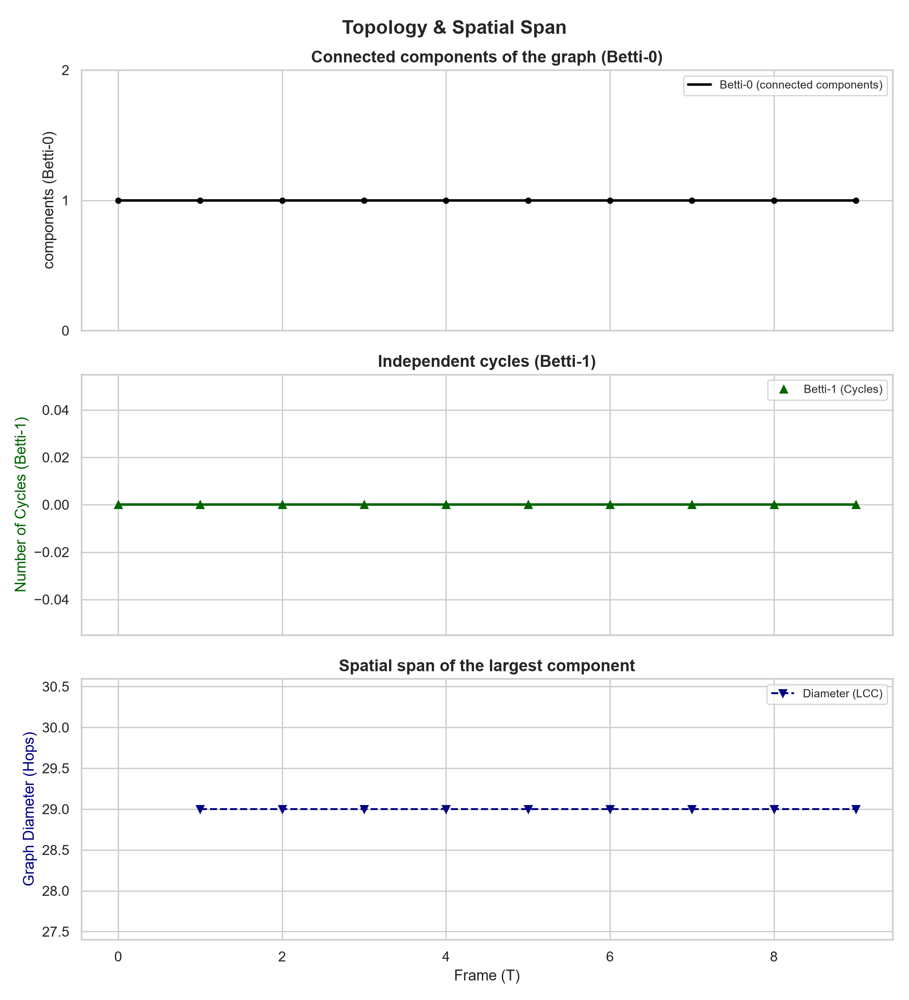
</div>

</details>
</details>
</details>

<a id="graph-similarity"></a>
<details>
<summary><strong><span style="font-size:25px;">Graph Similarity Metrics</span></strong></summary>

Having the graphs that enode the geometry of the transformation on the time step $t_i$ we can compute pairwise similarity metrics with the following code this will generate a csv with the resuslts and the corresponding plot within the path /PynamicMes/Results/scene1/Graph_analysis.


```python
from PynamicMesh.core.pipelines import run_pipeline
run_pipeline(**args)
```

In order to track the Graph Similarity, run:

```python
from PynamicMesh.core.pipelines import run_pipeline
run_pipeline(
    path_str='base/path',
    graph_sim = True, 
    graph_metrics = 'all'
    )
```

Or you can set your parameters on the [yaml](./examples/config.yaml) file, and in the PynamicMesh environment run on the command line:

```bash
run_pynamic --config /path/to/the/config.yaml
```

<b>Note: Graph Similarity Metrics vs. Time Graph AnalysisWhile</b>  

Both tools evaluate the generated Reeb Graphs, they serve completely different analytical purposes: 

Time Graph Analysis: Tracks consecutive animation frames $t_{i-1} \to t_i$ to pinpoint exactly when a structural event occurs. By relying on direct physical modification costs like Graph Edit Distance, alongside node and cycle counts, it flags the exact moment a mesh physically breaks, merges, or sprouts new limbs. 

Graph Similarity Metrics (The TDA Benchmark): Focuses on the mathematical nature of the deformation rather than discrete timeline events. It uses advanced Topological Data Analysis (TDA) distances to measure continuous geometric changes. Instead of just counting broken branches, it evaluates how scalar height values shift (Interleaving Distance), how internal travel pathways warp (Function Distortion Distance), how local junctions reorganize (Degree Wasserstein), how macro-level global structures deform (Spectral Laplacian), and tracks pure topological tearing and gluing independent of the shape's scale (Branch Decomposition).


<details>
<summary><span style="font-size:23px;">Graph Similarity Parameters</span></summary>

Path to the root folder that contains the scenes:
```python 
path_str (str) 
```   

Flag to indicate the execution:
```python 
graph_sim (bool)
```  

Desired metrics to track:

```python 
graph_metrics (str) | (list)
```
<details>
<summary><span style="font-size:21px;">Available metrics</span></summary>

Compute and report all the available metrics :

```python 
graph_metrics (str) : 'all'
```

Compute just the selected set of metrics :

```python 
graph_metrics (list) : ['metric_1',...,'metric_n']
```

Graphs analysed by the time analysis and the similarity — `'reeb'` (Reeb graphs, `Graph_analysis/`), `'reeb_controlled'` (topology-controlled Reeb graphs, `Graph_analysis/Topology_Controlled/`), `'mscomplex'` (Morse–Smale graphs, `MSComplexAnalysis/Graph_analysis/`); only the graphs that were computed are used:
```python 
analysis_graphs (list) : ['reeb', 'mscomplex']
```


<b>Degree Wasserstein Distance:</b>

```degree_wasserstein``` measures the difference in how "busy" or interconnected the junctions (nodes) are in the graph. This tracks local branching changes. If the mesh splits or merges, the junctions on the skeleton get more or fewer connections. A high value means the complexity of the intersections has shifted dramatically.

<b>Spectral Laplacian Distance:</b>

```spectral_laplacian``` measures the global "fingerprint" or structural vibe of the graph based on its overall matrix structure. This tracks major global shape deformations. We can think of it as looking at the big picture. If the mesh undergoes a massive twist, a huge stretch, or collapses entirely, this metric will spike. It is excellent for catching massive, macro-level structural changes rather than tiny details.

<b>Interleaving Distance & Labeled Interleaving Distance:</b>

```interleaving_distance``` , ```labeled_interleaving_distance```  measures the difference in the height or position (the scalar values) of the graph's features.  This tracks spatial stretching or shifting along an axis. Because it looks at the positions (pos or bin) of the nodes, it tell us if the mesh is being pulled upward, compressed downward, or if features are migrating along the direction of your measurement function.

<b>Note:</b> Interleaving Distance = Labeled Interleaving Distance when the vertices (nodes) of the graph don't have a 'label' attribute set.


<b>Function Distortion Distance:</b>

```function_distortion_distance``` measures the difference in the "shortest travel distance" between all points on the graph. This tracks elongation and structural shortening. This metric catches how much the "internal travel distance" across the mesh's skeleton is warping.

<b>Branch Decomposition Distance:</b>

```branch_decomposition_distance``` measures the literal count of pieces, loops/holes (Betti-0, Betti-1) and major branching points in the graph. This tracks pure topological tearing or gluing. It completely ignores how long or tall the shape is and focuses strictly on structure. If your deforming mesh rips open a new hole (like dough pulling apart) or sprouts a brand new limb, this metric registers that discrete structural change.

<b>Betti Distances:</b>

```betti_0_distance``` and ```betti_1_distance``` are the exact changes $|\Delta\beta_0|$ (connected pieces) and $|\Delta\beta_1|$ (cycles) between consecutive graphs: non-zero exactly when a piece splits off / two pieces merge, or a loop appears / disappears.

With known [frame times](#time-between-frames) the csv also has `Time`, `Dt` and every metric per time unit (`<metric>_rate`).

</details>
</details>

<details>
<summary><span style="font-size:23px;">Morse–Smale graphs: origin-separated comparison</span></summary>

When the Morse–Smale graphs contain protrusion tips found by the convex-hull detection (see <b>Morse–Smale Complex</b>), these tips are not maxima of the scalar field and comparing them in the same group as the field maxima would dominate the distances. For such graphs the analysis automatically adds a like-with-like comparison: the nodes are grouped by type and origin (`maximum_ms`, `maximum_hull`, `saddle_ms`, `saddle_hull`, `minimum_ms`, `center`), the labeled interleaving distance is computed per group (groups missing in one graph are not compared with zeros) and the group driving the value is reported (`<tag>_origin_group_similarity.csv`, `_frames.csv`, `_nodes.csv` and two plots). The existing columns of the similarity csv are unchanged.

</details>
</details>

<a id="morse-smale-complex"></a>
<details>
<summary><strong><span style="font-size:25px;">Morse–Smale Complex </span></strong></summary>

The Reeb graph summarises *how many* parts a shape has at every level of a scalar function. The Morse–Smale complex answers the complementary question: *where* are the peaks, pits and passes of that function on the surface, and which patch of surface belongs to each peak. Applied to a cell with a field such as the distance to the centre of mass, every peak is the tip of a protrusion and the patch flowing up to it is that protrusion's territory. Following peaks and territories through the functional maps of the pipeline turns a sequence of meshes into a story of protrusions that grow, shrink, split, merge, appear, flatten out or even invert into indentations.

<details>
<summary><span style="font-size:23px;">General Overview</span></summary>

In calculus, a point $p$ is a **critical point** of a function $f$ when its derivative vanishes, $\nabla f(p) = 0$, and the second-derivative test tells its nature: a local maximum $M$ when the Hessian is negative definite ($\nabla^2 f(p) \prec 0$), a local minimum $m$ when it is positive definite ($\nabla^2 f(p) \succ 0$), and a saddle point $S$ when it has eigenvalues of both signs.

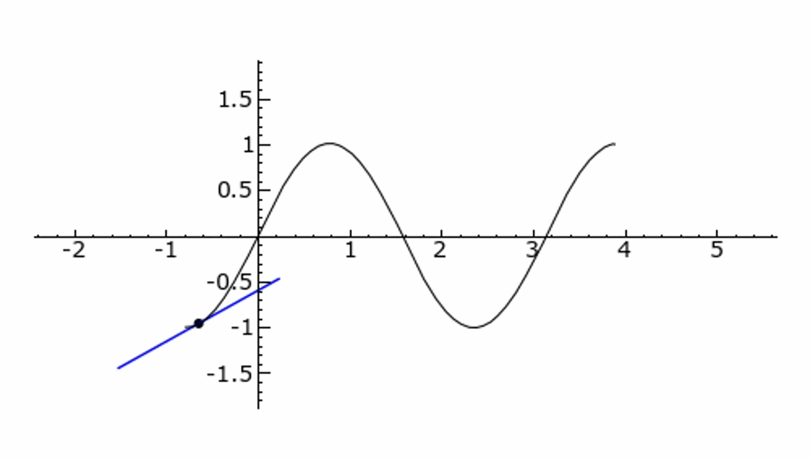

The same idea extends to a scalar field on the mesh, $f: M\to\mathbb{R}$ (for example the distance of every point to the centre of the cell): its local maxima, minima and saddles, connected by the paths of steepest ascent and descent, divide the surface into regions — the **Morse–Smale complex**. For a distance-to-centre field every maximum is the tip of a protrusion and its region is the protrusion itself, which gives an automatic segmentation of the protrusions.

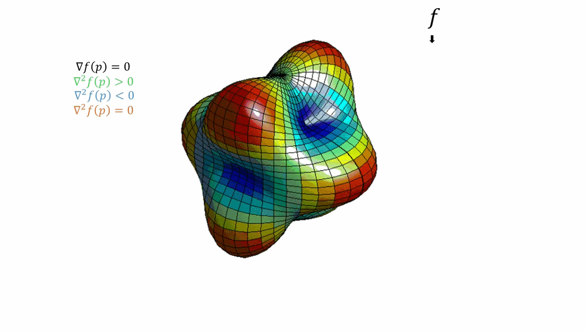

Near a non-degenerate critical point the surface of values of $f$ always looks the same up to a smooth change of coordinates (Morse lemma): on a small ball $\mathbb{B}_{\varepsilon}(p)$,
$$f = f(p) + x^2 + y^2 \ \ \text{(minimum)},\qquad f = f(p) - x^2 - y^2 \ \ \text{(maximum)},\qquad f = f(p) + x^2 - y^2 \ \ \text{(saddle)},$$
a paraboloid opening upwards, downwards, or a hyperbolic paraboloid. These three local shapes are what the pipeline detects and follows over time.

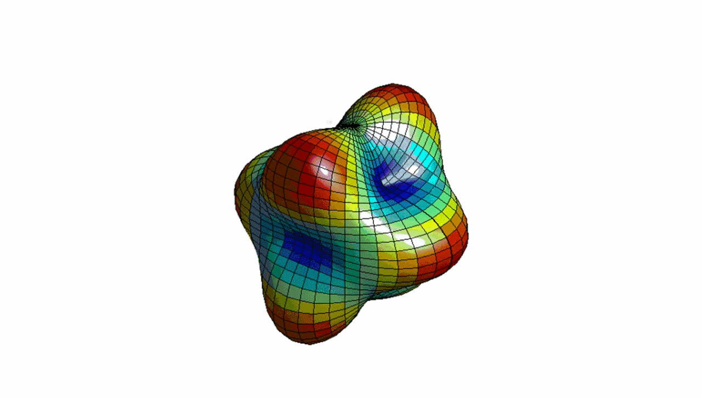


</details>

<details>
<summary><span style="font-size:23px;">Theoretical Description</span></summary>

<details>
<summary><span style="font-size:21px;">Critical points of a function on a mesh</span></summary>

Consider a scalar field $f:M\to\mathbb{R}$ on a closed triangle mesh, linear inside every triangle. Ties are broken by the vertex index, so all values can be treated as distinct. Around a vertex $v$ its neighbours form a ring (the *link*); split it into the vertices where $f<f(v)$ (lower link) and where $f>f(v)$ (upper link). Counting how many times the ring crosses from one side to the other classifies $v$ (Banchoff's piecewise-linear Morse theory):

$$
\#\text{crossings}=\begin{cases}
0,\ \text{all neighbours lower} & \text{maximum (peak)}\\
0,\ \text{all neighbours higher} & \text{minimum (pit)}\\
2 & \text{regular point}\\
2k,\ k\ge 2 & \text{saddle of multiplicity } k-1\ (\text{pass})
\end{cases}
$$

The computation is done for all vertices at once through the link edges of the incident triangles. On a closed surface without holes (genus 0) the counts always satisfy the **Euler relation**

$$\#\text{minima}-\#\text{saddles}+\#\text{maxima}=2,$$

which the module checks on every frame both before and after simplification.

</details>

<details>
<summary><span style="font-size:21px;">Regions: ascending and descending manifolds</span></summary>

From every vertex, follow the neighbour with the steepest ascent, $\arg\max_j (f_j-f_i)/|\mathbf{x}_j-\mathbf{x}_i|$, until a maximum is reached. All vertices ending at the same maximum $m$ form its **descending manifold** $D(m)$ — the territory of that peak, the coloured patch of the viewer. Following the steepest descent instead gives the **ascending manifolds** $A(p)$ of the minima. The intersections $D(m)\cap A(p)$ are the cells of the Morse–Smale complex: patches of surface where the field flows from a single pit to a single peak. The pass between two neighbouring territories is a saddle. The paths are compressed with pointer jumping, so the segmentation of a mesh with tens of thousands of vertices takes a fraction of a second.

</details>

<details>
<summary><span style="font-size:21px;">Persistence: telling protrusions from noise</span></summary>

Measured surfaces have small bumps everywhere, and each one is a mathematical maximum. Topological persistence ranks them by importance. Sweep the surface from the highest value downwards (a super-level filtration): every time a new peak is met a new component is born, and when the sweep reaches the pass joining two components the *lower* of their two peaks dies. The **persistence** of that peak is

$$\text{pers}(m)=f(m)-f(s),$$

the height of the peak above the pass $s$ that connects it to a higher neighbour; the global maximum never dies ($\text{pers}=\infty$). The same sweep upwards ranks the minima. A peak with persistence below a threshold $\tau$ (a fraction of the field range) is a ripple: its territory is merged into the territory of the peak that killed it, following the chain of merges until a surviving peak. The saddles of the simplified complex are the passes of the surviving pairs, which keeps the Euler relation exact.

Persistence is also the natural **height of a protrusion** in the units of the field: a peak with $\text{pers}=0.3$ on a `dist_centroid` field stands $0.3$ length units above the pass to its neighbour. Its evolution in time is reported for every tracked protrusion.

</details>

<details>
<summary><span style="font-size:21px;">Convex-hull protrusion detection</span></summary>

A scalar field such as `dist_centroid` finds the protrusions that point *away from the centre*, but misses protrusions on the flanks of the cell, small ones, or protrusions growing on top of others. A second, independent detector follows Huang, Wu & Yan (2024): every vertex receives its **depth below the convex hull** of the shape, $d(x) = \operatorname{dist}(x, \partial\,\text{hull}(M))$; the tips of protrusions touch the hull ($d\approx 0$) and the surface between them is deep. The minima of $d$ — computed with the persistence pairs of $-d$ directly on the mesh, since critical points are invariant under diffeomorphisms (no spherical projection needed) — are the candidate tips. A candidate is kept when its cap (the part of the surface around it above the surrounding pass) is high enough (`beta`, relative to the size and the noise of the surface), slim enough (`min_aspect`) and not too large (`max_cap_area`).

The hull tips are **fused** with the Morse–Smale maxima: a maximum inside a cap confirms it (`source='ms+hull'`), caps without maximum are carved out of their Morse–Smale region as new protrusions with a saddle at their pass (`source='hull'`), and every protrusion gets a **core** (its upper part). The tips of the previous frame lower the threshold locally (`temporal`), so a protrusion that becomes shallow is not lost. On a synthetic test with 11 protrusions the recall rose from 27 % (field maxima alone) to 100 % at equal precision. The Euler relation $\#\min-\#\text{saddle}+\#\max=2$ is preserved.

Frame by frame, how many protrusions were found by each detector, and the size of their cores, are shown in `plots/protrusion_detection_evolution.png` (see the results of this chapter).

</details>

<details>
<summary><span style="font-size:21px;">Correspondence of regions through the functional map</span></summary>

Between consecutive frames $t$ and $t+1$ the pipeline provides the functional map $C$ and the point-to-point map $\pi$ that sends every vertex of frame $t+1$ to a vertex of frame $t$. Two transports of the segmentation of frame $t$ onto the mesh of frame $t+1$ are used:

<b>Hard transport.</b> A vertex of frame $t+1$ receives the region of the vertex it is matched to, $L_{t\to t+1}(j)=L_t(\pi(j))$.

<b>Soft transport.</b> The indicator function $\mathbb{1}_R$ of every region is transported as a function, in the spirit of the original functional-map framework: with $\Phi_t,\Phi_{t+1}$ the Laplace–Beltrami eigenbases and $A_t$ the vertex areas,

$$g_R=\Phi_{t+1}\,C\,\Phi_t^{\top}A_t\,\mathbb{1}_R ,$$

which gives every vertex of frame $t+1$ a smooth degree of membership to each region of frame $t$; the largest membership is the soft label and its share of the total is a confidence. The viewer can display either transport, and the agreement between them is reported.

<b>Matching.</b> The overlap $O_{RS}$ between a transported region $R$ and a current region $S$ is the surface area they share. Regions are paired by maximising the area-weighted intersection-over-union, $\text{IoU}_{RS}=O_{RS}/(|R'|+|S|-O_{RS})$, with the Hungarian algorithm, a pair being accepted above `iou_threshold`. With `adaptive=True` (default) the threshold follows the size of the regions: a small region transported with a map error $\varepsilon$ cannot overlap as much as a large one, the expected overlap of two disks of radius $r$ shifted by $\varepsilon$ gives $\text{IoU}_\text{exp}(r)$, and a pair is accepted above $\max(\texttt{min\_iou},\ \texttt{iou\_threshold}\cdot\text{IoU}_\text{exp})$; $\varepsilon$ is estimated per transition from the scatter of the map and the shift of the matched tips. Unmatched previous tips landing in an unmatched region are recovered (`tip_rescue`). The unpaired regions are related by **dominant overlaps**: a current region whose largest contributor is $R$ (and covers more than the `dominance` fraction of it) is a *split* child of $R$; a previous region that mostly flows into a current region $S$ paired with another region has been *merged* (absorbed) into $S$; regions with no dominant relation are *births* and *deaths*. Every protrusion receives a persistent **track id** through these links (its lineage).

</details>

<details>
<summary><span style="font-size:21px;">Fate of the critical points and multi-frame trajectories</span></summary>

Every critical point of frame $t$ is carried to frame $t+1$ through the maps (the pre-image of $\pi$ when available, otherwise the forward map derived from $C$). The type of the surface at the arrival point is then decided with criteria that are robust to the wandering of an extremum on a flat top:

* a **maximum** whose image lies inside the region matched to its own region is still a maximum (the exact vertex of the peak may move, the protrusion has not changed);
* a point is "at the top" of a protrusion or "at the bottom" of a pit if its value is within half the persistence threshold of the maximum of its territory (respectively the minimum of its basin);
* a **saddle** persists when the two regions it separates are both matched and still share a boundary (their pass);
* otherwise the type is that of the nearest critical point within `fate_radius` along the surface, or *regular* if there is none.

For every extremum the module also measures the **displacement of its image along the surface normal** of frame $t$ (positive = outward = the protrusion grows, negative = it retracts), the tangential displacement, the change of the field value and rank, of the persistence and of the region area.

Because a slow inversion passes through a flat intermediate state, each critical point is additionally **followed for several frames** even after it has become regular (a *ghost* that tracks the material point of the original vertex for `ghost_horizon` frames). Its type sequence — e.g. maximum, maximum, regular, minimum, minimum — is summarised as a *long fate*: persistent, inverted (maximum → minimum), absorbed (extremum → saddle), flattened, or saddle → extremum.

</details>

<details>
<summary><span style="font-size:21px;">Graph generation</span></summary>
When the geometry of the mesh is too simple, for example similar to a sphere or  to a star shaped form, Reeb graphs capture this simplicity on the struture of the graph, this can provide a oversiplification on the analysis that not provide to much information, to extract a better geometrical representation for this cases we can build the graph generated by the critical points and the center of mass of the surface providing a rich structure representation to analyze under the same analysis provided for the reeb graphs.

This graphs can be visualized running:

```python
from PynamicMesh.utils.visualizers import  visualize_graphs

print('Mscomplex Graph visualizations...')
visualize_graphs(mesh_path, ms_graph_path, graph='mscomplex')
```


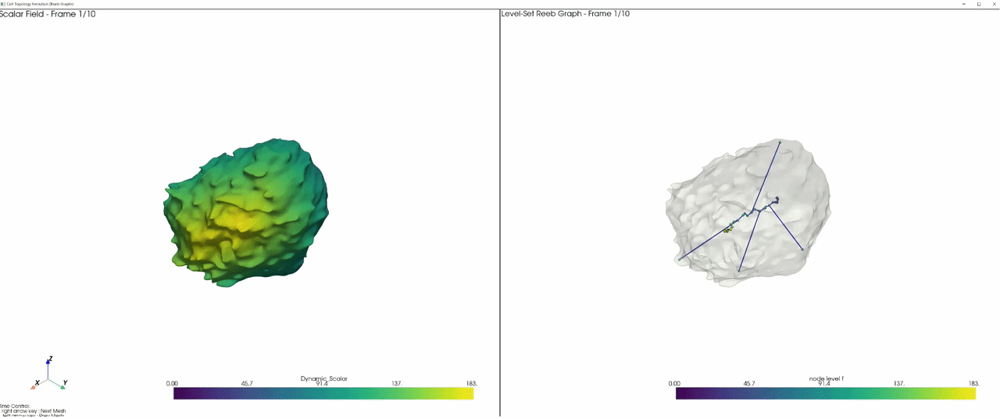

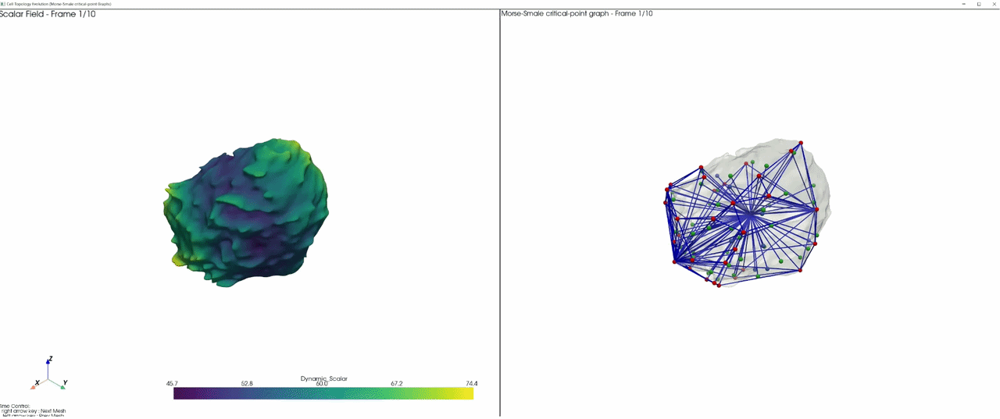


</details>
</details>

<details>
<summary><span style="font-size:23px;">Parameter Election</span></summary>

All Morse–Smale parameters are given to `run_pipeline` (or in the yaml).

```python
from PynamicMesh.core.pipelines import run_pipeline

run_pipeline(
    path_str=base_mesh_path,
    compute_mscomplex=True,
    ms_scalar='dist_centroid',
    ms_persistence=0.08,
    ms_min_region_area=0.0,
    mscomplex_graph=True,
    ms_graph_type='star+adjacency',
    ms_track_regions=True,
    ms_graph_metrics='all',
    ms_tracker_params={
     'iou_threshold': 0.25,          
     'dominance': 0.5,               
     'fate_radius': 0.04,            
     'growth_tolerance': 0.002,      
     'ghost_horizon': 6,
     'adaptive': True,
                       },
    ms_protrusion_params={'enabled': True, 'beta': 0.012, 'temporal': True},
)
```

<details>
<summary><span style="font-size:21px;">Pipeline parameters</span></summary>

Compute the Morse–Smale complex, the protrusion segmentation and the critical-point statistics of every mesh:
```python
compute_mscomplex (bool) : False
```

Scalar field of the complex; any method of `get_scalar_field` (see <b>Reeb graph</b> parameters). `None` uses the Reeb field of the same frame (reused, not recomputed). For protrusions the distance to the centre of mass is the natural choice — a peak of `dist_centroid` is literally the farthest point of a protrusion; `mass_center_geodesic` is its along-the-surface counterpart. Curvature fields segment by local shape instead (peaks of `mean_curvature` are sharp tips); `heat_diffusion` / `harmonic` fields give smooth, coarse territories:
```python
ms_scalar (str|None) : None | 'dist_centroid' | 'mass_center_geodesic' | 'geodesic' | 'mean_curvature' | ...
```

Persistence threshold as a fraction of the field range. Bumps lower than this fraction are merged into their neighbours. Practical guidance: start around $0.05$–$0.10$; if the segmentation still shows many tiny patches, raise it; if two protrusions that are visibly separate are merged, lower it. The raw and simplified counts in `critical_points.csv` show how many critical points the threshold removed. $0$ keeps every critical point of the mesh:
```python
ms_persistence (float) : 0.05
```

Optional size-based cleaning: regions covering less than this fraction of the surface are merged into the neighbour with the longest shared boundary (useful when small but tall spikes must not count as protrusions):
```python
ms_min_region_area (float) : 0.0
```

Build the critical-point graph of every frame (nodes: critical points with `f_value`, `type`, `persistence`; a `center` node at the centre of mass) and run the Reeb-graph analyses on these graphs. With `'star'` every critical point is connected to the centre only — the degree-based metrics are then trivial; `'star+adjacency'` also connects the maxima of neighbouring regions (edge weight = length of their shared boundary), so the graph encodes the arrangement of the protrusions:
```python
mscomplex_graph (bool) : False
ms_graph_type (str) : 'star' | 'star+adjacency'
ms_graph_metrics (str|list) : 'all'
```

Track regions and critical points through the functional maps (requires `matrix_tranformation=True`; silently skipped otherwise):
```python
ms_track_regions (bool) : True
```

Advanced settings of the tracker:
```python
ms_tracker_params (dict)
```

<details>
<summary><span style="font-size:19px;">ms_tracker_params keys</span></summary>

Minimum area-weighted IoU for two regions of consecutive frames to be considered the same protrusion. Lower it for fast-moving or strongly deforming cells (regions overlap less), raise it for slowly evolving sequences:
```python
iou_threshold (float) : 0.25
```

Fraction of a region's area that must flow into (or come from) a single counterpart for a split or merge relation. Higher values make splits/merges rarer and births/deaths more frequent:
```python
dominance (float) : 0.5
```

Search radius for the nearest critical point when deciding the fate of an image point, as a fraction of $\sqrt{\text{surface area}}$ (with the default, about 4% of the cell size). Only used when the region- and value-based criteria do not decide:
```python
fate_radius (float) : 0.04
```

Normal displacements smaller than this fraction of $\sqrt{\text{area}}$ are reported as 'stable' rather than growing/retracting (absorbs mesh noise):
```python
growth_tolerance (float) : 0.002
```

Number of frames a critical point that has become regular keeps being followed, so that slow inversions (peak → flat → pit) are detected:
```python
ghost_horizon (int) : 6
```

Size-adaptive matching (see <b>Correspondence of regions</b>): the IoU threshold is scaled by the overlap expected for the size of the regions, never below `min_iou`; `label_smoothing` majority-filter passes clean the transported labels; `tip_rescue` recovers small protrusions; `map_error` fixes the map error (fraction of $\sqrt{\text{area}}$, `None` = estimated per transition, capped at `max_map_error`):
```python
adaptive (bool) : True
min_iou (float) : 0.05
label_smoothing (int) : 1
tip_rescue (bool) : True
map_error (float|None) : None
max_map_error (float) : 0.15
```
</details>

Convex-hull protrusion detection (see <b>Convex-hull protrusion detection</b>; every key optional):
```python
ms_protrusion_params (dict)
```

<details>
<summary><span style="font-size:19px;">ms_protrusion_params keys</span></summary>

| key | default | meaning |
|---|---|---|
| `enabled` | `True` | fuse the convex-hull tips with the Morse–Smale maxima |
| `beta` | `0.012` | minimum cap height, relative to the size of the shape (raised automatically on noisy surfaces, `noise_factor`) |
| `noise_factor` | `1.0` | weight of the measured surface roughness in the threshold |
| `smooth_iters` | `5` | Taubin smoothing iterations before the hull (noise) |
| `alpha` | `0.08` | relative cap prominence |
| `min_aspect` | `0.12` | minimum height / width of a cap (rejects flat bulges) |
| `max_cap_area` | `0.30` | maximum cap area, fraction of the surface |
| `max_tip_depth` | `0.25` | maximum depth below the hull of a tip |
| `core_fraction` | `0.25` | upper fraction of the relief of a protrusion taken as its core |
| `temporal`, `temporal_beta_factor`, `temporal_radius` | `True`, `0.5`, `2.0` | lower threshold near the tips of the previous frame |
| `prune_ms`, `prune_depth` | `False`, `0.35` | optionally remove field maxima lying deep below the hull |

</details>
</details>
</details>

<details>
<summary><span style="font-size:23px;">Viewer</span></summary>

You can visualize the segmentation and critical point detection running:

```python
from PynamicMesh.utils.visualizers import visualize_ms_complex

visualize_ms_complex(mesh_path, ms_path)
```

The modes (`m`) show the segmentation, the correspondence between frames, the fates of the critical points and the protrusions (cores, tips coloured by detector, depth below the convex hull); press `i` for all the keys.

**Euler check against the surface.** `critical_points.csv` reports the Euler number of the simplified complex ($\sharp\min - \sharp\text{saddle} + \sharp\max$, `euler_simplified`), the Euler characteristic of the surface ($\chi = V - E + F$, `surface_euler`), its genus and `euler_consistent`: a complex that does not reproduce $\chi$ misses topology of the surface — typically tiny handles (self-contacts, defects of the mesh) below the persistence threshold, the same situation reported by the `Hidden_Handles` of the Reeb graphs. The topological control of the Reeb graphs is not applied to the Morse–Smale graphs: they are not built from slabs (nothing can hide inside a slab), the persistence simplification cancels critical points in pairs (the Euler relation is preserved by construction), and their loops come from the adjacency of the protrusion regions, not from the genus — the Euler check is the meaningful topological diagnostic here.

With known [frame times](#time-between-frames) the reports gain time columns, `region_tracks.csv` the **lifetime** of every protrusion and `tracking_summary.csv` the birth / death / split / merge rates per time unit.

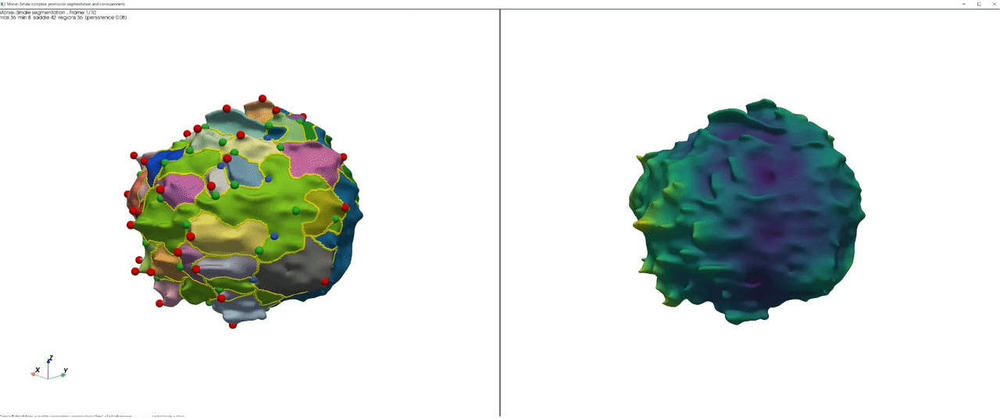

</details>


<details>
<summary><span style="font-size:23px;">Results and their interpretation</span></summary>

Folder layout of `Results/<scene>/MSComplexAnalysis/`:

* `MS_Complex/` — per frame: `MS_T####.pkl` (the complete complex), `Scalar_T####.npy` (the field), `Labels_T####.npy` (region of every vertex, identified by the vertex index of its maximum);
* `critical_points.csv`, `critical_points_detail.csv`, `plots/critical_points_evolution.png`;
* `MS_Graphs/` and `Graph_analysis/` — the critical-point graphs and the Reeb-graph analyses run on them (`time_analysis.csv`, `MS_Graphs_pairwise_graph_similarity.csv`, plots), documented in the <b>Reeb graph</b> and <b>Graph similarity</b> sections;
* `Protrusions/` — the convex-hull detection: tips, caps and their source per frame (`protrusions_detail.csv`, `hull_candidates.csv`) and a summary csv (`protrusions_summary.csv`); per frame `HullDepth_T####.npy` and `Core_T####.npy` in `MS_Complex/`;
* `Region_tracking/` — the dynamics: `region_lineage.csv`, `region_tracks.csv`, `critical_point_fates.csv`, `critical_point_trajectories.csv`, `tracking_summary.csv`, `fate_transition_counts.csv`, `long_fate_counts.csv`, `fate_meanings.json`, and the per-transition `mapped_T####_T####.npz` used by the viewer;
* `plots/` — `region_events_evolution.png`, `fate_transition_matrix.png`, `protrusion_lineage.png`, `critical_point_trajectories.png`, `protrusion_detection_evolution.png`.

`protrusion_detection_evolution.png` summarises the protrusion detection (see <b>Convex-hull protrusion detection</b>) frame by frame. Top panel: the number of protrusions as stacked areas by how they were found — **MS + hull (both)** (a Morse–Smale maximum confirmed by a convex-hull tip), **MS only** (a maximum of the scalar field without a hull tip) and **hull only** (recovered: a protrusion the scalar field missed, carved out of its Morse–Smale region) — with a dotted line for the protrusions **accepted by temporal support** (present in neighbouring frames). Bottom panel: the protrusion **cores** — the fraction of the surface covered by the cores (protrusion vs cell body) and their mean height relative to the equivalent radius of the cell. A growing "hull only" band means the scalar field alone misses protrusions (on the flanks, small, or on top of others); a gap between the stacked total and the dotted line means detections that do not persist in time.

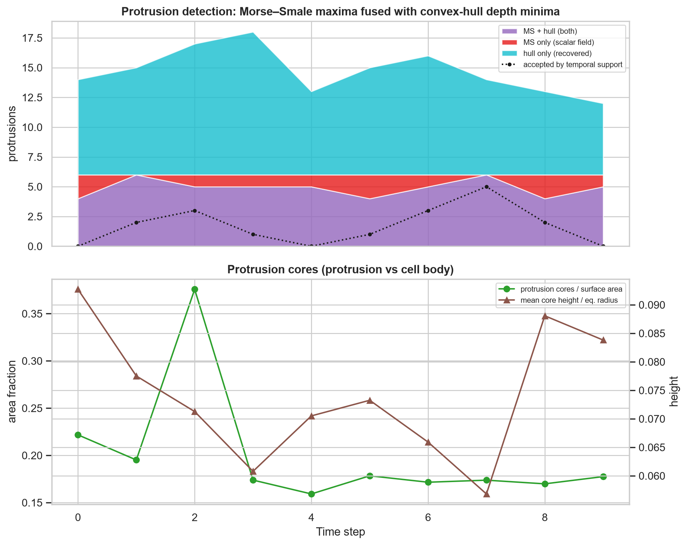


<details>
<summary><span style="font-size:21px;">Critical points per frame</span></summary>

`critical_points.csv` has one row per mesh. `n_max`, `n_min`, `n_saddle` are the simplified counts — for a `dist_centroid` field, `n_max` is the **number of protrusions** and `n_regions` equals it; `n_min` counts the pits (concave areas between protrusions); `euler_simplified` must be $2$ on a closed cell (a different value indicates holes or a non-manifold mesh, see the `topology` metrics of the basic geometry). The `*_raw` columns are the counts before simplification: their distance to the simplified ones measures how much of the surface detail is noise at the chosen persistence. `max_persistence_rel_mean` is the mean height of the protrusions relative to the field range: a rising value means the cell is becoming more protrusive, a falling one that it is rounding up. `n_ms_cells` grows when the surface develops more pits between the protrusions (a more corrugated surface). `critical_points_detail.csv` lists every critical point with its position, value, persistence and region area; `plots/critical_points_evolution.png` draws the three panels (simplified counts, raw counts with the Euler check, segmentation size and mean persistence).

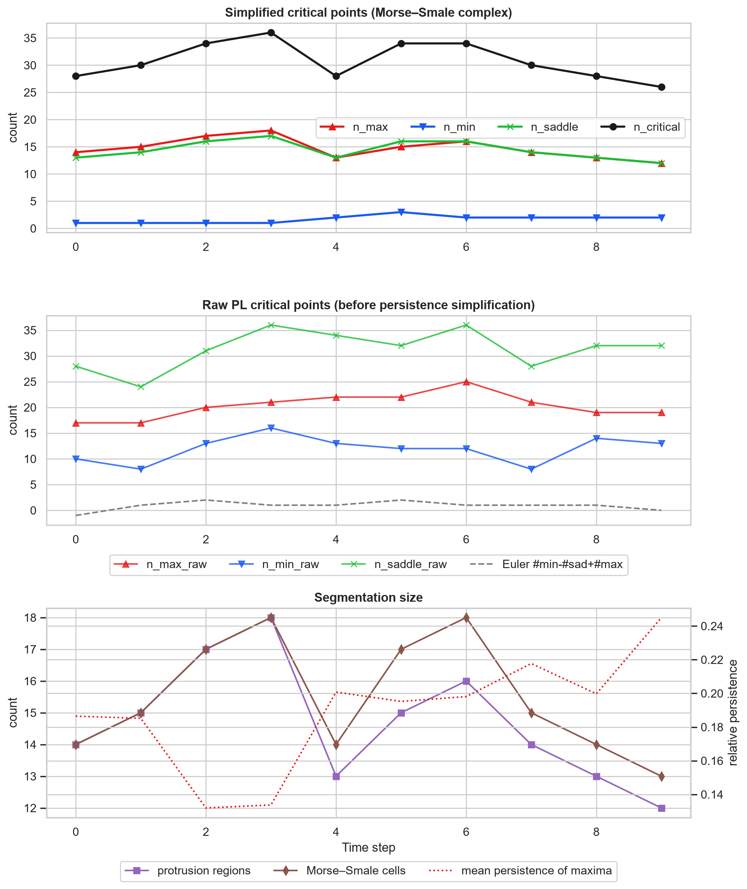

</details>

<details>
<summary><span style="font-size:21px;">Lineage of the protrusions</span></summary>

`region_lineage.csv` has one row per relation between a region of frame $t$ and a region of frame $t+1$, with the `event`:

* **continue** — the same protrusion (paired by IoU); `IoU` close to $1$ means it hardly moved or changed shape, `area_change_rel` its relative growth of territory, `persistence_prev/curr` its height before and after;
* **split** — one territory became two: a protrusion that branches, or a new protrusion emerging on the flank of an existing one (the child gets a new `curr_track_id`);
* **merge** — a territory was absorbed by a neighbour: the protrusion flattened and its surface was taken over by the neighbouring one (`overlap_fraction_prev` tells which share went where);
* **birth** — a region without a predecessor: a protrusion nucleated in a formerly flat area;
* **death** — a region whose surface has no significant successor.

`region_tracks.csv` summarises each `track_id` (first and last frame, mean area, mean IoU, number of splits and merges, mean normal growth, persistence at start and end), so the life of every protrusion can be read in one line. `tracking_summary.csv` counts the events per transition together with the mean IoU of the matched regions, the soft-transport confidence and the hard/soft agreement (low values flag transitions where the functional map itself is unreliable — check the diagonal analysis of that pair). `plots/region_events_evolution.png` plots the event counts, the fates of the extrema and the growth statistics over time; `plots/protrusion_lineage.png` is a timeline with one line per track (marker size = territory area, colour = normal growth of its peak, stars = births, crosses = deaths, oblique links = splits/merges).

<table>
  <!-- ROW 1 -->
  <tr>
    <td align="center">
      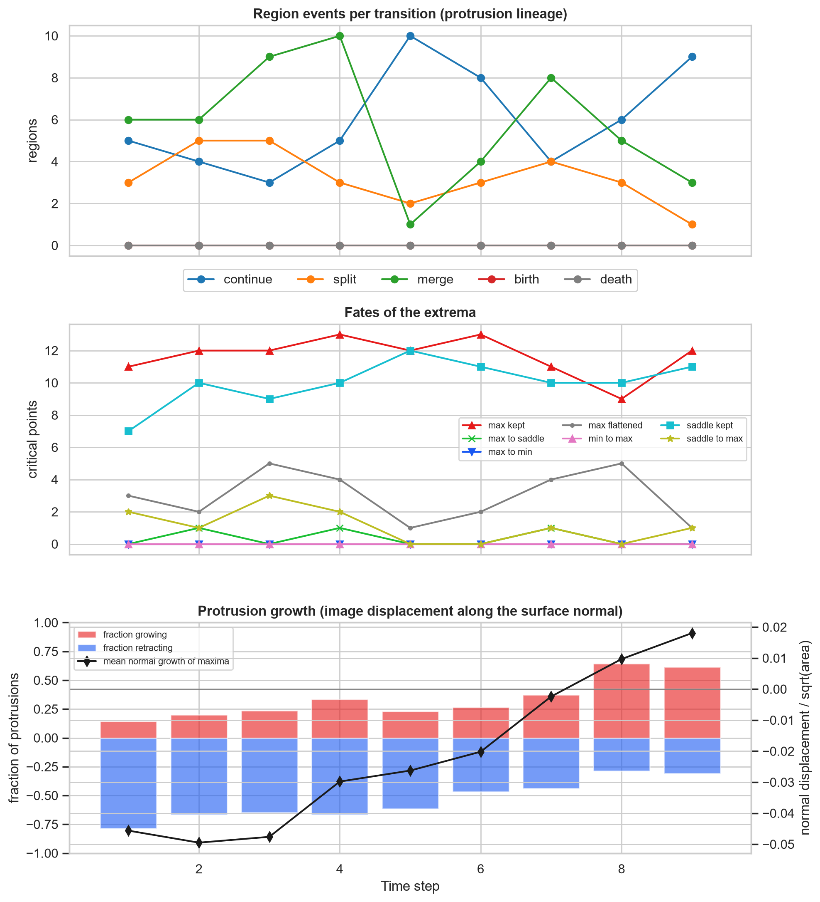<br />
    </td>
    <td align="center">
      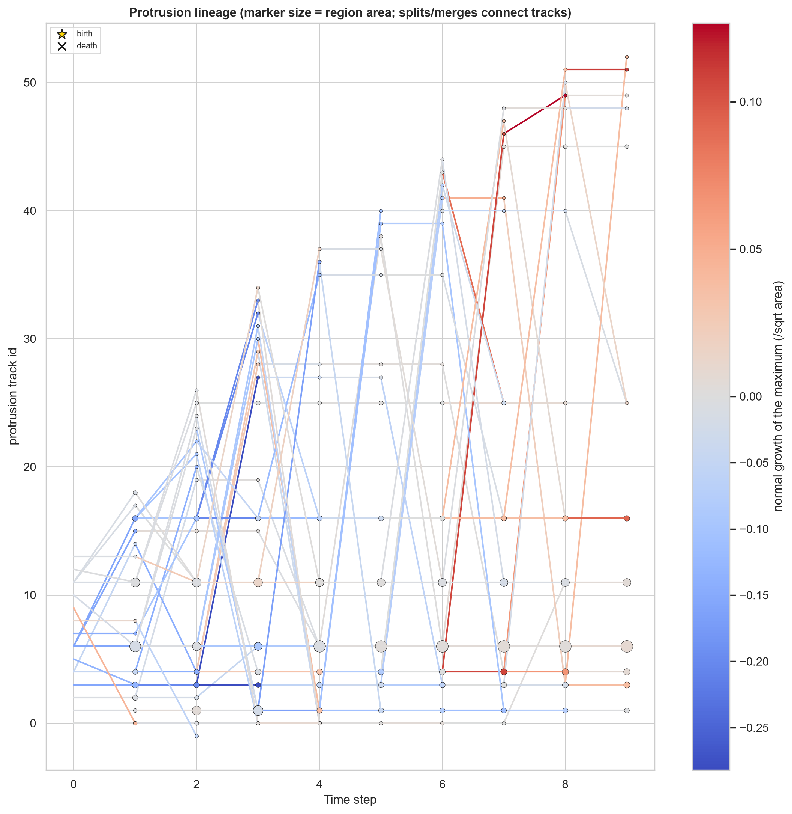<br />
    </td>
  </tr>
</table>


</details>

<details>
<summary><span style="font-size:21px;">Fates of the critical points and their meaning</span></summary>

`critical_point_fates.csv` has one row per critical point of frame $t$: its type, the type found at its image in frame $t+1$ (`type_next`), the geometric measures and a plain-language `meaning`. `fate_transition_counts.csv` and `plots/fate_transition_matrix.png` aggregate them over the sequence. The interpretation, for a field that increases toward the outside such as `dist_centroid`:

| type at $t$ | type at $t+1$ | meaning |
| --- | --- | --- |
| maximum | maximum | the protrusion persists; `growth` says whether its tip moved outward (**growing**), inward (**retracting**) or stayed (**stable**) |
| maximum | saddle | the protrusion was **absorbed laterally**: it no longer stands on its own, its former tip is now the pass toward a taller neighbouring protrusion (the two territories merged) |
| maximum | minimum | the protrusion **inverted**: the tip was pushed inward and became a pit — a local contraction / invagination |
| maximum | regular | the protrusion **flattened out** without becoming anything else |
| minimum | minimum | the indentation persists (`normal_displacement` tells whether it deepens or relaxes) |
| minimum | saddle | the pit **opened sideways**: it became the pass between two neighbouring pits or protrusions |
| minimum | maximum | the indentation **inverted** into a bulge — a new protrusion pushed out from a formerly concave area |
| minimum | regular | the indentation was **filled** |
| saddle | saddle | the ridge/pass between two protrusions persists |
| saddle | maximum | a **ridge rose** into a protrusion of its own — the signature of a protrusion splitting in two |
| saddle | minimum | the pass **sank** into a pit between the two protrusions it separated |
| saddle | regular | the pass smoothed out because the two regions it separated merged |
| any | lost | no correspondence could be found through the maps (usually a poor functional map for that pair) |

About the saddles: a maximum turning into a saddle is not a contraction. It is a **loss of independence** — the protrusion still bulges but has become part of a larger neighbour, its former tip being the lowest point of the ridge that joins them. Conversely saddle → maximum is the birth of independence: a bulge on a ridge becomes a protrusion with its own territory, which is exactly a **split** in the lineage. Reading the saddle transitions together with the split/merge events therefore separates protrusions that *retract* (max → regular / minimum, negative normal displacement) from protrusions that *coalesce* (max → saddle, merge) or *branch* (saddle → max, split).

Quantities attached to every fate row: `normal_displacement` (image displacement along the outward normal, in units of $\sqrt{\text{area}}$; the growth signal), `tangential_displacement` (sliding along the surface), `delta_persistence` (change of protrusion height), `delta_f_rel` and `delta_rank` (change of the field value in absolute and rank terms — rank is comparable between frames even when the field's scale drifts), `same_region` (whether the image still lies in its own matched territory), `image_rings` (how far the correspondence had to search; $0$ is an exact match).

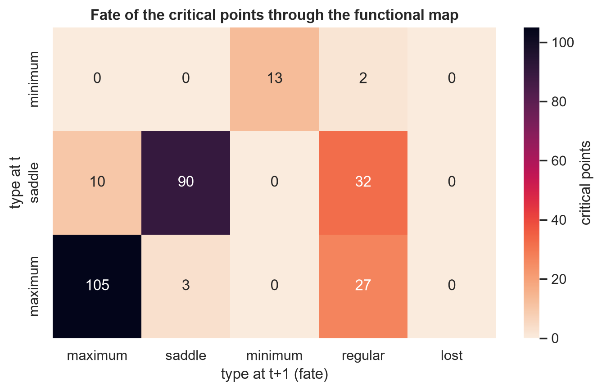

</details>

<details>
<summary><span style="font-size:21px;">Multi-frame trajectories</span></summary>

`critical_point_trajectories.csv` follows each critical point across the whole sequence: `type_sequence` (its type frame after frame, e.g. `maximum,maximum,regular,minimum,minimum`), `frames`, `vertices` (the critical vertex it is attached to) and `material_vertices` (the material point of its origin), `f_sequence`, `first_change_frame`, `cumulative_normal_disp` and the `long_fate` summary: **persistent** (or persistent (intermittent) when it briefly lost its type), **inverted (maximum → minimum)** / **(minimum → maximum)**, **absorbed (maximum → saddle)**, **flattened**, **saddle → extremum**. `long_fate_counts.csv` tallies them per original type and `plots/critical_point_trajectories.png` shows the type timeline as a coloured band per critical point (red maximum, green saddle, blue minimum, grey regular). This is the view to look at for slow processes: a protrusion that takes three frames to be pushed in appears per transition as "maximum → regular" and then nothing, but as a trajectory it is one inversion with a strongly negative cumulative normal displacement.

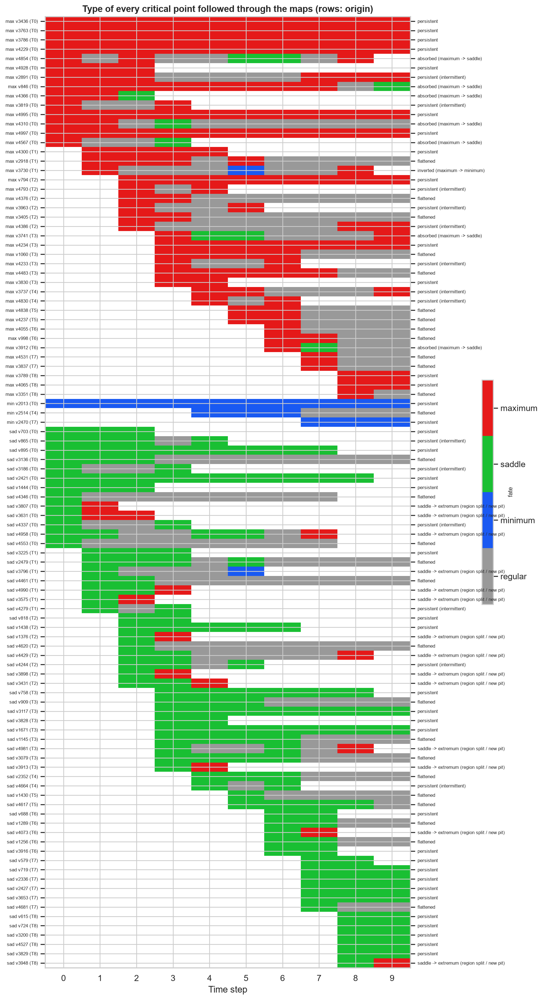
</details>

<details>
<summary><span style="font-size:21px;">Reading the whole picture</span></summary>

A cell that is spreading protrusions shows rising `n_max` and `max_persistence_rel_mean`, births and splits in the lineage, positive `mean_normal_growth` and mostly maximum → maximum (growing) fates. A cell that rounds up shows the opposite: falling counts and persistence, merges and deaths, negative growth, maximum → saddle / regular fates. Localised contractile events stand out as maximum → minimum fates and inverted trajectories at specific tracks, whose position (`x, y, z` in `critical_points_detail.csv`, colour in the viewer) tells where on the cell they happened. Because the segmentation is tied to a scalar field, the same machinery run with a curvature field reports tips and folds instead of protrusions, and with a heat or harmonic field reports the coarse lobes of the shape.

</details>
</details>
</details>

<a id="spherical-parametrization"></a>
<details>
<summary><strong><span style="font-size:25px;">Spherical Parametrization & SPHARM</span></strong></summary>

<details>
<summary><span style="font-size:23px;">General Overview</span></summary>

A closed surface without holes (a cell, an organ, most segmented objects) can be "inflated" onto a sphere: every point of the surface receives a position on the unit sphere, like the countries of the Earth on a globe. Once every frame lives on the same sphere, its shape can be written with **spherical harmonics** — the sphere's equivalent of the Fourier series. The first terms describe the coarse shape (size, elongation), the following ones finer and finer details (protrusions, wrinkles).

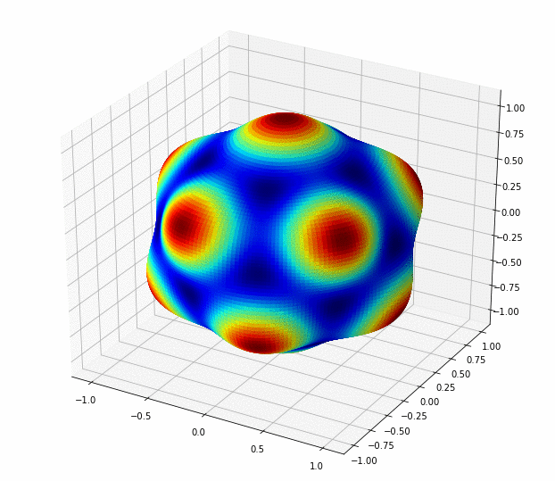

What you get:

* a **compact, comparable description of every shape**: a vector of coefficients per frame, the same length for all frames and all scenes;
* **smooth reconstructions** of every frame with as much detail as wanted (degree $L$);
* how the shape's "energy" is distributed between coarse and fine details, and how this changes in time (e.g. a cell that starts producing fine protrusions);
* the input of the shape-space analyses of the [Dynamic Analysis](#dynamic-analysis).

The parametrizations of consecutive frames are aligned through the functional maps, so the coefficients of different frames refer to the same parts of the shape and can be compared over time.


</details>

<details>
<summary><span style="font-size:23px;">Mathematical Construction Details</span></summary>

<details>
<summary><span style="font-size:21px;">Sphere map</span></summary>

For a genus-0 mesh $M$ we look for a bijective map $u: M \to \mathbb{S}^2$ that distorts the surface as little as possible. Angles and areas cannot both be preserved, so the construction combines two steps:

1. **Conformal initialisation** (`sphere_method='conformal'`): a stereographic harmonic map followed by alternating Schwarz sweeps on the two hemispheres, normalised with a true Möbius transformation of the ball, $u \mapsto \frac{(1-|a|^2)(u-a) - |u-a|^2 a}{1 - 2\langle a,u\rangle + |a|^2|u|^2}$, that moves the area centre to the origin without destroying conformality. `sphere_method='harmonic'` minimises the Dirichlet energy by projected gradient descent instead  and falls back to the conformal map if folds remain.
2. **Area correction**: minimisation of the spherical stretch energy.
$$E_S(u) = \sum_{\tau} \frac{|u(\tau)|^2}{|\tau|},$$
where $|\tau|$ is the area of a triangle of the mesh and $|u(\tau)|$ the area of its image on the sphere. Since $\sum_\tau |u(\tau)| = 4\pi$ is fixed, the Cauchy–Schwarz inequality shows that $E_S$ is minimal exactly when the area ratio $|u(\tau)|/|\tau|$ is the same for every triangle, i.e. when the map is equi-areal. It is minimised through a sequence of re-weighted harmonic problems on random hemispheres, with fold-over checks; every accepted step lowers the energy. `area_weight` $\in[0,1]$ moves the result from conformal ($0$) to equi-areal ($1$).

Quality per frame (`quality.csv`): fold-overs, angle and area distortion.


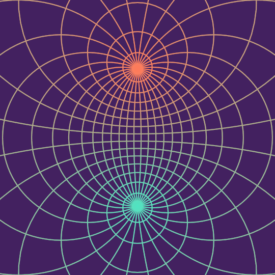


</details>

<details>
<summary><span style="font-size:21px;">Spherical harmonics expansion (SPHARM)</span></summary>

With $(\theta,\varphi)$ the spherical coordinates of $u(x)$, every coordinate function of the surface is expanded in real spherical harmonics up to degree $L$:
$$x(\theta,\varphi) \approx \sum_{l=0}^{L}\sum_{m=-l}^{l} c_{lm}\, Y_l^m(\theta,\varphi), \qquad c_{lm}\in\mathbb{R}^3,$$
solved by regularised least squares (`reg`). $l=0$ is the position of the shape, $l=1$ the best-fitting ellipsoid (size and orientation), $l\ge 2$ the shape details. The **degree energy** $E_l = \sum_m \|c_{lm}\|^2$ is invariant to rotations of the sphere and of space; its distribution over $l$ tells how much of the shape is coarse vs fine.

<table>
  <tr>
    <td align="center">
      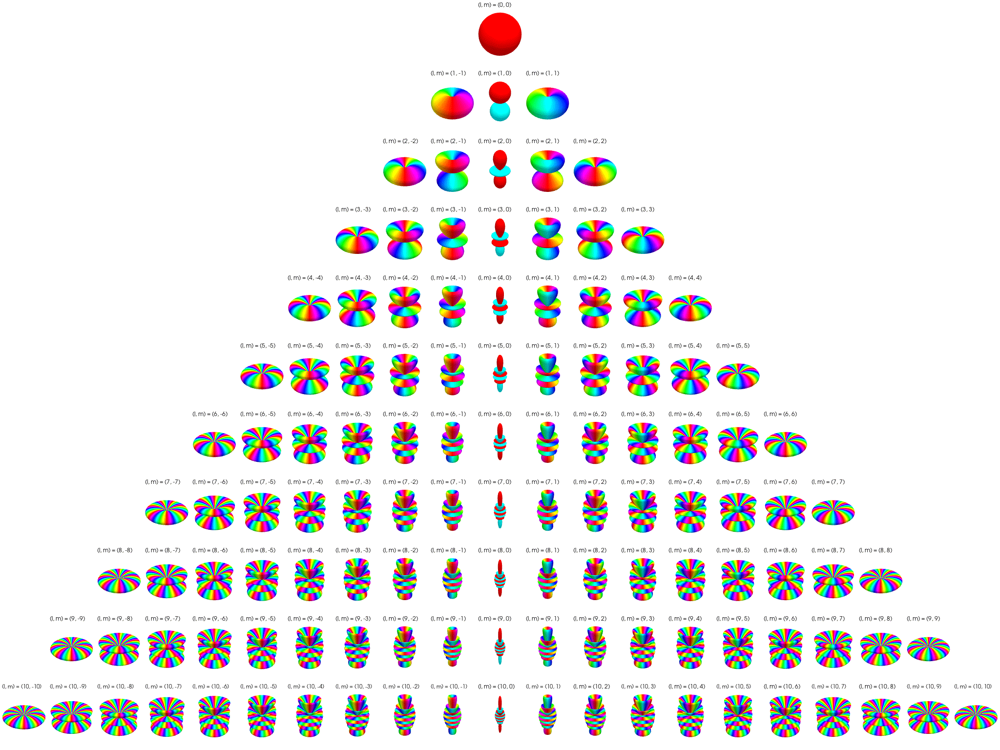<br />
    </td>
    <td align="center">
      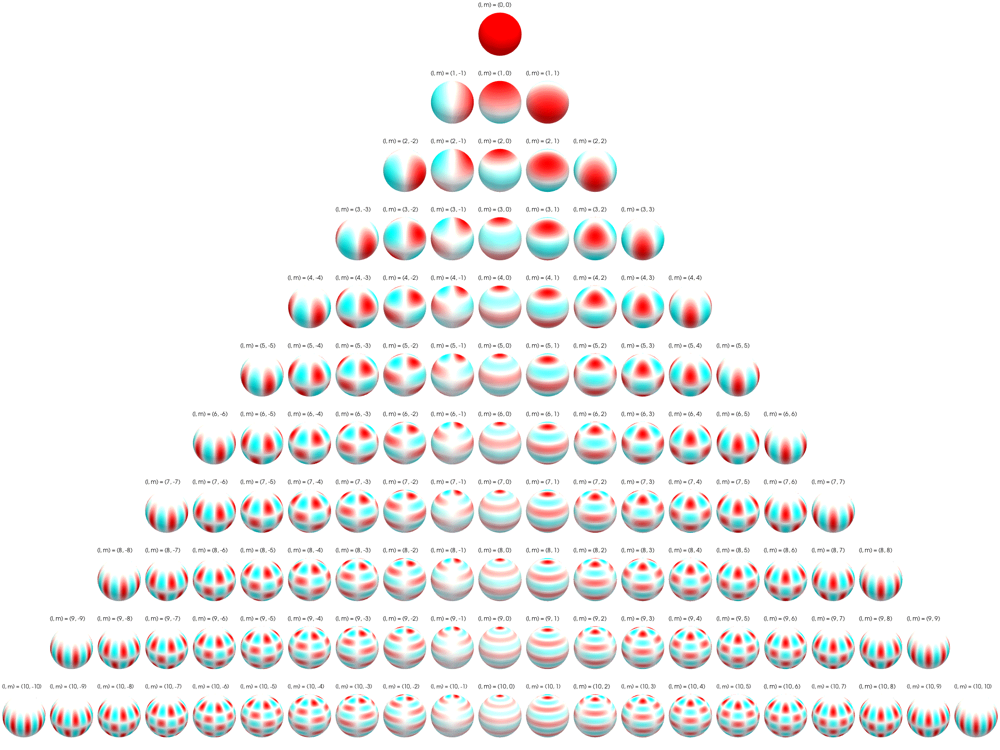<br />
    </td>
  </tr>
</table>

**Temporal alignment** (`align_with_p2p`): the sphere map of frame $t$ is rotated to agree, through the point-to-point map of the functional maps, with the sphere map of frame $t-1$; the aligned coefficients (`coeffs_consistent.npy`) therefore describe the same parts of the shape in every frame. `temporal_weight` adds a soft temporal coherence term.

**Manifold harmonics**: the same idea with the intrinsic basis of the surface, the Laplace–Beltrami eigenfunctions $\phi_k$ ($\Delta\phi_k = \lambda_k\phi_k$, `mh_modes` of them): coefficients $\langle x, \phi_k\rangle_M$ and the reconstruction error as a function of the number of modes. The eigenvalues $\lambda_k$ are also the Shape-DNA used later.

**Symbolic expression**: the low-degree expansion (`symbolic_degree`) is also written as a closed formula of $(\theta,\varphi)$ (folder `symbolic/`).

</details>

<details>
<summary><span style="font-size:21px;">High-degree SPHARM: fast spherical harmonic transform</span></summary>

The least-squares fit builds a dense matrix with one row per vertex and $(L+1)^2$ columns, so it is limited to moderate degrees ($L\approx 25$). That is enough for cells, but not for shapes with long thin parts (legs, tails): an (almost) equi-areal sphere map sends them to thin strips of the sphere, and a strip of angular width $w$ needs a degree $L\sim\pi/w$ — typically 64–128 for an animal.

A **spherical harmonic transform** (SHT) avoids the dense matrix: the coordinate functions are resampled (barycentrically, inside the spherical triangles of the sphere map) on a Gauss–Legendre grid of $n_\theta\times n_\varphi$ points, and
$$c_{lm} = \int_{\mathbb{S}^2} f\,\overline{Y_l^m}\,d\Omega \approx \sum_j w_j\, \Theta_{lm}(\theta_j)\; \frac{2\pi}{n_\varphi}\sum_k f(\theta_j,\varphi_k)\,e^{-im\varphi_k}$$
is an FFT in longitude followed by a Gauss–Legendre quadrature in latitude, $O(L^3)$ instead of $O(n L^4)$. It runs on the GPU with NVIDIA [torch-harmonics](https://github.com/NVIDIA/torch-harmonics) when installed (validated once against the reference transform), otherwise with the same NumPy transform. The coefficients are orthonormal complex harmonics with $m\ge 0$ (Condon–Shortley phase); the reconstruction error is computed on the vertices with the same definition as the least-squares SPHARM, so both can be compared directly.

Example (quadruped with four thin, bent legs, 7 670 vertices): least squares $L=25$: 5.4 % relative error; fast SHT $L=64$: 3.3 %, $L=128$: 1.4 %, in 2.3 s per frame on the CPU. At equal degree the least-squares fit is slightly more accurate (it fits the vertices exactly in the least-squares sense); the transform wins because the degree can grow.

</details>
</details>

<details>
<summary><span style="font-size:23px;">Parameters</span></summary>

```python
run_pipeline(path_str, compute_parametrization=True, param_params={...})
```

Flag to compute the parametrization (requires the functional maps on disk when `align_with_p2p=True`):
```python
compute_parametrization (bool) : False
```

Options of `param_params` (all optional):

| key | default | meaning |
|---|---|---|
| `sphere_method` | `'conformal'` | sphere map initialisation: `'conformal'` (recommended, robust) or `'harmonic'` |
| `area_weight` | `0.7` | area correction: 0 = conformal, 1 = equi-areal; 0.6–0.8 gives the lowest reconstruction errors |
| `temporal_weight` | `0.0` | soft temporal coherence of the sphere maps |
| `L_max` | `25` (execution example) | highest SPHARM degree: higher = more detail, more coefficients ($(L+1)^2$ per coordinate); `'auto'` = chosen from the geometry within the memory (see below) |
| `reg` | `1e-6` | Tikhonov regularisation of the least-squares fit |
| `mh_modes` | `80` | number of manifold-harmonic modes; `'auto'` = chosen from the geometry within the memory (see below) |
| `auto_target_error` | `0.02` | relative reconstruction error aimed at by the `'auto'` choices |
| `memory_fraction` | `0.6` | fraction of the free GPU / CPU memory the parametrization may use |
| `export_degrees` | `()` | degrees whose reconstructions are exported as OBJ, e.g. `(4, 8, 15)` |
| `sphere_subdiv` | `'auto'` | resolution of the sphere grid used for reconstructions (`'auto'`: level 5 for $L\le 40$) |
| `symbolic_degree` | `3` | degree of the symbolic (closed-form) expansion |
| `align_with_p2p` | `True` | temporal alignment through the functional maps |
| `planar_if_disk` | `True` | open surfaces (one boundary) are mapped to the disk instead of the sphere |
| `high_degree` | `True` | also compute the high-degree SPHARM with the fast spherical harmonic transform |
| `hd_lmax` | `'auto'` | its degree; `'auto'` adapts to the mesh resolution (32–160), complex shapes need 64–128 |
| `sht_backend` | `'auto'` | `'auto'` (torch-harmonics on the GPU when installed, else NumPy), `'torch'` or `'numpy'` |
| `plots` | `True` | write the plots |

<b>Shape complexity and cost.</b> The more complex the shape (long thin limbs, many protrusions, fine surface detail), the higher the `L_max` and the more manifold-harmonic modes (`mh_modes`) it needs to be reconstructed with the same accuracy — and the more memory and computing time they require (the SPHARM fit grows roughly with $(L+1)^4$). Simple, compact shapes (e.g. rounded cells) are reconstructed accurately with a low `L_max` and few modes, so they are computed quickly and with little memory. The `'auto'` options below choose these values from the shape itself, within the available memory.

<b>Automatic degree and number of modes, within the memory.</b> The cost of the SPHARM fit grows quickly with the degree: the least-squares basis holds $n\,(L+1)^2$ values and the normal equations $(L+1)^4$, so the memory is roughly $8\,(3n(L+1)^2 + 2(L+1)^4)$ bytes — about 0.1 GB at $L=25$ but 2 GB at $L=100$ for 5000 vertices, and impossible for very large $L$. Two limits are therefore computed first: the **memory limit** (the largest $L$ whose fit fits in `memory_fraction` of the free memory of the GPU — or the CPU without GPU) and the **vertex limit** (at least two vertices per unknown, $(L+1)^2 \le n/2$).

* `L_max='auto'`: the smallest degree whose fit reaches `auto_target_error` on the first frame — the error is the one reported in `reconstruction_error.csv` (area-weighted on the surface, so thin parts squeezed by the sphere map count fully); it decreases with $L$, so it is found by bisection with real fits (about $\log_2 L$ fits on one frame). Complex shapes (long thin limbs, many protrusions) need a higher degree. When the target is not reachable within the limits, the highest possible degree is used and a message says so (the detail of SPHARM is then limited by the memory or the resolution of the mesh).
* `mh_modes='auto'`: the fewest manifold-harmonic modes reaching `auto_target_error` on the first frame (the eigenbasis grows 40 → 600), within the memory.
* An explicit number larger than the limits is reduced, with a message (`L_max=500000000` → the largest feasible degree).

Every decision — requested, needed, memory and vertex limits, chosen, expected error, tested degrees and the estimated peak memory — is written to `Parametrization/auto_parameters.json`. Example (camel, 5002 vertices): a 6 % target gives $L=31$ (achieved 5.8 %) and 43 modes; a 2 % target is not reachable by SPHARM with 5002 vertices (best $L=49$, 3.8 %) but gives 190 manifold-harmonic modes (2.0 %).

**Memory between frames.** The memory of every frame (basis, eigenvectors, and the GPU blocks that CuPy's memory pool would otherwise keep) is released at the end of the frame, so every frame starts with the same free memory as the first one. The regulariser of the fit is added on the diagonal in place (no dense $(L+1)^2 \times (L+1)^2$ matrix) and the manifold-harmonic error curve is computed incrementally.

</details>

<details>
<summary><span style="font-size:23px;">Results</span></summary>

`Results/<scene>/Parametrization/`:

* `Spherical/sphere_T####.npy` — the sphere position of every vertex; `quality.csv` — fold-overs and distortion per frame;
* `SPHARM/coeffs_T####.npy`, `coeffs_consistent.npy` (temporally aligned, $T \times (L+1)^2 \times 3$), `reconstruction_error.csv` (error vs degree), `spharm_degree_energy.csv` (energy per degree and frame), `basis_info.json`, reconstructions `reconstruction_T####_L##_mesh.obj` for `export_degrees`;
* `SPHARM_HD/` — high-degree SPHARM: `coeffs_T####.npy` ($3\times(L+1)\times(L+1)$ complex), `coeffs_hd_consistent.npy`, `reconstruction_error.csv` (same format as the least-squares one), `degree_energy.csv`, `hd_info.json` (backend, device, degree, grid); plot `5_spharm_high_degree_error.png` compares both fits;
* `ManifoldHarmonics/` — eigenvalues, coefficients and `mh_reconstruction_error.csv`;
* `symbolic/` — closed-form low-degree expansions;
* `plots/` — reconstruction error, degree energy, manifold-harmonics error, sphere-map quality;
* `output_log.txt` — the complete console output of the stage.

How to read them: a small reconstruction error at moderate $L$ means the shape is smooth; energy moving towards higher degrees over time means the shape develops finer features (sharpening, new protrusions), towards lower degrees that it rounds off.

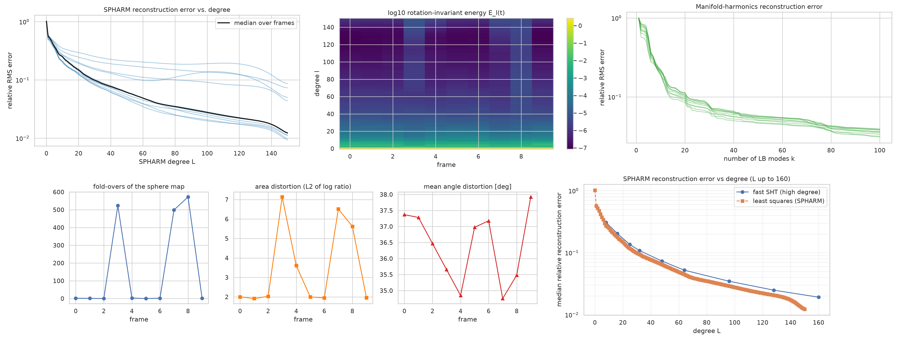

Viewer:
```python
from PynamicMesh.utils.dynamics_visualizers import visualize_parametrization
visualize_parametrization(mesh_path, results_path)      # results_path = Results/<scene>
```

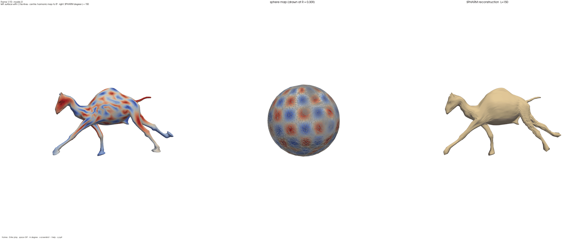
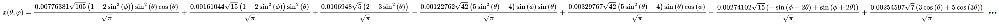

</details>
</details>


<a id="trajectories"></a>
<details>
<summary><strong><span style="font-size:25px;">Trajectories & Interpolation</span></strong></summary>

<details>
<summary><span style="font-size:23px;">General Overview</span></summary>

The meshes of a time-lapse are usually independent: every frame has its own vertices and triangles. To follow *the same material point* through time, PynamicMesh **tracks the first mesh (the reference) through the whole sequence**: its vertices are moved, frame after frame, onto the surface of every later frame, guided by the functional maps. The result is a single deforming mesh with a fixed triangulation — every vertex has a trajectory.

On top of these trajectories the stage

* **interpolates** the motion between the observed frames (several schemes, from straight lines to rotation-aware as-rigid-as-possible interpolation) to obtain smooth animations at any time resolution;
* **validates** every scheme by hiding one frame at a time and predicting it from the others, so you know which interpolation describes your data best;
* computes the **kinematics** of every point (speed, acceleration, path length, curvature of the path, tortuosity) and of the surface (local stretching, rigidity).

Without care, strongly moving thin parts (legs, protrusions) get distorted triangles: errors of the correspondences accumulate, vertices slide along the surface and position-based interpolation shortens rotating parts. Two mechanisms keep the mesh intact: the robust **ARAP tracking** and the **rigidity projection**, which restores the local shape of the reference mesh in every frame while following the motion.


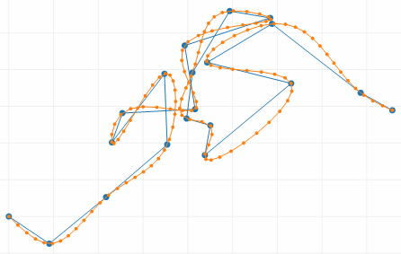


</details>

<details>
<summary><span style="font-size:23px;">Mathematical Construction Details</span></summary>

<details>
<summary><span style="font-size:21px;">Tracking the reference mesh</span></summary>

`trajectory_method='arap_tracking'` (default) registers the reference mesh $X_0 = M_{t_0}$ to every frame in turn, starting from its registration $X_{k-1}$ to the previous frame:

1. **Prediction**: every vertex is moved by the displacement field of the single transition $M_{t_{k-1}} \to M_{t_k}$ given by the functional map (no composition of maps, so errors do not accumulate): $\hat{x}_i = x_i^{k-1} + d_{k-1}(x_i^{k-1})$.
2. **Robust as-rigid-as-possible fit**:
$$\min_X \; (1-\beta)\,E_{\text{ARAP}}(X;X_{k-1}) + \beta\,E_{\text{ARAP}}(X;X_0) + \mu\sum_i w_i \|x_i - \hat{x}_i\|^2,$$
where $E_{\text{ARAP}}(X;V)=\sum_i\sum_{j\in N(i)} w_{ij}\|(x_i-x_j)-R_i(v_i-v_j)\|^2$ measures how far every one-ring is from a rotated copy of the rest shape $V$. The previous state lets genuine non-isometric change (growth) accumulate; the reference term $\beta$ (`reference_rigidity`, "elastic memory") stops small distortions from accumulating. The weights $w_i$ are re-estimated with a Cauchy loss, so wrong matches of the map are discarded.
3. **Refinement**: point-to-plane attraction to the true surface of frame $k$ (ICP) where the normals agree.

`trajectory_method='chain'` reproduces the earlier behaviour (maps composed back to frame 0, harmonic filling of the vertices that receive no match); kept for comparison.

</details>

<details>
<summary><span style="font-size:21px;">Rigidity projection (as-rigid-as-possible surface modeling)</span></summary>

Every key frame and every interpolated frame $X_t$ is replaced by
$$P_t = \arg\min_P \sum_i \sum_{j\in N(i)} w_{ij}\,\big\|(p_i-p_j) - s_i R_i (v_i - v_j)\big\|^2 + \mu \sum_i \|p_i - x_i(t)\|^2,$$
with $v$ the reference mesh, $w_{ij}$ its cotangent weights, $R_i$ the best rotation of every one-ring (local step: SVD of the edge covariance) and $s_i = 1$ (`mode='arap'`) or the best uniform scale of the one-ring (`mode='asap'`, as-similar-as-possible: growth allowed, shear and sliding forbidden). The global step solves $(L+\mu I)P = b(R) + \mu X_t$ with a matrix that does not depend on the frame: it is factored once for the whole sequence. The motion is kept (data term), the local shape of the reference is restored (rigidity term).

Integrity diagnostics without ground truth (`integrity.csv`): edge-length change, scale-free local shape change (RMS of $\log(L/L_0)$) and fraction of degraded triangles, before and after the projection.

</details>

<details>
<summary><span style="font-size:21px;">Interpolation schemes</span></summary>

| scheme | idea | when to use it |
|---|---|---|
| `linear` | straight segments between frames | reference / very dense time-lapses |
| `hermite_catmull_rom`, `hermite_finite_difference`, `kochanek_bartels` | cubic Hermite curves through the frames, tangents from neighbouring frames (Kochanek–Bartels: tension / bias / continuity) | smooth motion, robust default |
| `natural_cubic`, `bspline` | global cubic splines ($C^2$) | very smooth, slowly varying motion |
| `arap_rigid`, `arap_polar` | as-rigid-as-possible shape interpolation (Alexa et al. 2000): per-cell affine maps between key frames, polar decomposition $A = RS$, rotations interpolated on $SO(3)$ and stretches in log-Euclidean space, surface rebuilt by a Poisson solve | large rotations between frames (legs, swinging protrusions) |

Interpolation is evaluated at `substeps` sub-intervals inside every observed interval (with real, possibly irregular frame times, see [Time Between Frames](#time-between-frames)).

**Leave-one-out validation**: for every interior frame $k$ the scheme is fitted without frame $k$ and the prediction compared with $X_k$ (RMS error, relative error). The scheme with the lowest median relative error describes the data best.

</details>

<details>
<summary><span style="font-size:21px;">Kinematics</span></summary>

For every vertex trajectory $x(t)$: velocity $\dot{x}$, acceleration $\ddot{x}$, speed $|\dot{x}|$, Frenet curvature $\kappa = |\dot{x}\times\ddot{x}|/|\dot{x}|^3$ and torsion of the path, path length $\int|\dot{x}|\,dt$ and tortuosity (path length / net displacement). For the surface: Green–Lagrange strain of every triangle w.r.t. the reference, ARAP energy (deviation from rigid motion) and volumetric change $J$. With known frame times all values are in physical units (length / s, …).

</details>
</details>

<details>
<summary><span style="font-size:23px;">Parameters</span></summary>

```python
run_pipeline(path_str, compute_trajectories=True, traj_params={...})
```

Flag (requires the functional maps on disk or computed in the same run):
```python
compute_trajectories (bool) : False
```

Main options of `traj_params`:

| key | default | meaning |
|---|---|---|
| `trajectory_method` | `'arap_tracking'` | `'arap_tracking'` (recommended) or `'chain'` (previous behaviour) |
| `tracking_params` | see below | options of the ARAP tracking |
| `rigidity_params` | see below | options of the rigidity projection |
| `schemes` | all eight | interpolation schemes to compute |
| `substeps` | `4` | interpolated frames inside every observed interval |
| `validate` | `True` | leave-one-out ranking of the schemes (`validation_schemes` to choose them) |
| `kinematics` | `True` | kinematic quantities |
| `export_obj` | `True` | dense OBJ sequence of every scheme (large on long sequences) |
| `plots` | `True` | write the plots |

`tracking_params`:

| key | default | meaning |
|---|---|---|
| `reference_rigidity` | `0.5` | elastic memory $\beta$: 0 = purely incremental, 1 = rigid w.r.t. the reference; lower (0.2–0.3) for strongly growing cells |
| `data_weight` | `0.5` | pull towards the map prediction (higher = follow the maps more) |
| `icp_rounds`, `icp_weight` | `3`, `1.0` | refinement on the true surface of every frame (0 rounds = maps only) |
| `robust_rounds`, `robust_scale` | `3`, `2.5` | rejection of wrong map matches (lower scale = stricter) |
| `arap_iters` | `6` | ARAP iterations per solve |
| `normal_threshold`, `max_icp_distance` | `0.3`, `4.0` | closest points with disagreeing normals or farther than this × mean edge are ignored |
| `inpainted_confidence` | `0.25` | confidence of predictions from vertices the map did not reach |

`rigidity_params`:

| key | default | meaning |
|---|---|---|
| `enabled` | `True` | `False` restores the previous behaviour |
| `mode` | `'asap'` | `'arap'` for near-isometric motion (walking animals), `'asap'` when the shape grows |
| `data_weight` | `0.005` | lower = more rigid (cleaner triangles), higher = closer to the input |
| `iterations` | `15` | local/global iterations per frame |
| `keyframes`, `interpolations` | `True`, `True` | project the observed frames / every interpolation |

</details>

<details>
<summary><span style="font-size:23px;">Results</span></summary>

`Results/<scene>/Trajectories/`:

* `trajectories.npy` ($T\times n_0\times 3$, the tracked reference mesh), `reference_faces.npy`, `time.npy`, `frame_names.txt`, `trajectories_raw.npy` (before the rigidity projection);
* `tracking.csv` (map inliers, surface distance per frame), `coverage.csv`, `integrity.csv`;
* `interpolation/<scheme>.npy` + `query_times.npy` (dense trajectories), `interpolation/raw/`, `validation.csv`, `arap_polar_diagnostics.csv`, OBJ sequences;
* `kinematics/` — `summary.csv`, `strain.csv`, `arap_energy.csv`, per-frame `kinematics_T####.vtp`, `velocity.npy`;
* `displacements/` — mesh-to-mesh displacement fields;
* `plots/` — kinematics, path statistics, strain, interpolation validation, tracking, mesh integrity;
* `info.json`, `output_log.txt`.


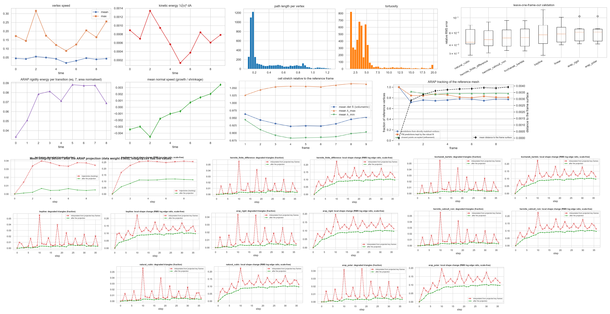


Viewers:
```python
from PynamicMesh.utils.dynamics_visualizers import visualize_trajectories, visualize_dynamic_trajectories, visualize_interpolation

visualize_trajectories(results_path, mesh_path=mesh_path, scheme='arap_polar')        # displacements, paths, ghost stack
visualize_dynamic_trajectories(results_path, mesh_path=mesh_path, scheme='arap_polar') # particles moving along the paths
visualize_interpolation(results_path, 'arap_polar', compare_with='hermite_catmull_rom', mesh_path=mesh_path)
```
In the trajectory views, single trajectories can be selected by clicking on their points (see the `i` window). Without `scheme` the best-validated scheme is used.

<table>
  <!-- ROW 1 -->
  <tr>
    <td align="center">
      <br />
      <sub>Natural Cubic</sub>
    </td>
    <td align="center">
      <br />
      <sub>Linear</sub>
    </td>
    <td align="center">
      <br />
      <sub>Kochanek Bartels</sub>
    </td>
  </tr>
  
  <!-- ROW 2 -->
  <tr>
    <td align="center">
      <br />
      <sub>Hermite Finite Difference</sub>
    </td>
    <td align="center">
      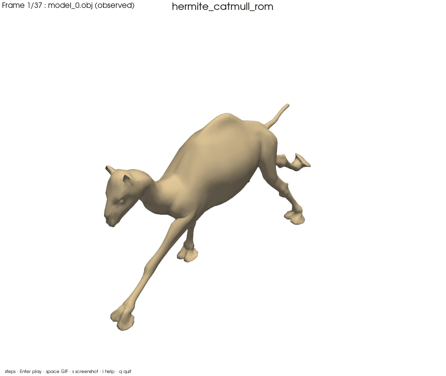<br />
      <sub>Hermite catmull rom</sub>
    </td>
    <td align="center">
      <br />
      <sub>ARAP Rigid</sub>
    </td>
  </tr>

  <!-- ROW 3 -->
  <tr>
    <td align="center">
      <br />
      <sub>Bspline</sub>
    </td>
    <td align="center">
      <br />
      <sub>ARAP Polar</sub>
    </td>
    <td align="center">
      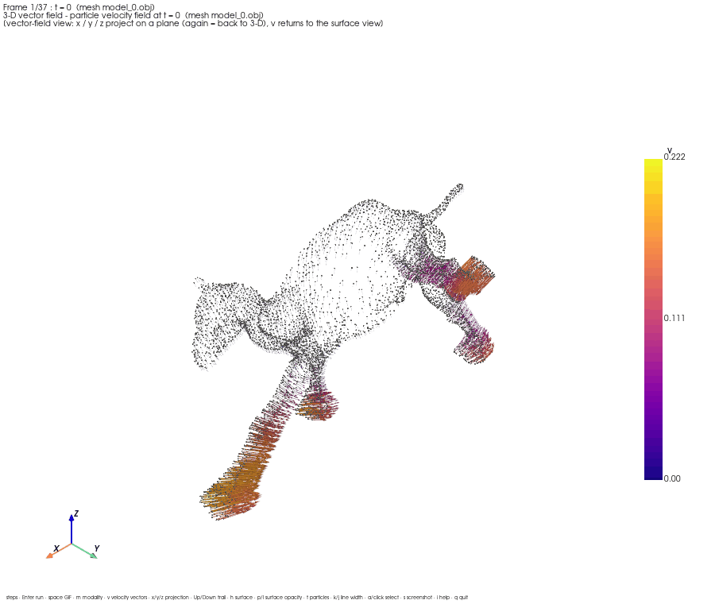<br />
      <sub>Directional Vectors</sub>
    </td>
  </tr>

  <!-- ROW 4 -->
  <tr>
    <td align="center">
      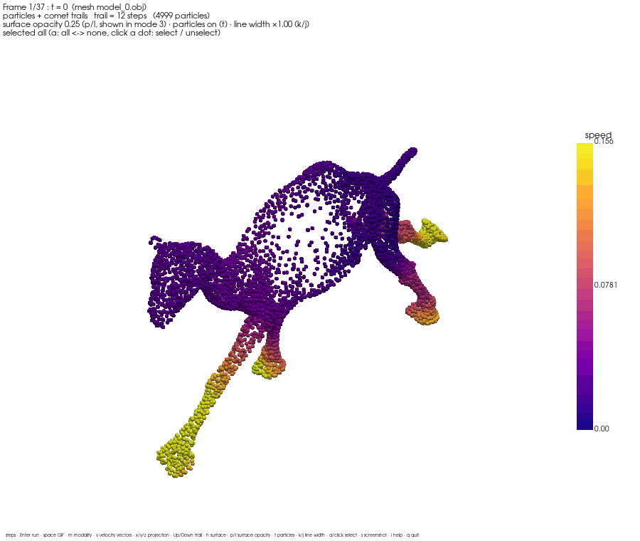<br />
      <sub>Comet Trail</sub>
    </td>
    <td align="center">
      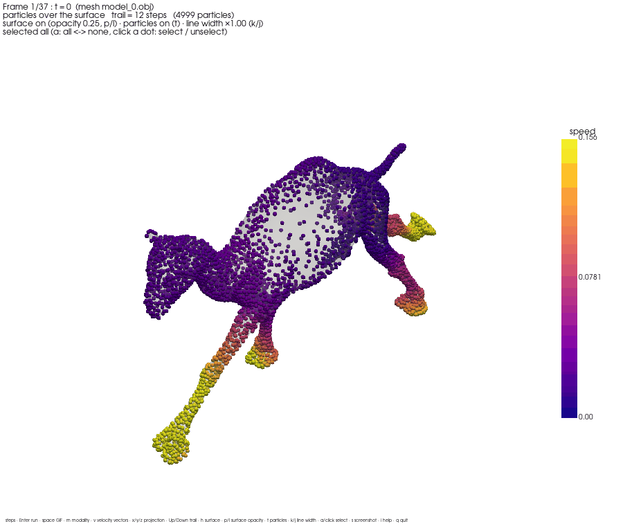<br />
      <sub>Particles over Surface</sub>
    </td>
    <td align="center">
      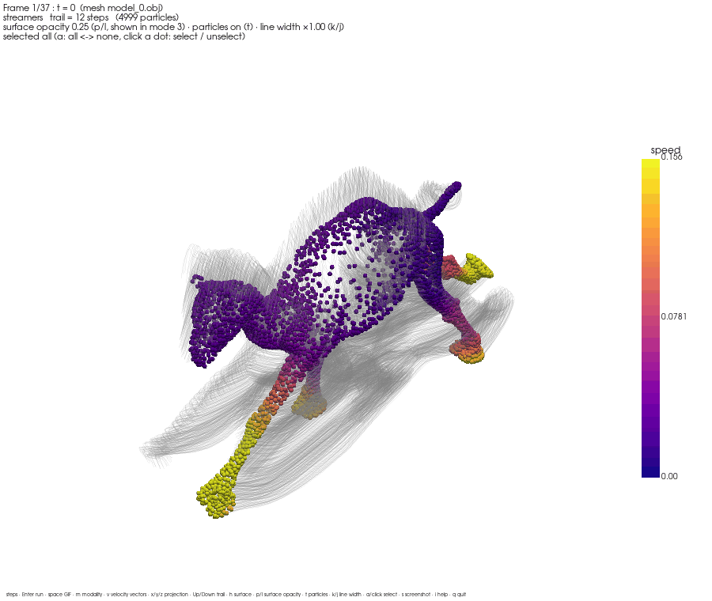<br />
      <sub>Trajectory Streamers</sub>
    </td>
  </tr>

  <!-- ROW 5 -->
  <tr>
    <td align="center">
      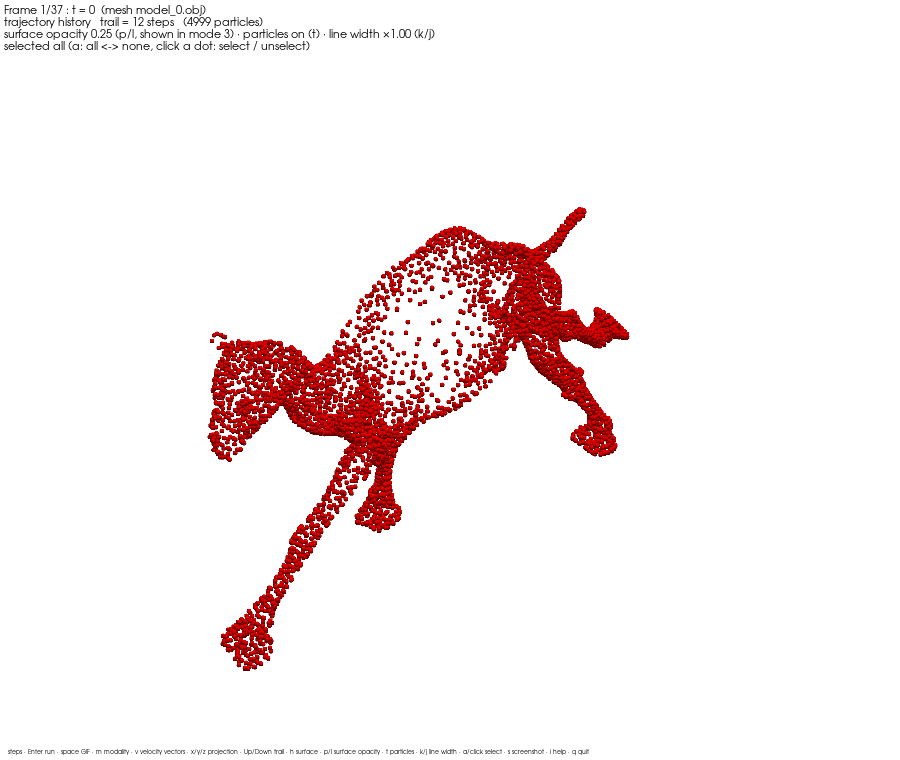<br />
      <sub>Velocity</sub>
    </td>
    <td align="center">
      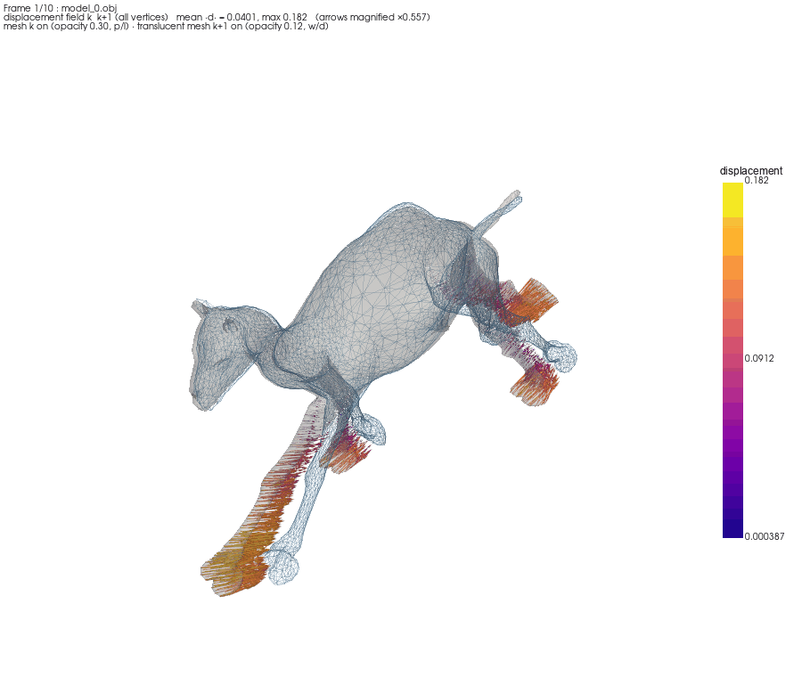<br />
      <sub>Trajectory Filed</sub>
    </td>
    <td align="center">
      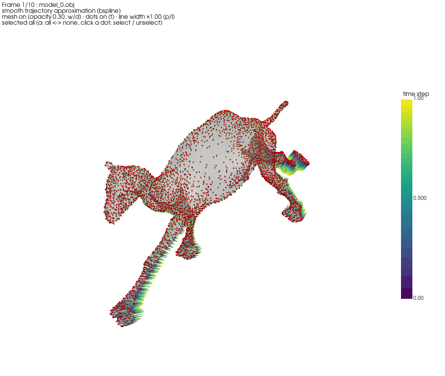<br />
      <sub>Bspline Trajectory</sub>
    </td>
  </tr>

  <!-- ROW 6 -->
  <tr>
    <td align="center">
      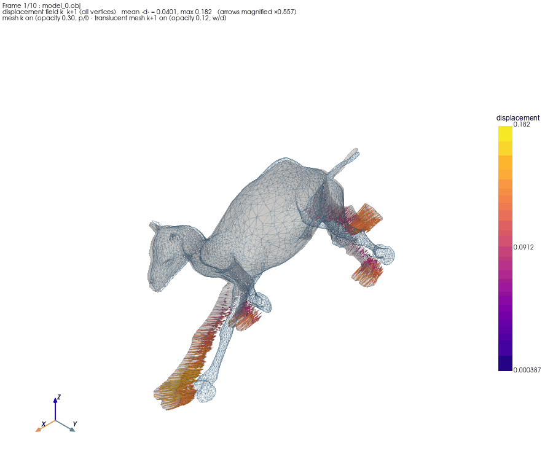<br />
      <sub>Trajectory Vector</sub>
    </td>
    <td align="center">
      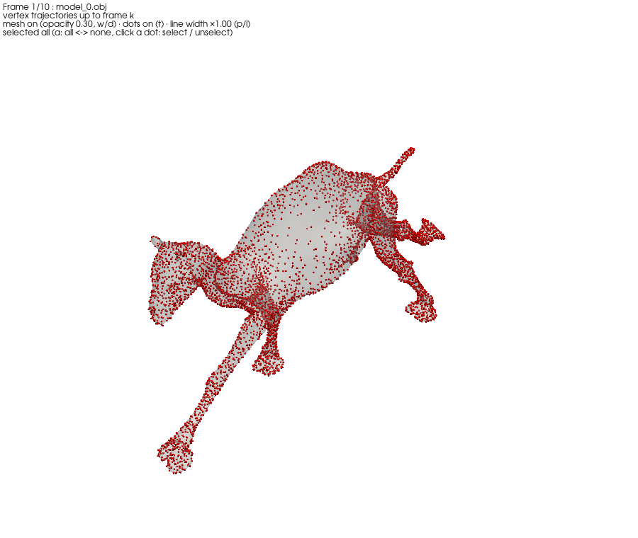<br />
      <sub>Vertex Trajectory</sub>
    </td>
    <td align="center">
      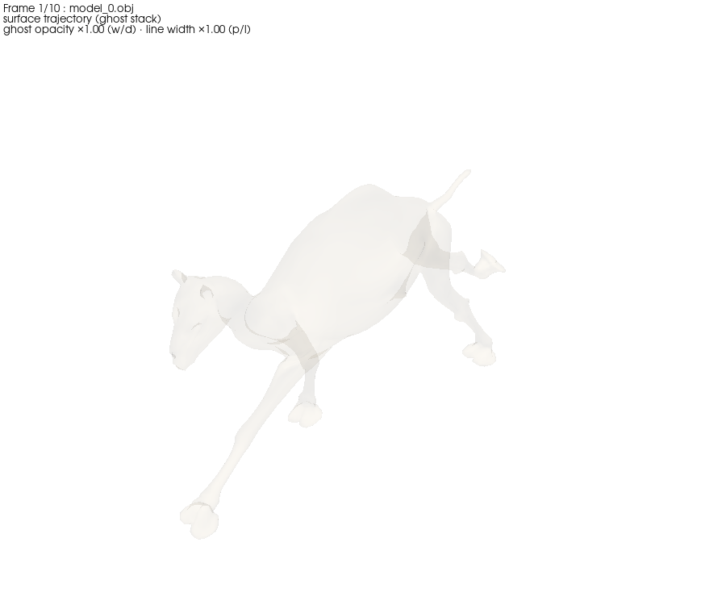<br />
      <sub>Gosht Stack</sub>
    </td>
  </tr>
</table>

</details>
</details>

<a id="graph-animation"></a>
<details>
<summary><strong><span style="font-size:25px;">Graph Animation</span></strong></summary>

<details>
<summary><span style="font-size:23px;">General Overview</span></summary>

A Reeb graph or a Morse–Smale critical-point graph describes the skeleton or the protrusions of **one** frame. The graph animation attaches the graph of a chosen frame to the moving surface of the [Trajectories](#trajectories), so the skeleton **moves with the shape** over the whole sequence, also between the observed frames. You then see how every branch bends, stretches and swings, and — comparing the moving graph with the graph actually computed on every frame — *when the structure itself changes* (a branch appears or disappears) and not only moves.


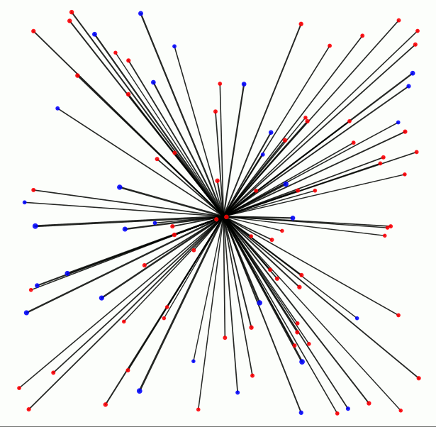


</details>

<details>
<summary><span style="font-size:23px;">Mathematical Construction Details</span></summary>

Every node is written as a fixed linear combination of reference vertices (its **anchor**), so that its position at any time $t$ is $p(t) = \sum_i a_i\, x_i(t)$ with $x_i(t)$ the tracked trajectories:

* Reeb node with a vertex set $S$: $a_i = 1/|S|$ for $i\in S$ (the node is the mean of its level-set component);
* node without vertices (on an iso-line inside a triangle): the barycentric weights of that triangle;
* Morse–Smale critical point: the vertex itself; the `center` node: the area-weighted centre of the moving surface, recomputed at every step.

The vertices of the chosen frame are mapped to the reference mesh through its registration, so any frame can be animated. All steps are computed as one sparse product $A\,X$ (GPU when available).

Measures: node speed, **edge strain** $\varepsilon_e(t) = L_e(t)/L_e(t_\text{source}) - 1$ (stretching / shortening of every skeleton segment; for the star graph, the extension of every protrusion), total skeleton length, and at every observed frame the Chamfer / Hausdorff distance between the animated nodes and the graph computed on that frame. Several trajectory models (interpolation schemes) can be animated and compared: deviation of the nodes of every model from the first one.

</details>

<details>
<summary><span style="font-size:23px;">Parameters</span></summary>

```python
run_pipeline(path_str, compute_graph_animation=True, graph_animation_params={...})
```

Requires the trajectories and the graphs of the chosen frame (on disk or computed in the same run).

| key | default | meaning |
|---|---|---|
| `graphs` | `('reeb', 'mscomplex')` | graph kinds to animate — `'reeb'`, `'mscomplex'`, `'reeb_controlled'` (a kind without a graph for `frame` is skipped) |
| `frame` | `0` | frame whose graphs are animated |
| `model` | `'best'` | trajectory model: `'best'` (lowest validation error), `'observed'` (observed frames only), a scheme name, or a tuple of them to compare several, e.g. `('arap_polar', 'natural_cubic')` |
| `export_graphs` | `'observed'` | animated graph pickles: `'observed'` frames, `'all'` steps or `'none'` |
| `plots` | `True` | write the plots |

</details>

<details>
<summary><span style="font-size:23px;">Results</span></summary>

`Results/<scene>/GraphAnimation/<graph>_T<frame>_<model>/`: `animation.npz` (node positions over time, edges, node attributes), `summary.csv` (node speed, skeleton length, edge strain per step), `nodes.csv`, `edge_strain.npy`, `comparison.csv` (animated vs actual graph per frame), `graphs/` (animated graph pickles), `plots/`. With several models also `<graph>_T<frame>_comparison/` (kinematics per model and node deviation between models).

Viewer (one model, or several side by side):
```python
from PynamicMesh.utils.dynamics_visualizers import visualize_graph_animation
visualize_graph_animation(results_path, mesh_path=mesh_path, graph='reeb', frame=0, scheme='arap_polar')
visualize_graph_animation(results_path, mesh_path=mesh_path, graph='reeb', frame=0, scheme=('arap_polar', 'natural_cubic'))
```

<table>
  <!-- ROW 1 -->
  <tr>
    <td align="center">
      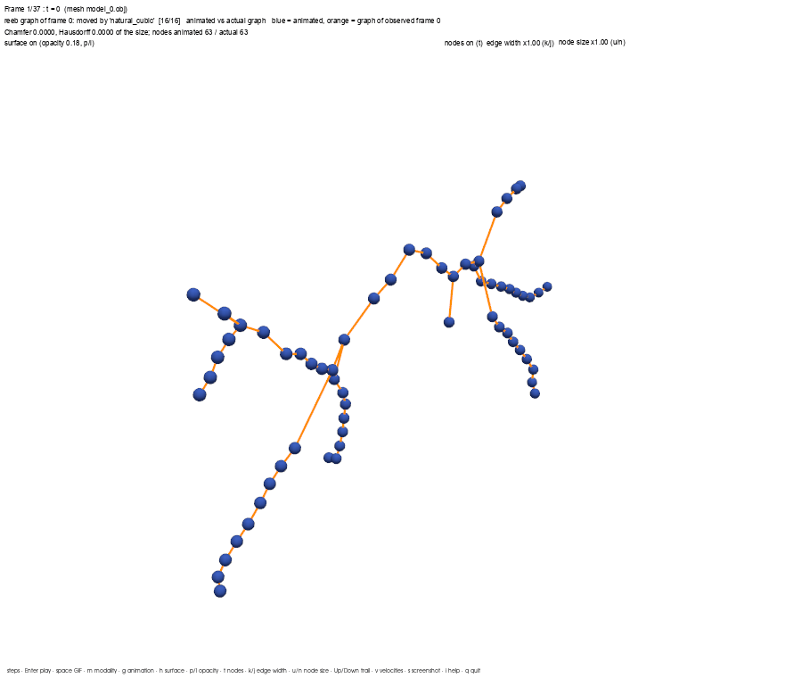<br />
      <sub>Reeb Original vs Animated(Cubic)</sub>
    </td>
    <td align="center">
      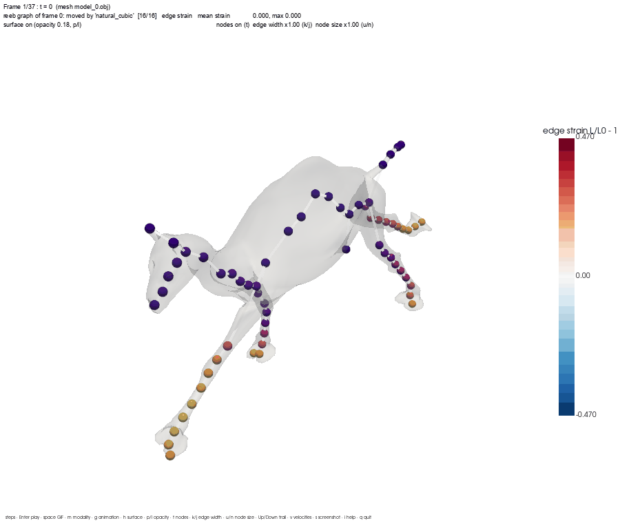<br />
      <sub>Edge Strain Reeb Animated(Cubic)</sub>
    </td>
    <td align="center">
      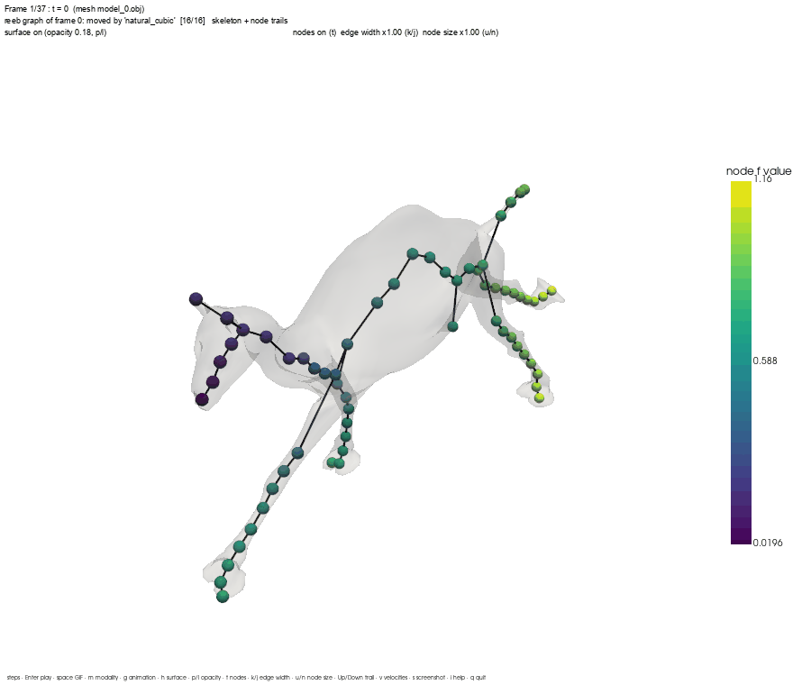<br />
      <sub>Node Trails Reeb Animated(Cubic)</sub>
    </td>
    <td align="center">
      <br />
      <sub>Reeb Animated(Cubic) on Surface</sub>
    </td>
    <td align="center">
      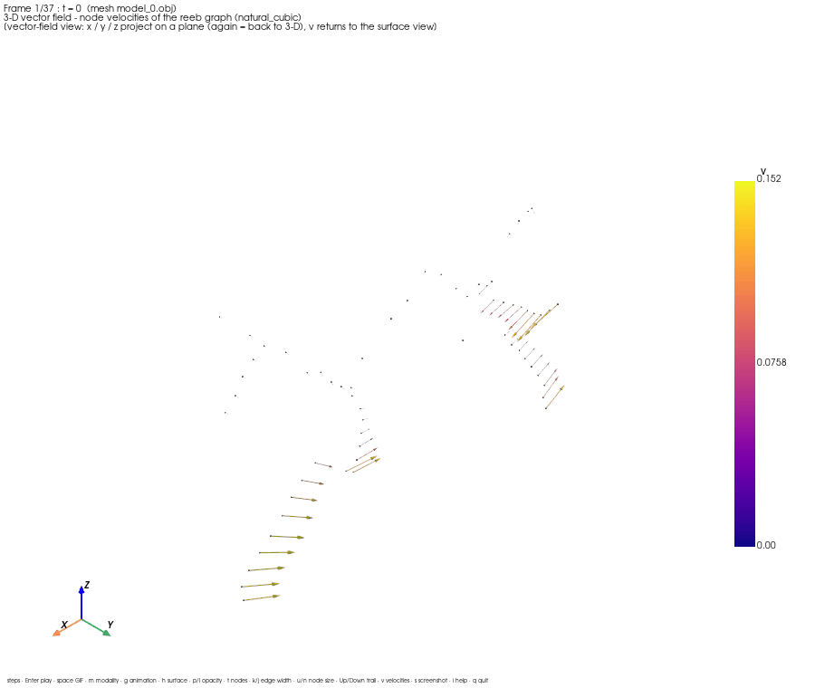<br />
      <sub>Directional Vectors Reeb Animated(Cubic)</sub>
    </td>
  </tr>
  
  <!-- ROW 2 -->
  <tr>
    <td align="center">
      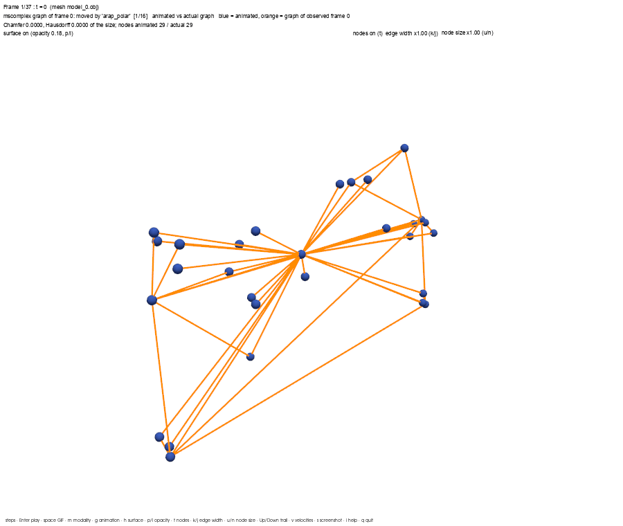<br />
      <sub>MSComplex Original vs Animated(ARAP)</sub>
    </td>
    <td align="center">
      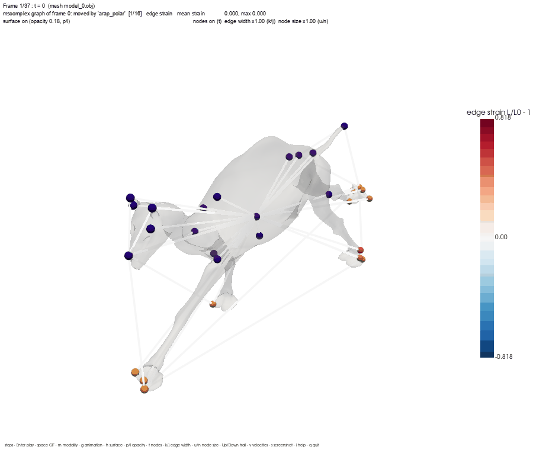<br />
      <sub>Edge Strain MSComplex Animated(ARAP)</sub>
    </td>
    <td align="center">
      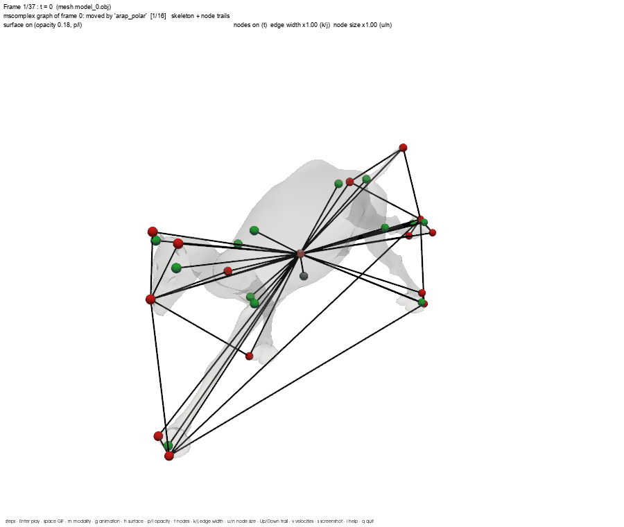<br />
      <sub>Node Trails MSComplex Animated(ARAP)</sub>
    </td>
    <td align="center">
      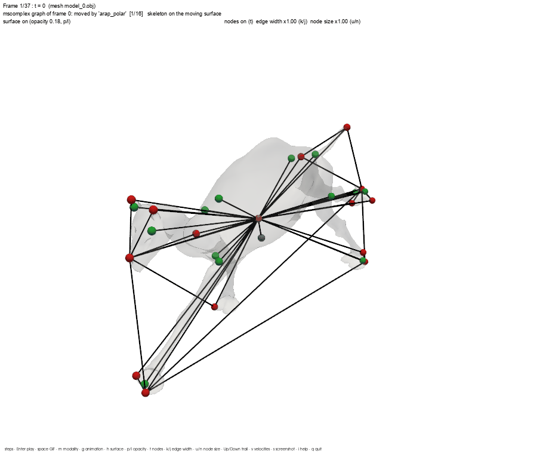<br />
      <sub>MSComplex Animated(ARAP) on Surface</sub>
    </td>
    <td align="center">
      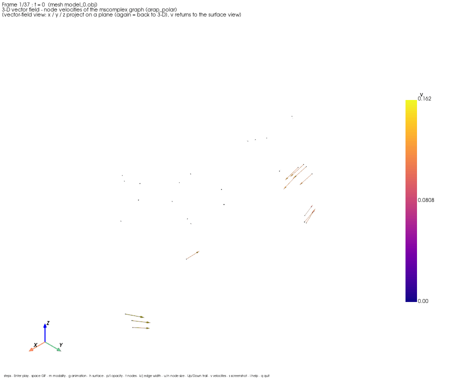<br />
      <sub>Directional Vectors MSComplex Animated(ARAP)</sub>
    </td>
  </tr>

</table>

</details>
</details>


<a id="dynamic-analysis"></a>
<details>
<summary><strong><span style="font-size:25px;">Dynamic Analysis</span></strong></summary>

<details>
<summary><span style="font-size:23px;">General Overview</span></summary>

The dynamic analysis describes the **motion as a whole**, without fitting any physical model. Using the trajectories (and, when available, the SPHARM coefficients) it answers:

* **What kind of surface flow is there?** The velocity along the surface is split into flows that *spread out / converge* (sources and sinks, like a membrane expanding or being absorbed), flows that *rotate* (vortices, like cortical rotation) and the rest; the motion perpendicular to the surface is the growth / retraction.
* **Where does the surface separate?** Regions whose points end up stretched apart are highlighted (finite-time Lyapunov exponents): borders between parts of the surface that "go different ways".
* **What are the main ways the shape changes?** The principal deformation modes (e.g. elongation, bending, a protrusion cycle), with meshes showing each mode, and a 2-D map of the whole sequence in shape space.
* **When does the behaviour change?** Change points split the time-lapse into regimes (e.g. a resting phase and a migration phase).
* **Is the motion periodic?** Loops in the shape trajectory reveal cyclic behaviour.
* **At which spatial scales does the shape change?** The growth and the curvature of the surface are decomposed into spherical harmonics frame by frame: coarse scales (the whole cell bulging) vs fine scales (small protrusions, ruffles).

**Dependence on the parametrization.** The Hodge decomposition and the FTLE use only the trajectories. The shape space, the change points and the persistent homology need *shape coordinates*: they are chosen automatically by their quality (see below), so a poor sphere map of a complex shape (e.g. an animal) never degrades them — the analysis then uses the manifold harmonics of the tracked mesh, which need no sphere map.

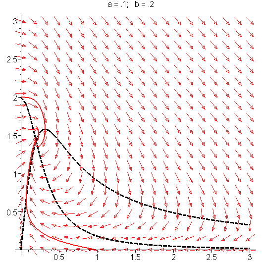

</details>

<details>
<summary><span style="font-size:23px;">Mathematical Construction Details</span></summary>

<details>
<summary><span style="font-size:21px;">Helmholtz–Hodge decomposition of the surface velocity</span></summary>

The tangential velocity $v_T$ on the reference surface is decomposed as
$$v_T = \nabla\alpha + J\nabla\beta + h,$$
with the potential $\alpha$ (curl-free part: sources and sinks, local area production), the stream function $\beta$ ($J$ = rotation by $90°$ in the tangent plane; divergence-free part: vortices) and the harmonic remainder $h$; both potentials are obtained from Poisson problems with the cotangent Laplacian on faces. The energy fractions $\|\nabla\alpha\|^2 : \|J\nabla\beta\|^2 : \|h\|^2$ characterise the type of motion; the normal component $v_n$ is the growth field.

</details>

<details>
<summary><span style="font-size:21px;">Finite-time Lyapunov exponents (FTLE)</span></summary>

For the flow map $\Phi_{t_0\to t}$ of the surface (reference → frame $t$), the per-face deformation gradient $F$ gives the right Cauchy–Green tensor $C = F^\top F$; the FTLE is
$$\sigma(t) = \frac{1}{|t - t_0|}\,\ln\sqrt{\lambda_{\max}(C)}$$
Its ridges are Lagrangian coherent structures: lines separating regions of the surface with different fates. With known frame times $\sigma$ is in $1/\text{time unit}$.

</details>

<details>
<summary><span style="font-size:21px;">Shape space and reduced coordinates</span></summary>

The aligned SPHARM coefficients (or, without parametrization, the trajectories) of every frame form a point $z_t$ of a shape space. PCA gives the principal deformation modes (exported as meshes at mean $\pm 2\sigma$), the shape-distance matrix, a classical MDS embedding of the trajectory, the recurrence matrix and the Shape-DNA distance (Laplace–Beltrami spectra). The **reduced coordinates** are the POD (SVD) coordinates keeping the energy fraction `pod_energy` (at most `pod_max_rank` modes); they feed the next two analyses.

</details>

<details>
<summary><span style="font-size:21px;">Quality-aware shape coordinates</span></summary>

Three representations of the shape of every frame can feed the shape space:

* **SPHARM** (least squares) and **high-degree SPHARM** (fast transform) of the [parametrization](#spherical-parametrization) — compact and comparable between scenes, but only as good as the sphere map;
* **manifold harmonics of the tracked mesh**: every frame of the trajectories, rigidly aligned to the reference (translation and rotation removed, so they describe the shape and not the pose), is projected on the first $k$ Laplace–Beltrami eigenfunctions of the reference mesh, $a_t = \Phi^\top M\, Y_t$. One basis and one triangulation for all frames make the coordinates consistent in time by construction, for any topology and complexity.

With `shape_source='auto'` the median relative reconstruction error of every representation is measured; SPHARM is used when its error is at most `shape_max_error` (the high-degree version when it is better), otherwise the manifold harmonics. The choice, its reason and all the errors are written to `ShapeSpace/source.json` and to the report.

The manifold harmonics act as a low-pass filter: with few modes thin parts such as legs or tails shrink towards their centre lines in the mode meshes. With `mh_modes='auto'` the number of modes grows (60, 120, 200, 300) until the median error is at most half of `shape_max_error` and the **worst-region error** (95th percentile of the per-vertex error, the thin parts) is at most `shape_max_worst_error`; SPHARM is also required to meet the worst-region limit when its per-vertex errors are available (high-degree SPHARM). The number of modes used is in `source.json`.

</details>

<details>
<summary><span style="font-size:21px;">Spherical spectra of growth and curvature</span></summary>

The tracked mesh keeps the vertices of the reference frame, so every field on it is, at every time, a function on the sphere map of the reference frame — a Lagrangian spherical coordinate system. For the normal speed $v_n$ (growth / retraction) and the mean curvature $H$ of every frame the SHT gives the degree power
$$P_l(t) = |c_{l0}(t)|^2 + 2\sum_{m>0}|c_{lm}(t)|^2,\qquad \sum_l P_l = \int_{\mathbb{S}^2} f^2\,d\Omega ,$$
its spectral centroid $\bar{l}(t)=\sum_l l P_l/\sum_l P_l$ (the typical spatial scale, $\approx \pi/\bar l$ radians on the sphere) and the dominant degree. A centroid moving up means the growth concentrates on smaller features (protrusions), moving down that the whole shape deforms coherently. A curvature power that keeps rising can also reflect tracking noise on fine scales; compare with the tracking diagnostics.

</details>

<details>
<summary><span style="font-size:21px;">Change points and persistent homology</span></summary>

**Change points**: binary segmentation of the reduced coordinates under a multivariate mean-shift model, $\min \sum_{\text{segments}} \text{RSS} + \text{pen}\cdot\#\text{change points}$ with a BIC-type penalty $\text{pen} = 2d\,\hat\sigma^2\log T$; the same on their speed and on the ARAP energy series. Every detected frame starts a new regime (with known frame times also reported as a time).

**Confidence of the change points**: for every change point a permutation test — the gain of the split (RSS reduction) is compared with the best split gain of random permutations of its segment (`cp_permutations`), giving a p-value (small = a real change of regime). **Joint change points** are detected on all the standardised signals together (shape coordinates, trajectories, ARAP energy); change points at frames with unreliable correspondences are listed (`*_at_low_confidence`).

**Hodge decomposition of the deformation only** (`hodge_nonrigid`): the same decomposition of the shape-only velocity (rigid motion removed, see [Motion Analysis](#motion-analysis)); a rotating object has a large divergence-free part in the full motion that disappears in the deformation (`Hodge_nonrigid/comparison.csv`, plot `8_hodge_full_vs_deformation.png`).

**Persistent homology** (optional, needs `ripser` or `gudhi`): Vietoris–Rips persistence of the reduced trajectory $\{z_t\}$; long-lived 1-cycles indicate periodic behaviour of the shape.

</details>
</details>

<details>
<summary><span style="font-size:23px;">Parameters</span></summary>

```python
run_pipeline(path_str, compute_dynamic_analysis=True, dyn_analysis_params={...})
```

Requires the trajectories (and uses the SPHARM coefficients when present).

| key | default | meaning |
|---|---|---|
| `hodge` | `True` | Helmholtz–Hodge decomposition |
| `ftle` | `True` | finite-time Lyapunov exponents |
| `shape_space` | `True` | PCA modes, MDS, recurrence, Shape-DNA |
| `change_points` | `True` | regimes of the deformation |
| `homology` | `True` | persistent homology (skipped with a message if `ripser`/`gudhi` are missing) |
| `n_shape_modes` | `4` | number of principal modes exported |
| `pod_energy`, `pod_max_rank` | `0.99`, `8` | energy kept and maximum rank of the reduced coordinates |
| `shape_source` | `'auto'` | shape coordinates: `'auto'` (by quality), `'spharm'`, `'spharm_hd'`, `'manifold'`, `'trajectories'` |
| `shape_max_error` | `0.05` | `'auto'`: SPHARM only when its median relative reconstruction error is at most this |
| `mh_modes` | `'auto'` | manifold-harmonic modes of the tracked mesh (`'auto'`: 60–300 until the errors are met) |
| `shape_max_worst_error` | `0.15` | `'auto'`: limit of the worst-region (95th percentile) error |
| `hodge_nonrigid` | `True` | also the Hodge decomposition of the deformation-only motion |
| `cp_permutations` | `500` | permutation p-values of the change points (0 = off) |
| `spherical_spectra`, `spectral_lmax` | `True`, `32` | spectra of growth and curvature and their degree (needs the sphere map of the reference frame) |
| `sht_backend` | `'auto'` | torch-harmonics (GPU) / NumPy |
| `plots` | `True` | write the plots |

</details>

<details>
<summary><span style="font-size:23px;">Results</span></summary>

`Results/<scene>/DynamicAnalysis/`: `Hodge/` (components per frame, `hodge_energy.csv` with the frame confidence), `Hodge_nonrigid/` (deformation only, `comparison.csv`), `FTLE/` (`ftle_summary.csv`, fields), `ShapeSpace/` (`source.json` — the shape coordinates used and why —, `variance.csv`, `mds.csv`, `shape_dna_spectra.csv`, `mode_meshes/`), `SphericalSpectra/` (`spectra.csv`, `summary.csv`: power per degree, spectral centroid and dominant degree of growth and curvature per frame), `ReducedCoordinates/`, `ChangePoints/change_points.json`, `Topology/persistence.csv`, `plots/` and a readable summary `report.md`.


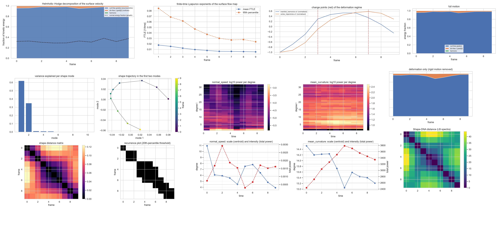


Viewers:
```python
from PynamicMesh.utils.dynamics_visualizers import visualize_hodge, visualize_ftle, visualize_shape_modes
visualize_hodge(results_path, mesh_path=mesh_path)
visualize_ftle(results_path, mesh_path=mesh_path)
visualize_shape_modes(results_path)
```
<table>
  <!-- ROW 1 -->
  <tr>
    <td align="center">
      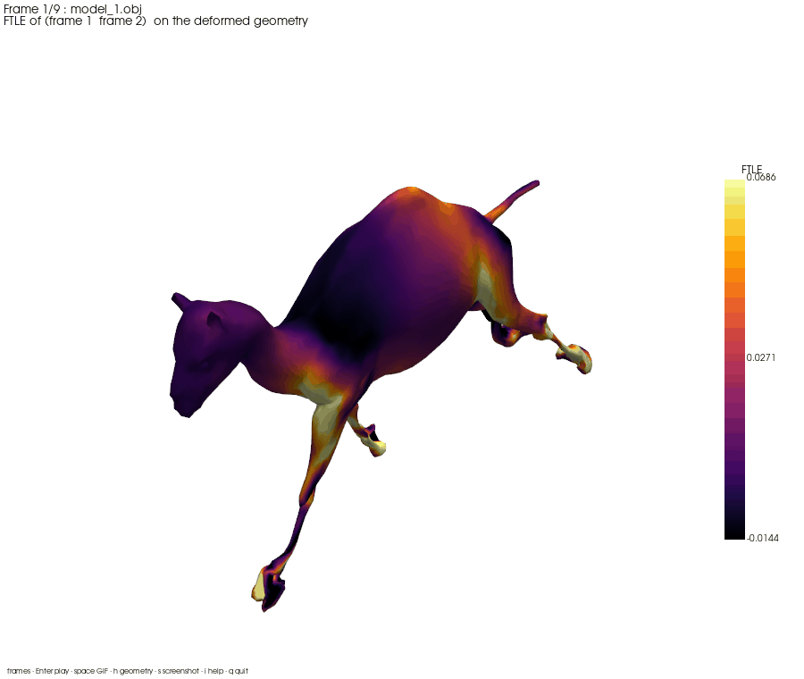<br />
      <sub>Finite-time Lyapunov exponents</sub>
    </td>
    <td align="center">
      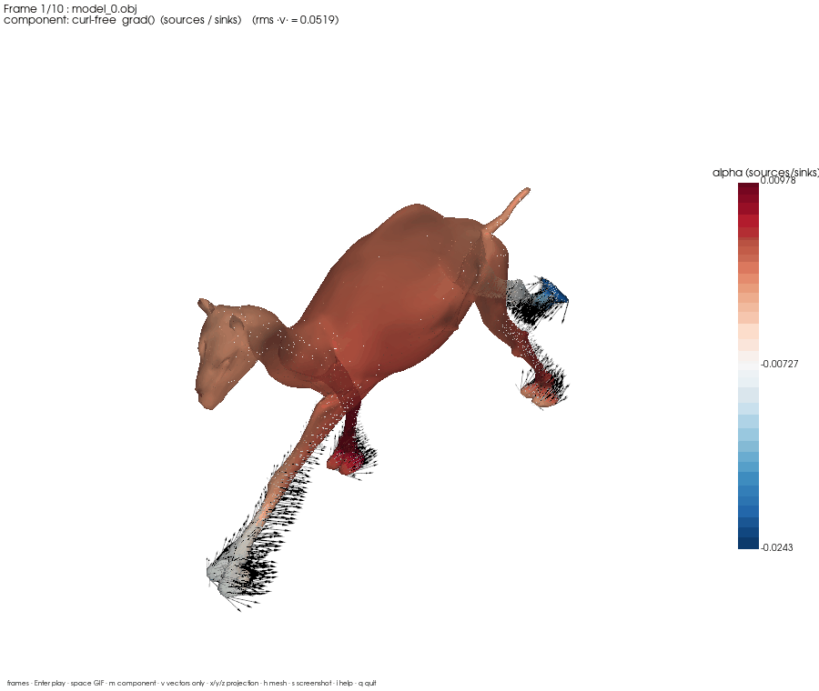<br />
      <sub>Helmholtz–Hodge Sinks</sub>
    </td>
    <td align="center">
      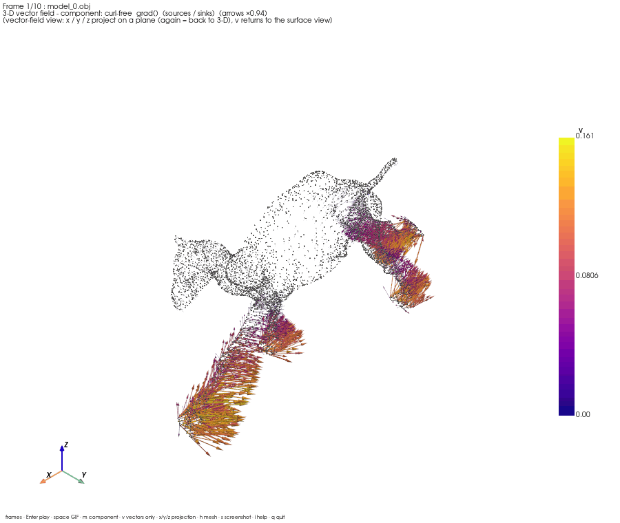<br />
      <sub>Helmholtz–Hodge Sinks Vectors</sub>
    </td>
    <td align="center">
      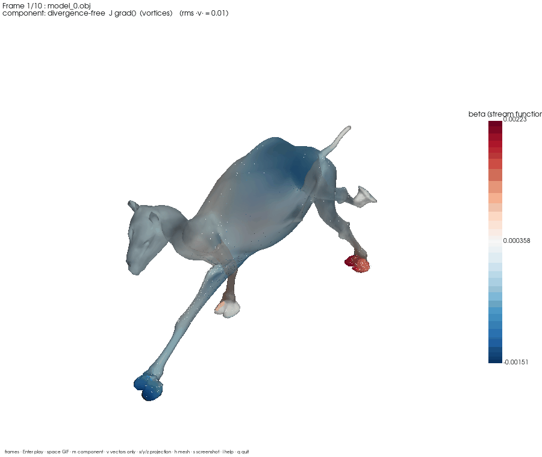<br />
      <sub>Helmholtz–Hodge Vortices</sub>
    </td>
    <td align="center">
      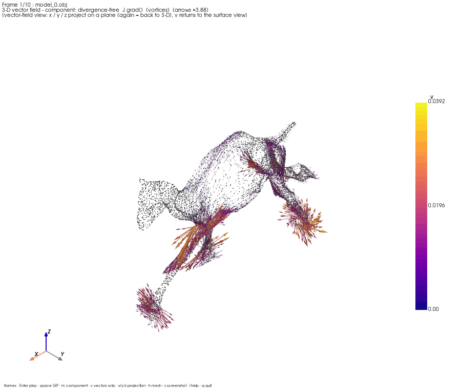<br />
      <sub>Helmholtz–Hodge Vortices Vectors</sub>
    </td>
    <td align="center">
      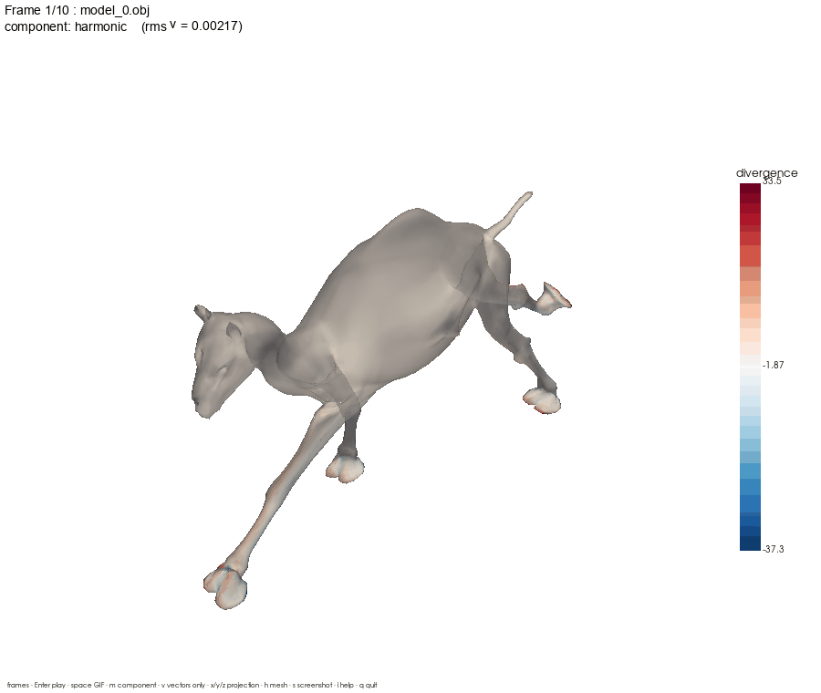<br />
      <sub>Helmholtz–Hodge Harmonic</sub>
    </td>
  </tr>
  
  <!-- ROW 2 -->
  <tr>
    <td align="center">
      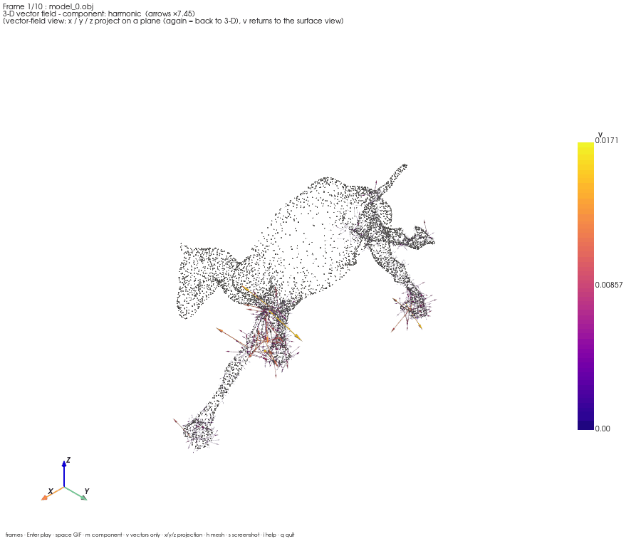<br />
      <sub>Helmholtz–Hodge Harmonic Vectors</sub>
    </td>
    <td align="center">
      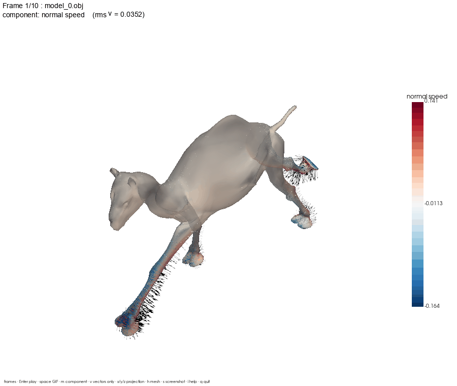<br />
      <sub>Helmholtz–Hodge Normal Speed</sub>
    </td>
    <td align="center">
      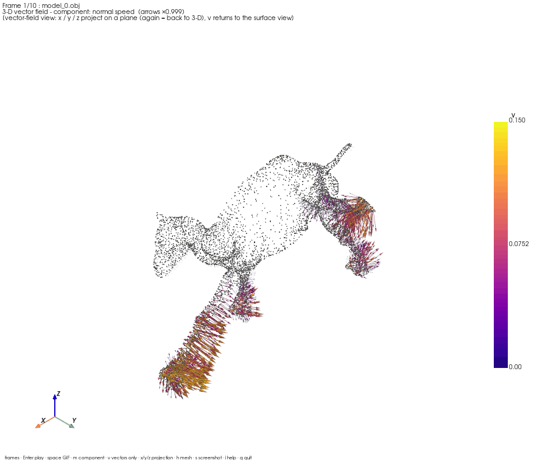<br />
      <sub>Helmholtz–Hodge Normal Speed Vectors</sub>
    </td>
    <td align="center">
      <br />
      <sub>Helmholtz–Hodge Total Tangential Velocity</sub>
    </td>
    <td align="center">
      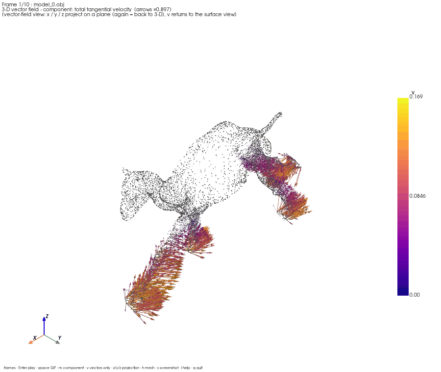<br />
      <sub>Helmholtz–Hodge Total Tangential Velocity Vectors</sub>
    </td>
    <td align="center">
      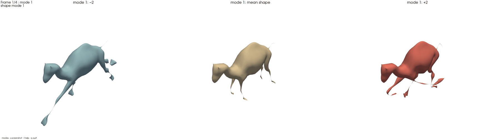<br />
      <sub>Shape Modes Parametrization with low L value</sub>
    </td>
  </tr>
</table>
</details>
</details>

<a id="reeb-graph-dynamics"></a>
<details>
<summary><strong><span style="font-size:25px;">Reeb Graph Dynamics</span></strong></summary>

<details>
<summary><span style="font-size:23px;">General Overview</span></summary>

The [Reeb graphs](#reeb-graph) of the frames are computed one by one and compared with global distances: they tell *that* the skeleton changed, not *which branch became which* nor *what happened* to it. Following Edelsbrunner, Harer, Mascarenhas, Pascucci & Snoeyink (2008), the Reeb graph dynamics follows every **branch** of the graph through time and classifies every change:

* **birth / death** of a branch — a protrusion sprouting or retracting (a maximum and a saddle appear or annihilate together), a dent forming or vanishing (a minimum and a saddle);
* **interchange** — two junctions of the graph swap their order (sibling branches change their branching order, or a branch junction passes the junction of its parent branch);
* **dominance change** — the highest protrusion (or deepest dent) changes.

Events are located **between** the observed frames, every branch has a birth time, a death time, a lifetime and a strength (persistence) curve, and its tip has a trajectory on the surface.

<!-- add figure/gif here: branches and their critical-point paths on the moving surface (visualize_reeb_dynamics) + branch persistence plot -->

</details>

<details>
<summary><span style="font-size:23px;">Mathematical Construction Details</span></summary>

**Field on the tracked mesh.** The scalar field of the Reeb graphs (`reeb_scalar`, `scalar_args`) is evaluated on the tracked mesh of the [Trajectories](#trajectories) — one triangulation followed through the sequence — with its arguments resolved once on the reference frame, so a source vertex (e.g. `vertex_ref_index`) is the **same material point** in every frame. Between two observed frames the field is interpolated linearly, $f(x, t) = (1-a) f_k(x) + a\,f_{k+1}(x)$: a piecewise-linear space–time function, the setting of the paper. With a fixed triangulation the critical vertices depend only on the vertex values, so `substeps` samples per interval resolve the events cheaply.

**Branches.** At every sample, the 0-dimensional persistence pairs of $-f$ (and $f$) are computed by a union-find sweep with the elder rule: every maximum $m$ is paired with the saddle $s$ where its component joins an older one, with persistence $f(m) - f(s)$. On a genus-0 surface these pairs are exactly the branches of the Reeb graph (the global extremum is the essential trunk). Pairs with relative persistence above `persistence` are branches.

**Critical-point paths (Jacobi curve).** Branches of consecutive samples are matched (Hungarian algorithm) by the material position of their extremum and, for branches whose extremum jumps between two nearly equal maxima, of their junction saddle — the discrete version of the Jacobi curve that connects the Reeb graphs through time. Hysteresis: a branch is born above `persistence` and survives down to half of it; an interchange is counted when the new order of two junctions is confirmed by a margin, so noise does not create flickering events.

**Events.** An unmatched new branch is a birth, an unmatched old one a death — by the index lemma of the paper the two critical points created or destroyed together differ in index by one (maximum + saddle or minimum + saddle). Two related junctions (siblings on the same parent, or a branch and its parent) whose order flips form an interchange; the essential trunk passing to another extremum is a dominance change.

**Morse–Smale regions and graph** (`ms_regions`). The protrusion branches are the maxima of the Morse–Smale complex, so the same tracking also follows its **regions**. At every sample, each vertex of the tracked mesh belongs to the maximum reached by steepest ascent (the ascending Morse–Smale cell of that maximum); a maximum that is not a tracked branch (below the persistence threshold) gives its cell to the branch it merges into — the persistence simplification of the complex. Regions therefore keep the identity of their branch (`max_<track>`) through time, from the tracked mesh, without the functional maps. Two regions are **neighbours** (an edge of the Morse–Smale graph) when their common boundary — the length of the mesh edges joining them, relative to $\sqrt{\text{area}}$ — exceeds `contact_threshold`; a contact starts above the threshold and ends below half of it, so a boundary close to the threshold does not flicker. Changes of the graph between regions that both exist are events: **regions start touching** / **regions stop touching** (e.g. when the protrusion between two others retracts, the two become neighbours).

The Morse–Smale analysis of `MSComplexAnalysis/` tracks its regions through the frame-to-frame functional maps; these regions come from the tracked mesh instead (continuous, located between the frames, independent of the quality of the maps).

</details>

<details>
<summary><span style="font-size:23px;">Parameters</span></summary>

```python
run_pipeline(path_str, compute_reeb_dynamics=True, reeb_dynamics_params={...})
```

Requires the trajectories; uses the Reeb scalar field settings (`reeb_scalar`, `scalar_args`). It builds its own time-varying Reeb graph on the tracked mesh, so it does not depend on the stored graphs (`reeb`, `reeb_controlled`, `mscomplex`).

| key | default | meaning |
|---|---|---|
| `persistence` | `0.08` | relative persistence (fraction of the field range) of a branch |
| `substeps` | `4` | time samples inside every observed interval |
| `match_radius` | `0.12` | largest move of a branch between samples, fraction of $\sqrt{\text{area}}$ |
| `k_spectral` | `60` | eigenpairs for spectral fields (heat diffusion, …) on the tracked mesh |
| `ms_regions` | `True` | Morse–Smale regions of the protrusion branches, their adjacency graph and contact events |
| `contact_threshold` | `0.02` | common boundary (relative to $\sqrt{\text{area}}$) above which two regions touch; they stop touching below half of it |
| `plots` | `True` | write the plots |

</details>

<details>
<summary><span style="font-size:23px;">Results</span></summary>

`Results/<scene>/ReebDynamics/`: `events.csv` (time, event, kind, branch), `tracks.csv` (one row per branch: kind, birth / death time, lifetime, maximum and mean persistence, path length), `paths.csv` (the critical-point paths: branch, sample, time, extremum and saddle vertices, persistence, reference and current positions), `samples.csv` (number of protrusion and dent branches per sample), `field_on_tracked_mesh.npy`, `summary.json`, `plots/` (branch persistence with births and deaths, branch count, event timeline). The events also appear in the event timeline of the [Motion Analysis](#motion-analysis).

Morse–Smale regions (`ms_regions`): `regions/labels.npz` (the region — branch track — of every vertex at every sample, -1 = none, and the sample times), `regions.csv` (per sample and region: area, area fraction of the surface, centre, number of neighbours), `adjacency.csv` (per sample, the pairs of regions in contact and the length of their common boundary), the events `regions start touching` / `regions stop touching` (kind `region`) in `events.csv`, and the plots `4_ms_regions.png` (area fraction and number of neighbours of every region over time) and `5_ms_contacts.png` (timeline of the contacts, i.e. of the edges of the Morse–Smale graph). The contact events also appear in the event timeline of the [Motion Analysis](#motion-analysis). In the viewer, the view **Morse–Smale regions + graph** shows the regions coloured like their branch, one node at the centre of every region and one edge per pair of regions in contact; the view **Morse–Smale regions + graph + paths** adds the paths up to the current time — thick: the centre of every region (how the node of the graph moves as the region moves and grows), thin: the tip of its branch. With `gif=True` every view is recorded (`reeb_dynamics_morse_smale_regions_graph.gif`, `reeb_dynamics_morse_smale_regions_graph_paths.gif`, …).

How to read them: a branch with a long lifetime and a high persistence is a stable structural part (a limb, a long-lived protrusion); short-lived branches are transient protrusions; interchanges mean that the hierarchy of the protrusions reorganises (which one branches first from the body), and dominance changes that the largest protrusion changes.

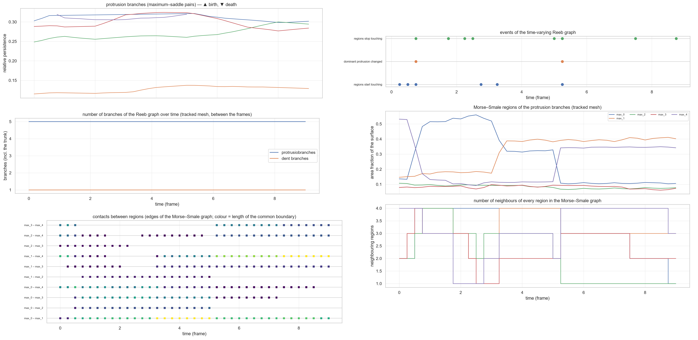

Viewer:
```python
from PynamicMesh.utils.dynamics_visualizers import visualize_reeb_dynamics
visualize_reeb_dynamics(results_path, mesh_path=mesh_path)   # 'm': branches / + paths / Morse–Smale regions + graph / + paths
```
<table>
  <!-- ROW 1 -->
  <tr>
    <td align="center">
      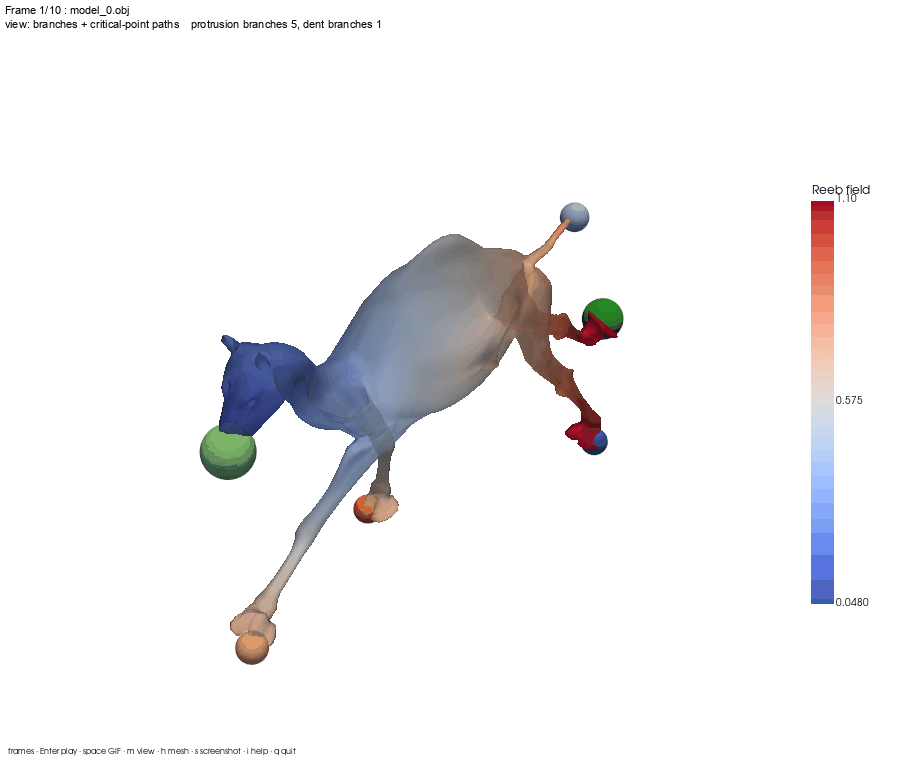<br />
      <sub>Reeb Branches Critical Point Paths</sub>
    </td>
    <td align="center">
      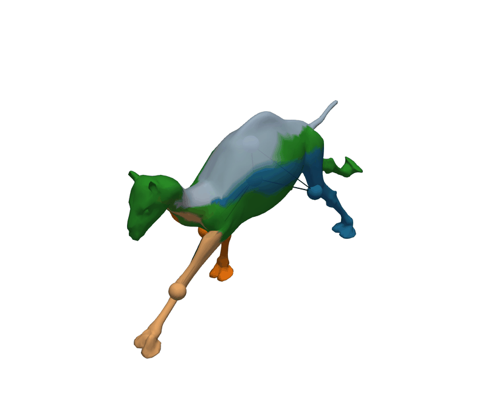<br />
      <sub>MSComplex Graph Branches Critical Point Paths</sub>
    </td>
  </tr>
</table>


</details>
</details>

<a id="motion-analysis"></a>
<details>
<summary><strong><span style="font-size:25px;">Motion Analysis</span></strong></summary>

<details>
<summary><span style="font-size:23px;">General Overview</span></summary>

The motion analysis turns the results of the previous stages into a description of **how the object moves and changes**, and of **when things happen**:

* **Moving vs deforming**: the motion of every frame is split into a rigid part (the object translating and rotating as a whole) and the deformation (the change of shape). A migrating cell that keeps its shape is almost all rigid motion; a cell spreading in place is all deformation.
* **Physical fields from the trajectories**: velocity, acceleration, normal (growth) speed and strain computed on the tracked mesh — a smoother, consistent complement of the [physical fields](#functional-map) obtained from the frame-to-frame maps (both are kept and compared).
* **Where the surface grows**: a growth atlas (cumulative growth and local area change of every point and of every protrusion region) and the **direction** of the growth (anisotropy: does the surface stretch equally in all directions or along one?).
* **When separating regions form**: the finite-time Lyapunov exponent over a sliding window of frames.
* **Polarity**: the angle between the direction of motion and the long axis of the shape, and how many protrusions point forward.
* **Kinetics of the parts**: speed and deformation of every Morse–Smale region (body vs each protrusion), protrusion lifetimes and extension / retraction speeds, length and extension of every branch of the animated skeleton.
* **The story in time**: one table of signals, one **event timeline** (splits, merges, protrusion births and deaths, regime changes), the **synchronisation** of the signals with time lags (e.g. *do protrusions appear before the cell moves?*), the **periods** of the motion and the **Dynamic Mode Decomposition**: the patterns of deformation, each with its frequency and its growth or decay rate, with a short forecast of the next frames.
* **Reliability**: every frame gets a confidence from the quality of its correspondences; jumps of the orientation between consecutive frames reveal symmetric flips of the correspondences (front/back, left/right).


</details>

<details>
<summary><span style="font-size:23px;">Mathematical Construction Details</span></summary>

<details>
<summary><span style="font-size:21px;">Rigid / non-rigid decomposition</span></summary>

For every frame the best rigid motion of the tracked mesh w.r.t. the reference is the weighted Kabsch / Procrustes fit (weights $m_i$ = vertex areas)
$$\min_{R_t\in SO(3),\,c_t}\ \sum_i m_i\,\big\|x_i(t) - c_t - R_t\,(x_i(0) - c_0)\big\|^2 ,$$
with $c_t$ the area-weighted centroid. It gives the translation $c_t - c_0$, the rotation angle of $R_t$, the angular velocity $\omega_k = \theta(R_kR_{k-1}^\top)/\Delta t_k$, the **shape-only motion** $\tilde{x}_i(t) = R_t^\top(x_i(t)-c_t) + c_0$ (every frame in the reference pose) and the deformation fraction of the motion energy $E_\text{def}/(E_\text{rig}+E_\text{def})$. A frame-to-frame rotation larger than `flip_angle` is flagged as a probable symmetric flip of the correspondences rather than a real rotation.

</details>

<details>
<summary><span style="font-size:21px;">Trajectory-based physical fields, growth atlas and anisotropy</span></summary>

On the tracked mesh (fixed triangulation): $v = \dot{x}$, $a = \ddot{x}$ (derivatives on the real frame times), normal speed $v_n = v\cdot n$, deformation-only speed $|\dot{\tilde{x}}|$ and, per face, the deformation gradient $F$ of the map reference → frame $t$ in the tangent plane, the Green–Lagrange strain $E = \tfrac12(F^\top F - I)$ (its norm) and the area strain $\sqrt{\det F^\top F} - 1$. `comparison.csv` sets their mean speed against the frame-to-frame fields.

**Growth atlas**: $G_i(t) = \int_0^t v_n\,dt$ (trapezoidal rule) and $\log(A_i(t)/A_i(0))$ with $A_i$ the vertex area; averaged over every Morse–Smale region of the reference frame.

**Anisotropy**: the principal stretches $\lambda_1\ge\lambda_2$ of the shape-only deformation ($\lambda^2$ = eigenvalues of $F^\top F$), the anisotropy $\log(\lambda_1/\lambda_2)$ (0 = isotropic growth) and the direction of largest stretch $F e_1$ in the current frame. **Sliding-window FTLE**: $\sigma_k = \ln\sqrt{\lambda_{\max}(C_{k\to k+w})}/(t_{k+w}-t_k)$ over `ftle_window` frames — *when* the separating structures form, while the FTLE of the Dynamic Analysis integrates from the reference frame.

</details>

<details>
<summary><span style="font-size:21px;">Polarity, regions, protrusions and branches</span></summary>

* **Polarity**: the migration direction $\dot c/|\dot c|$, the elongation axis (first principal axis of the frame) and the angle between them; the fraction of protrusion tips (Morse–Smale maxima) ahead of the centroid along the migration direction.
* **Regions**: mean speed, deformation-only speed and area ratio of every Morse–Smale region of the reference frame.
* **Protrusion kinetics** (Region tracking): lifetime in time units, extension speed $=\overline{\Delta h_n}\cdot n_\text{frames}/\text{lifetime}$ (normal growth per time; > 0 extending, < 0 retracting), also relative to the size, birth / death / split / merge rates.
* **Branches** of the animated Reeb skeleton ([Graph Animation](#graph-animation)): maximal paths between nodes of degree ≠ 2; length $L(t)$, extension $L/L_0-1$ and extension rate $\dot L$.

</details>

<details>
<summary><span style="font-size:21px;">Signals, synchronisation, periods and DMD</span></summary>

**Signals** (one value per frame, speeds relative to the size $\sqrt{A_0}$): centroid speed, angular speed, deformation fraction and speed, strain, normal speed, shape-change speed $|\dot z|$ (shape-space scores), first shape modes, area / volume growth rates, Hodge fractions, number of protrusions and their births / deaths, anisotropy, axis–motion angle; next to the frame confidence.

**Synchronisation**: normalised cross-correlation $\rho_{ij}(\ell)=\langle \hat s_i(t)\,\hat s_j(t+\ell)\rangle$ of every pair of signals (uniform resampling first), its maximum $|\rho|$ and the lag of the maximum: a positive lag means signal $i$ **leads** signal $j$.

**Periods**: Lomb–Scargle periodogram (exact for irregular frame times) of every signal; dominant period and its share of the periodogram.

**Dynamic Mode Decomposition** of the shape-only motion (Schmid 2010): the motion is reduced by POD, $d$ consecutive coordinate vectors are stacked (time-delay / Hankel embedding — a standing wave has rank one and plain DMD cannot represent its oscillation) and the best linear propagator $h_{k+1}\approx A h_k$ is computed (exact DMD). Every eigenvalue $\mu_j$ gives the continuous rate $\lambda_j=\ln\mu_j/\Delta t$: frequency $\operatorname{Im}\lambda_j/2\pi$, growth ($\operatorname{Re}\lambda_j>0$) or decay rate, with its spatial mode (exported as displacement meshes) and energy. Propagating the eigenvalues forecasts the next frames.

**Event timeline**: splits / merges of the surface (Betti-0) and of the Reeb graph, cycles created or removed, protrusion births / deaths / splits / merges, change points of the Dynamic Analysis, and the branch events of the [Reeb Graph Dynamics](#reeb-graph-dynamics).

**Frame confidence**: reliable map fraction × $\exp(-d_{95}/0.02\sqrt{A_0})$ with $d_{95}$ the 95th percentile distance of the tracked mesh to the true surface (`Trajectories/tracking.csv`); frames below `low_confidence` × median are flagged (also in the Hodge, FTLE and change-point results).

</details>
</details>

<details>
<summary><span style="font-size:23px;">Parameters</span></summary>

```python
run_pipeline(path_str, compute_motion_analysis=True, motion_params={...})
```

Requires the trajectories; uses every other result available (Morse–Smale tracking, shape space, graph animation, frame times).

| key | default | meaning |
|---|---|---|
| `rigid`, `fields`, `growth_atlas`, `anisotropy`, `polarity`, `regions`, `protrusions`, `branches`, `signals`, `timeline`, `synchronization`, `frequency`, `dmd` | `True` | each analysis on / off |
| `ftle_window` | `3` | frames of the sliding-window FTLE |
| `max_lag` | `None` | largest lag of the cross-correlations (`None` = a quarter of the sequence) |
| `dmd_energy`, `dmd_delays`, `dmd_forecast` | `0.999`, `'auto'`, `3` | energy kept, delays of the embedding (`'auto'`: T/4, 2–8), forecast steps |
| `low_confidence` | `0.5` | frames below this × the median confidence are flagged |
| `graphs` | `None` | graph kinds whose animated skeletons are used for the branch tracking (`None` = every animation computed, i.e. the `graphs` of the graph animation) |
| `flip_angle` | `120.0` | orientation jump (degrees) between frames treated as a symmetric flip of the correspondences |
| `plots` | `True` | write the plots |

</details>

<details>
<summary><span style="font-size:23px;">Results</span></summary>

`Results/<scene>/MotionAnalysis/`:

* `Confidence/frame_confidence.csv` — confidence, low-confidence and symmetry-flip flags per frame;
* `RigidMotion/` — `rigid_motion.csv` (translation, rotation, angular speed, rigid / deformation RMS and fraction), `nonrigid_trajectories.npy`, `rotations.npy`;
* `GrowthAtlas/` — cumulative normal growth and log area change per vertex and frame, `regions.csv`;
* `Anisotropy/` — principal stretches, anisotropy and directions per frame, `anisotropy_summary.csv`, sliding-window FTLE fields and `ftle_window_summary.csv`;
* `Polarity/polarity.csv`, `Regions/regional_kinematics.csv`, `Protrusions/` (kinetics per track, statistics), `Branches/branches.csv`;
* `Signals/` — `signals.csv` (+ `signals_with_confidence.csv`), `event_timeline.csv`, `cross_correlation.csv` and `cross_correlation_lag.csv`, `periods.csv`, `periodograms.csv`, `DMD/` (modes, information, mode meshes, forecast);
* `trajectory_fields_global.csv`, `summary.json`, `output_log.txt`;
* `plots/` — one plot per table: 1 rigid motion, 2 signals (grey lines: events, red bands: frames with low correspondence confidence), 3 event timeline, 4 synchronisation (correlation and lag), 5 dominant periods, 6 DMD modes, 7 anisotropy and sliding-window FTLE, 8 protrusion kinetics, 9 branch extension, 10 frame confidence (with probable symmetric flips), 11 physical fields from the trajectories vs the frame-to-frame maps, 12 growth atlas per region, 13 polarity, 14 regional kinematics, 15 periodograms of all the signals, 16 frame-to-frame vs tracked-mesh physical fields (see below);
* `Physical_fields/from_trajectories/` — the trajectory-based physical fields per frame, `global_metrics.csv`, `comparison.csv` (mean speed of both sources), `comparison_fields.csv` and `comparison/` (see below).

<b>Frame-to-frame vs tracked-mesh physical fields.</b> The physical fields of `Physical_fields/` are computed from the frame-to-frame functional maps; the tracked mesh gives a second, independent source of correspondences. For every transition $i-1 \to i$ the same functions of the physical model (speed, acceleration, normal flow, edge strain, area strain) are evaluated on the tracked mesh with the identity correspondence — same definitions, units and time intervals, only the source of the correspondences differs — and the frame-to-frame field is sampled at the tracked vertices (nearest vertex of the frame mesh). Outputs:

* `comparison/frame_####.npz` — both versions of every field at the tracked vertices (`{field}_frame_to_frame`, `{field}_trajectories`);
* `comparison_fields.csv` — per frame and field: area-weighted mean $|value|$ of both sources, their ratio, the correlation of the per-vertex values and the relative difference (median $|$difference$|$ / median $|$frame-to-frame$|$);
* plot 16 (`MotionAnalysis/plots/16_field_comparison.png`) — the means of both sources over time and their agreement (correlation, relative difference), one row per field;
* the viewer `visualize_field_comparison` (and one GIF per field with `gif=True`): left the frame-to-frame field on the frame mesh, centre the tracked-mesh field with the same colour scale (2–98th percentiles of both sources in the frame), right their difference; `m` changes the field.

How to read it: fields that agree (high correlation, ratio ≈ 1 — typically speed and acceleration) are reliable from both sources; where they disagree, look at the maps — scattered patches in the frame-to-frame field only (e.g. the strains, very sensitive to small correspondence errors) are noise of the frame-to-frame maps, while a disagreement concentrated on a moving part points to tracking errors there.

How to read them: a deformation fraction close to 0 means the object mostly moves as a whole; a high shape-change speed with a low centroid speed means it deforms in place; a strong cross-correlation with a positive lag from protrusion births to the centroid speed means protrusions precede the motion; DMD modes with a frequency and a growth rate near 0 are sustained oscillations, negative growth rates are transients that die out.


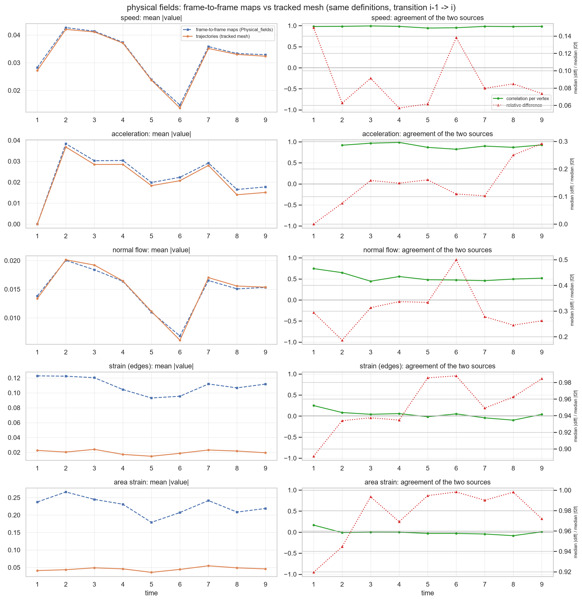

Viewer:
```python
from PynamicMesh.utils.dynamics_visualizers import visualize_motion_analysis
visualize_motion_analysis(results_path, mesh_path=mesh_path)
```
<table>
  <!-- ROW 1 -->
  <tr>
    <td align="center">
      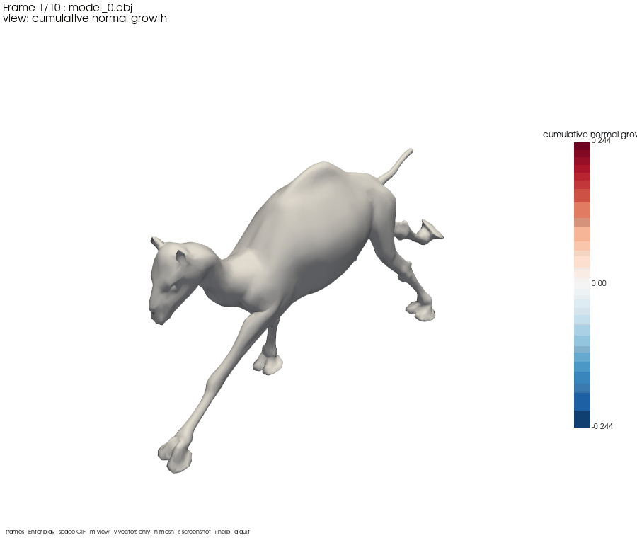<br />
      <sub>Cumulative Normal Growth</sub>
    </td>
    <td align="center">
      <br />
      <sub>Growth Anisotropy log(l1/l2)</sub>
    </td>
    <td align="center">
      <br />
      <sub>Growth Anisotropy log(l1/l2) vectors</sub>
    </td>
  </tr>
  
  <!-- ROW 2 -->
  <tr>
    <td align="center">
      <br />
      <sub>Only motion (Rigid Motion Removed)</sub>
    </td>
    <td align="center">
      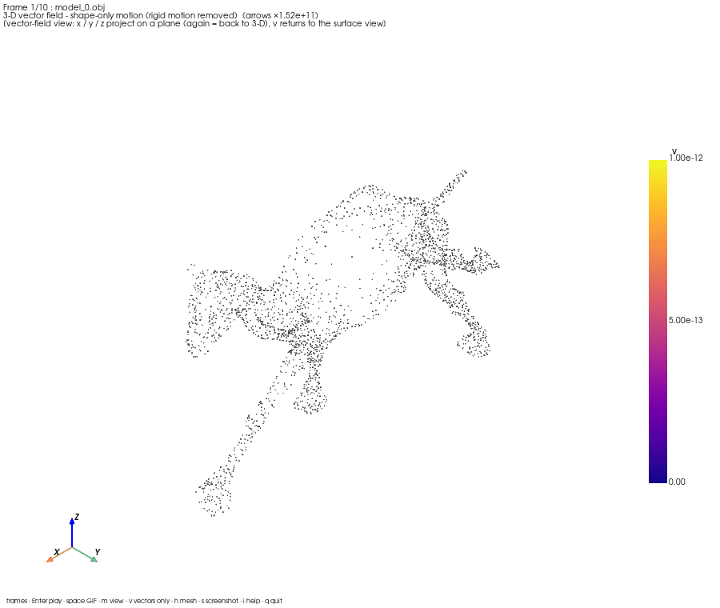<br />
      <sub>Only motion vectors (Rigid Motion Removed)</sub>
    </td>
    <td align="center">
      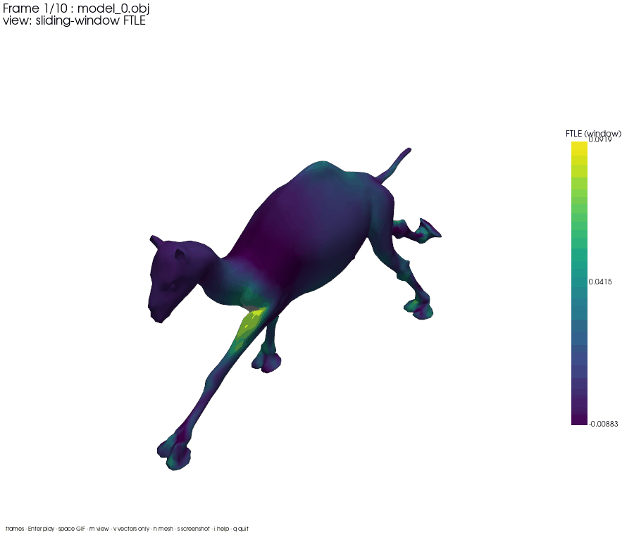<br />
      <sub>Sliding Window FTLE</sub>
    </td>
  </tr>
  <!-- ROW 3 -->
  <tr>
    <td align="center">
      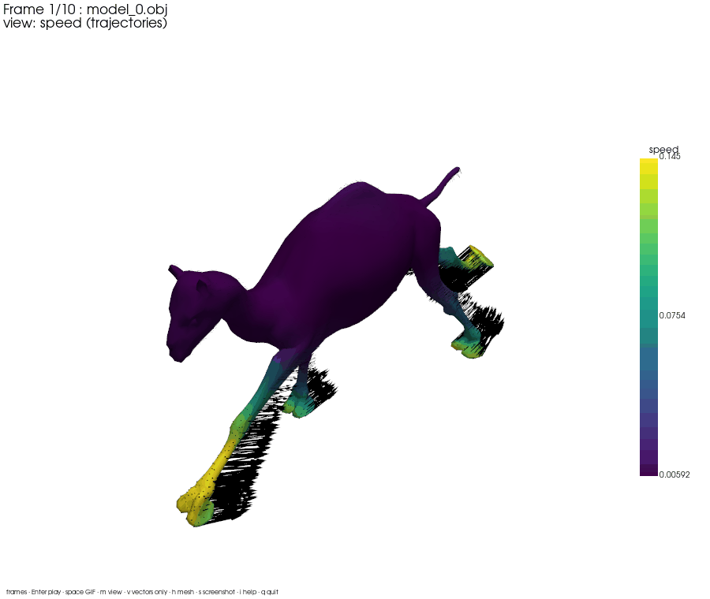<br />
      <sub>Speed Trajectories</sub>
    </td>
    <td align="center">
      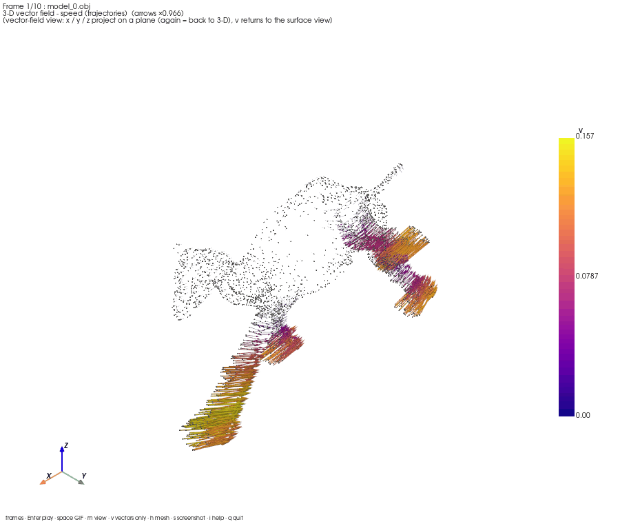<br />
      <sub>Speed Trajectories vectors</sub>
    </td>
    <td align="center">
      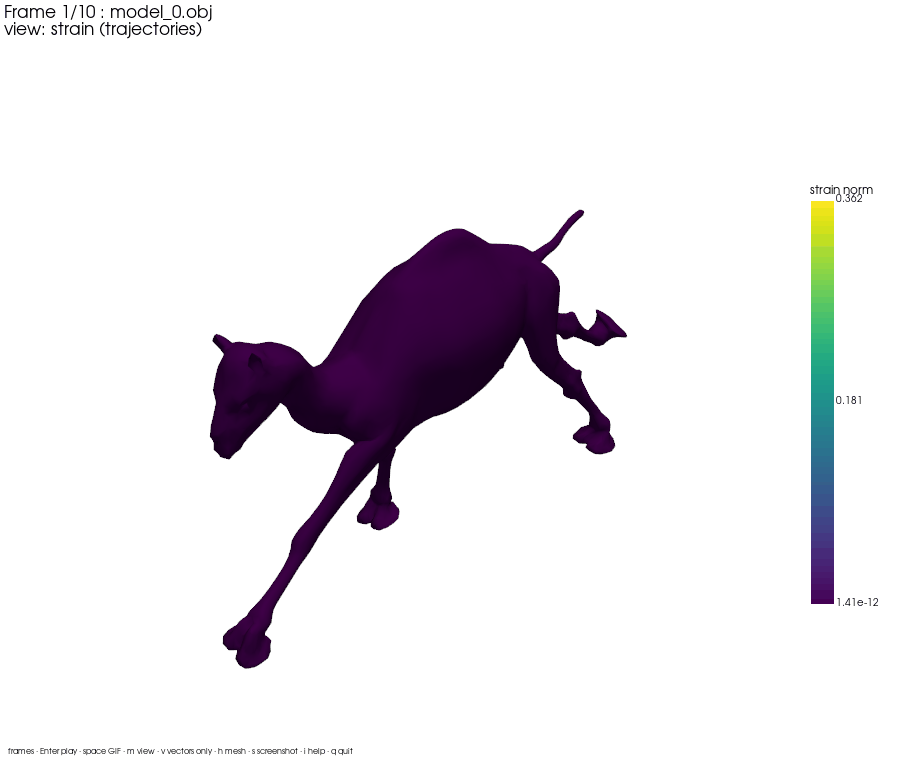<br />
      <sub>Strain Trajectories</sub>
    </td>
  </tr>
</table>

```python
from PynamicMesh.utils.dynamics_visualizers import visualize_field_comparison
visualize_field_comparison(results_path, mesh_path=mesh_path)
```
<table>
  <!-- ROW 1 -->
  <tr>
    <td align="center">
      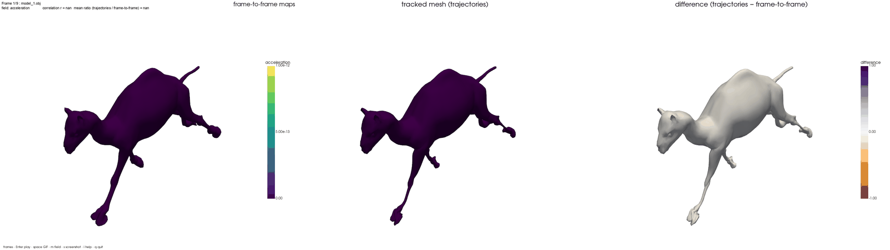<br />
      <sub>Acceleration</sub>
    </td>
    <td align="center">
      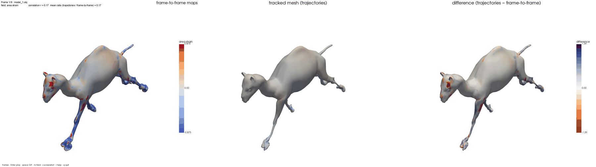<br />
      <sub>Area Strain</sub>
    </td>
  </tr>
  
  <!-- ROW 2 -->
  <tr>
      <td align="center">
      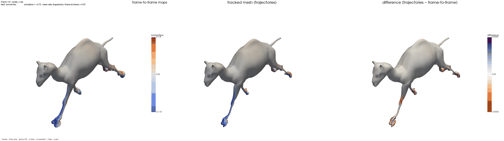<br />
      <sub>Normal Flow</sub>
    </td>
    <td align="center">
      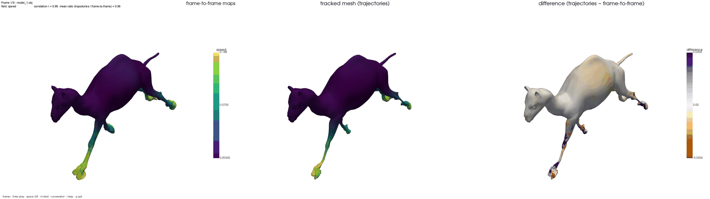<br />
      <sub>Speed</sub>
    </td>
  </tr>
    <!-- ROW 3 -->
  <tr>
    <td align="center">
      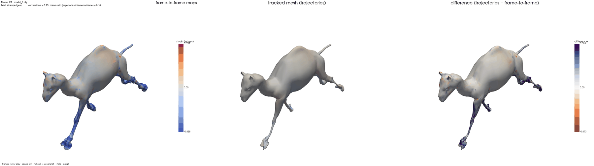<br />
      <sub>Strain edges</sub>
    </td>
  </tr>
</table>

</details>
</details>


<a id="virtual-lab"></a>
<details>
<summary><strong><span style="font-size:25px;">Virtual Lab (Active Surfaces Simulations)</span></strong></summary>

Having a physical property $P_i(S)$ over the surface (mesh), like pressure, elasticity, friction, etc. We can generate a model based on dfferential equations that describe the behaivour of the changes of this properties $\displaystyle F\left(\frac{\partial S}{\partial P_1(S)},...,\frac{\partial S}{\partial P_n(S)}\right)$, given some initial conditions $P_i(S)=v_i$, that is, some vector of initial values for the model $\vec{v}={v_1,...,v_n}$ then the model can run an approxomimated simulation of the evolution of the system on time.

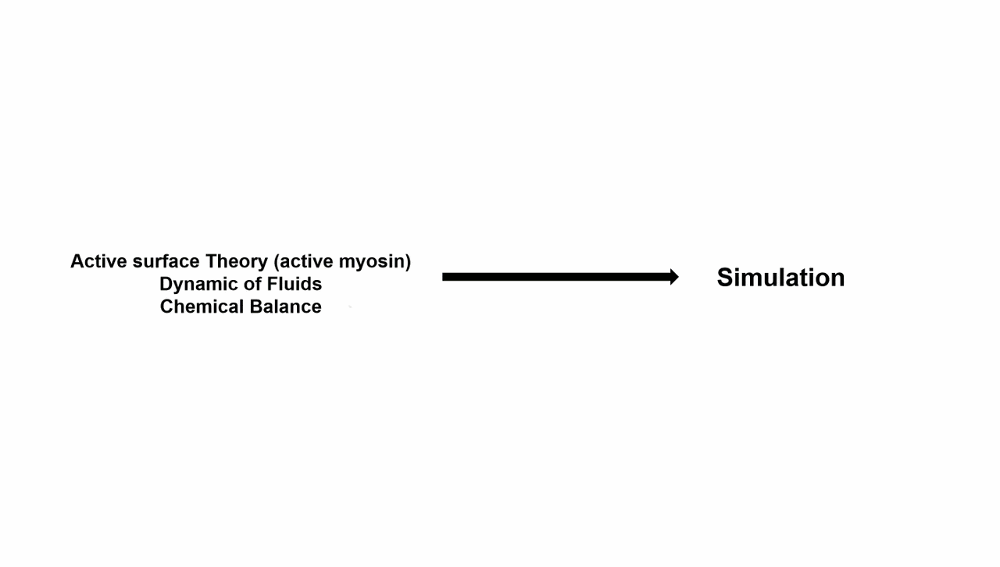

The Virtual Lab turns a real cell mesh into a **mechano-chemical simulation**: the surface is treated as an *active surface* (the actomyosin cortex) whose tension, bending moments and cortical flows are set by a regulator field (active myosin) that lives on the surface, is transported by the flow it creates and reacts to the mechanics it produces. On top of the physics, the module provides the infrastructure of a laboratory: experiments defined as reusable protocols, perturbation assays (optogenetics, laser ablation, drug wash-in), parameter sweeps, metrics, animations.

<center>
<b>GIF Simulations examples</b>
</center>

<table>
  <!-- ROW 1 -->
  <tr>
    <td align="center">
      <br />
      <sub>Passive Control</sub>
    </td>
    <td align="center">
      <br />
      <sub>Fluid Rounding</sub>
    </td>
    <td align="center">
      <br />
      <sub>Polar Contraction</sub>
    </td>
  </tr>
  
  <!-- ROW 2 -->
  <tr>
    <td align="center">
      <br />
      <sub>Cytokinesis Ring</sub>
    </td>
    <td align="center">
      <br />
      <sub>Torque Folding</sub>
    </td>
    <td align="center">
      <br />
      <sub>Protrusion Anchored</sub>
    </td>
  </tr>

  <!-- ROW 3 -->
  <tr>
    <td align="center">
      <br />
      <sub>Buckling</sub>
    </td>
    <td align="center">
      <br />
      <sub>Pulsatile Cortex</sub>
    </td>
    <td align="center">
      <br />
      <sub>Optogenetic Wave</sub>
    </td>
  </tr>

  <!-- ROW 4 -->
  <tr>
    <td align="center">
      <br />
      <sub>Spontaneous Polarity</sub>
    </td>
    <td align="center">
      <br />
      <sub>Curvature Feedback Folding</sub>
    </td>
    <td align="center">
      <br />
      <sub>Strain Feedback Pulses</sub>
    </td>
  </tr>

  <!-- ROW 5 -->
  <tr>
    <td align="center">
      <br />
      <sub>Laser Ablation</sub>
    </td>
    <td align="center">
      <br />
      <sub>Ring Blebbistatin</sub>
    </td>
    <td align="center">
      <br />
      <sub>Protrusion + Buckling</sub>
    </td>
  </tr>

  <!-- ROW 6 -->
  <tr>
    <td align="center">
      <br />
      <sub>Protrusion + Pulsatile</sub>
    </td>
    <td align="center">
      <br />
      <sub>Protrude -> Buckle -> Ablate</sub>
    </td>
    <td align="center">
      <br />
      <sub>Polarise -> Divide</sub>
    </td>
  </tr>
</table>

<center>
<b>Mesh Simulation result visualizer</b>
</center>


<details>
<summary><span style="font-size:23px;">General Overview</span></summary>

The module is organised in layers, each one usable on its own:

<b>Mesh preparation</b> (`prepare_mesh`, `to_physical_units`): repairs the input surface (degenerate, duplicate and non-manifold faces, holes), remeshes it to a target resolution with isotropic triangles, relaxes the triangle quality, orients the normals outward and rescales the cell so that its equivalent-sphere radius is $R_{eq}=(3V/4\pi)^{1/3}=1$. The scale factors are stored in the mesh and `to_physical_units` maps any simulated frame back to the original units.

<b>Discrete geometry</b> (`DiscreteGeometryEngine`): the differential operators of the surface (cotangent Laplace–Beltrami, vertex areas, normals, mean and Gaussian curvature, tangential gradient, edge and quality statistics), rebuilt every time the surface moves.

<b>Material model</b> (`ActiveSurfaceConstitutiveModel`): the passive (Helfrich) and active coefficients of the surface, its dissipation, the volume/area constraints, and the viscoelastic *shell* terms that let a real cell shape be remembered (in-plane elasticity, curvature memory, turnover time).

<b>Time integrator</b> (`ActiveSurfaceSimulator`): solves the overdamped force balance every step as a sparse linear system, with the stiff bending operator treated semi-implicitly, an exact volume constraint, adaptive time stepping, tangential mesh regularisation (ALE) and on-the-fly refinement of over-stretched regions.

<b>Regulator chemistry</b> (`ChemistryModel` and its implementations `LinearTurnover`, `MechanosensitiveTurnover`, `ExcitableRho`, `TuringPolarity`): pluggable reaction kinetics of one or several species living on the surface. Reactions may depend on the local mechanics (curvature, tension, strain rate) and on external lab-frame signals, which closes the loop mechanics → chemistry → mechanics.

<b>Perturbations</b>: `Stimulus` objects (`GaussianPulse`, `UniformStimulus`, `PatternStimulus`) are time dependent signals in the laboratory frame (optogenetic illumination, drug wash-in); `Event` objects (`LaserAblation`, `ParameterStep`) are one-shot modifications of the state at a given time (cortex ablation, drug that switches a material parameter). External forces (`LocalNormalForce`, `AnchorSpring`, `UniformBodyForce`) represent polymerisation pressure, adhesion and body forces.

<b>Protocols</b> (`Protocol`): an experiment definition (material, regulator field, forces, chemistry, stimuli, events, duration) that can be composed in parallel with other protocols (`A + B`: the ingredients are merged) or chained in time (`A >> B`: one continuous simulation whose stages switch mechanics and inputs without losing geometry, regulator or elastic memory).

<b>Laboratory and run management</b> (`VirtualLaboratory`, `ExperimentRun`): every execution of a driver creates `Results/Virtual_lab/Experiment_<id>/` with one folder per laboratory and per experiment (frames, per-frame fields, `metrics.csv`, `params.json`, `log_output.txt`), a `simulation_gifs/` folder and a global `log_output.txt` that collects all the status output. The console only shows a transient progress bar of the running experiment; pressing <kbd>Enter</kbd> in the console stops the running experiment after the current step (everything computed so far is saved) and the driver continues with the next one.

You can check the experiments examples executions [here](./examples/Virtual_Lab_execution.py) 

</details>

<details>
<summary><span style="font-size:23px;">Theoretical Description</span></summary>

The physics use the covariant theory of active surfaces, restricted to an **isotropic, non-chiral fluid surface with broken up–down symmetry** embedded in a viscous medium at low Reynolds number, extended with the elastic thin-shell terms of their Sec. IV so that a given cell shape can be preserved. Throughout, lengths are measured in units of $R_{eq}$, tensions in units of a reference tension $\gamma$, and time in units of $\xi R_{eq}^2/\gamma$ (drag over tension). For real cells $\kappa/(\gamma R^2)\sim 10^{-5}\ldots10^{-2}$: bending is a small correction and the presets use $\kappa\sim 0.01$–$0.05$.

<details>
<summary><span style="font-size:21px;">Discrete geometry of the surface</span></summary>

The surface is a closed triangle mesh with vertex positions $\mathbf{X}_i$, outward normals $\mathbf{n}_i$ and barycentric vertex areas $A_i=\tfrac13\sum_{f\ni i}A_f$. The convention is that a sphere of radius $R$ has mean curvature $H=1/R>0$ and Gaussian curvature $K=1/R^2$; the trace of the curvature tensor of the paper is $C_k{}^k=2H$.

<b>Laplace–Beltrami operator.</b> With the cotangent weights $w_{ij}=\tfrac12(\cot\alpha_{ij}+\cot\beta_{ij})$ of the two angles opposite to the edge $ij$, the stiffness matrix $W$ and the mass matrix $M=\mathrm{diag}(A_i)$ give

$$(\Delta f)_i=\frac{1}{A_i}\sum_{j\sim i} w_{ij}\,(f_j-f_i)\quad\Longleftrightarrow\quad \Delta f = M^{-1}W f ,$$

a negative semi-definite operator that is exact for linear functions on the triangles. Cotangents of near-degenerate corners are clipped for robustness.

<b>Curvatures.</b> The mean curvature comes from the Laplacian of the embedding, $\Delta\mathbf{X}=-2H\mathbf{n}$, i.e. $H_i=-\tfrac12\,(\Delta\mathbf{X})_i\cdot\mathbf{n}_i$; the Gaussian curvature from the angle defect (discrete Gauss–Bonnet), $K_i=(2\pi-\sum_{f\ni i}\theta_{f,i})/A_i$, so that $\sum_i K_iA_i=4\pi$ exactly on any closed genus-0 mesh.

<b>Gradient.</b> The tangential gradient of a vertex field is the area-weighted average of the (constant) gradients on the incident triangles, $\nabla f|_f=\tfrac{1}{2A_f}\sum_k f_k\,\mathbf{n}_f\times\mathbf{e}_k$ with $\mathbf{e}_k$ the edge opposite to vertex $k$, projected onto the tangent plane at the vertex.

<b>Quality.</b> The per-face quality $q_f=4\sqrt3\,A_f/\sum_k|\mathbf{e}_k|^2$ (1 for equilateral, 0 for degenerate) drives the mesh regularisation and the stability diagnostics; the enclosed volume is computed by the divergence theorem $V=\tfrac16\sum_f \mathbf{p}_0\cdot(\mathbf{p}_1\times\mathbf{p}_2)$.

</details>

<details>
<summary><span style="font-size:21px;">Constitutive relations and force balance</span></summary>

A regulator field $c(\mathbf{x},t)\ge 0$ (active myosin density) sets the local chemical drive $\Delta\mu\to\Delta\mu\,\phi(c)$ through the saturating function

$$\phi(c)=\frac{c}{1+c/c_{sat}},$$

so that a bounded density gives a bounded active stress ($c_{sat}=\infty$ recovers the linear drive). Every active coefficient multiplies $\phi(c)$; with $c=0$ the surface is a passive Helfrich membrane, with a uniform $c=1$ it is the homogeneous active surface of the paper (Sec. III F).

<b>Tensions and moments.</b> The in-plane tension and bending moment tensors are (paper Eqs. 52–55)

$$\bar t^{ij}=\big[\gamma_H+\zeta\phi+(-\kappa C_0+\zeta'\phi)\,C_k{}^k\big]g^{ij}+2\tilde\zeta\phi\,\tilde C^{ij},\qquad
\bar m^{ij}=\big[(\kappa_{\rm eff}+\kappa_g)C_k{}^k-b\big]g^{ij}-\kappa_{g}C^{ij},$$

with the active renormalisation of the bending rigidity and the active torque that acts as a spontaneous curvature

$$\kappa_{\rm eff}=\kappa+(\tilde\zeta_c+\zeta'_c)\,\phi(c),\qquad b=\kappa C_0-\zeta_c\,\phi(c).$$

Here $\gamma_H$ is the passive tension, $\zeta$ the active isotropic tension ($>0$ contractile), $\zeta'$ a tension–curvature coupling, $\tilde\zeta$ an anisotropic tension acting only where the principal curvatures differ (tubes, necks, saddles), $\zeta_c$ the active torque, and $\tilde\zeta_c,\zeta'_c$ the active corrections to $\kappa$ (negative values soften the surface).

<b>Force densities.</b> Inserting the constitutive relations into the covariant force balance and taking the variational part from the effective energy $E=\int\big[\tfrac{\kappa_{\rm eff}}{2}(2H)^2-2bH+s\big]dA$ gives the normal force density

$$f_n=\Delta\!\left(2\kappa_{\rm eff}H-b\right)+4\kappa_{\rm eff}H\left(H^2-K\right)+2bK-2sH-4\zeta'\phi H^2-4\tilde\zeta\phi\left(H^2-K\right)+p,$$

and the tangential force density that drives cortical flows toward regions of high tension,

$$\mathbf{f}_t=\nabla s+2H^2\nabla\kappa_{\rm eff}-2H\nabla b+\nabla\!\left(2\zeta'\phi H\right)+2\tilde\zeta\phi\,\nabla H,$$

where the total isotropic tension collects the passive, active, spontaneous-curvature and area-penalty contributions

$$s=\gamma_H+\zeta\phi(c)+\tfrac12\kappa C_0^2+k_A\frac{A-A_0}{A_0},$$

and $p$ is the pressure of the enclosed fluid (see the volume constraint below). The bending operator $\Delta(2\kappa_{\rm eff}H)$ is fourth order in the positions and is the stiff part of the problem.

<b>Dissipation.</b> The surface is overdamped: a local friction $\xi$ with the medium and a surface shear viscosity $\eta$ acting as a Laplacian on the velocity,

$$\xi\,\mathbf{v}-\eta\,\Delta\mathbf{v}=\mathbf{f}_n\,\mathbf{n}+\mathbf{f}_t+\mathbf{f}_{\rm el}+\mathbf{f}_{\rm ext}+p\,\mathbf{n}.$$

Approximations with respect to the full theory are documented in the module: no chiral couplings, no up–down asymmetric viscosity, the $2\tilde\zeta\tilde C^{ij}\partial_i c$ term is dropped (needs the full shape operator), gradients of $\kappa_g$ give no bulk force on closed surfaces (Gauss–Bonnet), and the medium is a local drag rather than a bulk Stokes flow.

<b>Linear stability.</b> On a sphere of radius $R$ with uniform drive and a negative effective tension $\gamma_H+\zeta\phi<0$, the shape mode $l$ is unstable when $|\gamma_H+\zeta\phi|\,(l-1)(l+2)>\kappa\,l(l+1)(l-1)(l+2)/R^2$; the surface buckles when $\zeta\phi<-\gamma_H$ (paper Eq. 57) and softens into short-wavelength instabilities when $\kappa_{\rm eff}<0$ (Eq. 58, bounded in the code by $\kappa_{\rm eff}\ge10^{-3}\kappa$). These thresholds are the reference for the `active_buckling` and `curvature_tension_instability` presets.

</details>

<details>
<summary><span style="font-size:21px;">Viscoelastic shell: remembering the cell shape</span></summary>

A purely fluid active surface relaxes any initial shape to a sphere on the time scale $\xi/(\kappa q^4)$, which is instantaneous for the fine features of a real cell. To simulate deformations *of a given cell*, the surface is given a reference configuration (paper Sec. IV) built from the input mesh:

<b>In-plane elasticity.</b> Every edge is a spring with rest length $\ell_0$ equal to its initial length and every triangle has a rest area $A^0_f$,

$$\mathbf{F}_{\rm shear}=\sum_{\rm edges}E_{\rm shear}\,(\ell-\ell_0)\,\hat{\mathbf{d}},\qquad
\mathbf{F}_{\rm area}=-\sum_f E_{\rm area}\,\frac{A_f-A_f^0}{A_f^0}\,\nabla_{\mathbf{p}}A_f ,$$

converted to force densities by the vertex areas. $E_{\rm shear}$ and $E_{\rm area}$ are two-dimensional moduli in units of the tension scale.

<b>Curvature memory.</b> The spontaneous curvature becomes a field equal to the initial curvature, $C_0(\mathbf{x})=2H_0(\mathbf{x})$, lightly smoothed by solving $(M-\ell_s^2W)\,C_0=M\,2H_0$ with $\ell_s$ a few edge lengths, so that bending forces vanish on the input shape and resist departures from it.

<b>Turnover (Maxwell relaxation).</b> The cortex is continuously rebuilt: the reference configuration relaxes toward the current one with the remodelling time $\tau$,

$$\dot\ell_0=\frac{\ell-\ell_0}{\tau},\qquad \dot A^0_f=\frac{A_f-A^0_f}{\tau},\qquad \dot C_0=\frac{2H-C_0}{\tau}.$$

Deformations shorter than $\tau$ are elastic and reversible, longer ones become permanent; $\tau\to\infty$ is a permanently elastic shell, small $\tau$ a fluid. Cytokinesis-like furrowing needs $\tau$ shorter than the process (the ring preset uses $\tau=0.5$), while a control experiment uses $\tau=5$ to keep the morphology.

</details>

<details>
<summary><span style="font-size:21px;">Time integration</span></summary>

<b>Semi-implicit velocity solve.</b> Given the forces on the current geometry, the velocity is obtained from a sparse symmetric positive-definite system that contains the drag, the surface viscosity and linearised, implicit versions of the stiff operators (tension, bending, elasticity) weighted by the stabilisation $\theta$,

$$\mathcal{A}\,\mathbf{V}=M\,\mathbf{F},\qquad
\mathcal{A}=\xi M-\eta W-\theta\,\Delta t\,s_{\max}W+\theta\,\Delta t\,\kappa_{\max}\,WM^{-1}W-\theta\,\Delta t\,(E_{\rm shear}+E_{\rm area})\,h\,W ,$$

with $s_{\max}$ and $\kappa_{\max}$ the largest tension and effective rigidity of the step and $h$ the mean edge. The fourth-order bending term $WM^{-1}W$ is what allows time steps orders of magnitude larger than an explicit scheme on fine meshes.

<b>Volume constraint.</b> With `volume_constraint='lagrange'` the pressure is the multiplier that enforces the volume: the system is solved once for the forces and once for a unit pressure ($\mathcal{A}\mathbf{V}_p=M\mathbf{n}$), and $p$ is chosen so that the normal flux removes a fraction $\alpha$ of the volume error per step,

$$\int v_n\,dA=-\alpha\,\frac{V-V_0}{\Delta t},\qquad \mathbf{V}\leftarrow\mathbf{V}+p\,\mathbf{V}_p .$$

`'penalty'` uses $p=-k_V(V-V_0)/V_0$ and `'none'` leaves the volume free.

<b>Adaptive time step.</b> The step is the requested $\Delta t_{\max}$ unless the CFL-like condition on the displacement, $v_{\max}\Delta t\le c_{\rm cfl}\,h_{5\%}$ ($h_{5\%}$ a robust short-edge length), requires a smaller one, in which case the system is re-solved because $\mathcal{A}$ depends on $\Delta t$. Non-finite velocities or $\Delta t$ hitting `min_dt` stop the experiment with a diagnostic (mesh quality, suggested remedies).

<b>Material update and ALE regularisation.</b> Vertices are moved with the material, $\mathbf{X}\leftarrow\mathbf{X}+\Delta t\,\mathbf{V}$ (or only along the normal when `tangential_flow=False`). To keep the triangles well shaped under cortical flow, a tangential Laplacian smoothing $\mathbf{u}_i=\lambda\big(\bar{\mathbf{X}}_{N(i)}-\mathbf{X}_i\big)_{\parallel}$ is applied afterwards (extra passes when the minimum quality drops below the threshold). This mesh motion is *not* a material motion, so every field carried by the vertices is corrected semi-Lagrangian, $f\leftarrow f-\mathbf{u}\cdot\nabla f$, clipped to its local one-ring range, the total amount of every surface density is restored exactly, and the elastic rest state is carried along with the mesh move.

<b>Adaptive refinement.</b> When a region swells (bleb, protrusion, buckle) its triangles stretch and the discretisation coarsens. With `refine_ratio` $r>0$, edges longer than $r\,h_0$ ($h_0$ the initial mean edge) are bisected at their midpoint; both adjacent faces are split (no T-junctions) and each face at most once per pass. Vertex fields are interpolated linearly at the midpoint, the halves of the split edge inherit $\ell_0/2$, the new edge to the opposite vertex gets its current length divided by the mean stretch of the parent face, the child faces get $A^0_f/2$, and events are notified so that their vertex masks stay consistent. The refinement changes only the resolution (macroscopic observables are unchanged) and is bounded by `max_vertex_factor`.

</details>

<details>
<summary><span style="font-size:21px;">Regulator chemistry</span></summary>

Each species $c_k$ is a surface density transported by the flow it helps create,

$$\partial_t c_k+c_k\,\nabla\!\cdot\mathbf{v}=D_k\,\Delta c_k+R_k(c_1,\ldots;H,s,\nabla\!\cdot\mathbf{v},\sigma),$$

integrated in three sub-steps: <b>advection–dilution</b> is exact in the Lagrangian frame, $c^{n+1}_i=c^n_i\,A^n_i/A^{n+1}_i$ (species declared as not *diluted*, e.g. buffered pools, keep their value); <b>diffusion</b> is implicit and mass conserving, $(M-\Delta t\,D_k W)\,\mathbf{c}^{n+1}=M\,\mathbf{c}$; <b>reactions</b> are integrated with Heun's method (second order) in `substeps` sub-steps with positivity enforced, followed by an optional multiplicative Langevin term $\sigma\sqrt{c\,\Delta t}\,\xi$ that models stochastic binding/unbinding and nucleates patterns. The first species is always `c`, the one that drives the mechanics through $\phi(c)$. The reaction terms receive a snapshot of the mechanics on the updated surface (`MechanicalState`): curvatures $H,K$, tension $s$, effective rigidity, area strain rate $\nabla\!\cdot\mathbf{v}=(1/A)\,dA/dt$, velocity, the material-attached target pattern $c_{eq}$ and the external lab-frame stimulus $\sigma(\mathbf{x},t)\ge0$ summed over all active stimuli.

<b>LinearTurnover</b> (default; identical to the legacy `k_turn`): relaxation toward the pattern set by upstream signalling,

$$R=k_{\rm turn}\,(c_{eq}+g\,\sigma-c).$$

<b>MechanosensitiveTurnover</b>: the target level is modulated by the local mechanics (all couplings default to zero),

$$R=k_{\rm turn}\Big[c_{eq}\big(1+\alpha_H(H-H_{\rm ref})\big)\big(1+\alpha_s(s/s_{\rm ref}-1)\big)+g\,\sigma-c\Big]+k_{\rm turn}\,\alpha_{\rm comp}\,c_{eq}\,\max(-\nabla\!\cdot\mathbf{v},0),$$

with curvature sensing $\alpha_H$ (BAR-domain-like recruitment; combined with a negative $\zeta_c$ it closes a positive feedback that folds or tubulates the surface), tension-dependent binding $\alpha_s$ (catch-bond-like recruitment where the cortex is under tension) and recruitment by compressive strain rate $\alpha_{\rm comp}$ (compression → myosin → more compression, a purely mechanical positive feedback that drives a contractile clustering instability above a threshold). $H_{\rm ref}$ and $s_{\rm ref}$ default to the area-weighted means at $t=0$.

<b>ExcitableRho</b>: a two-species activator–inhibitor model of the Rho–actomyosin cortex (Bement et al. 2015 type kinetics), with active RhoA $\rho$ as fast autocatalytic activator and actomyosin $c$ as slow inhibitor that is also the mechanical drive,

$$\partial_t\rho=k_b(1+\sigma)+k_a\frac{\rho^n}{K^n+\rho^n}-k_d\,\rho-k_i\,c\,\rho+\alpha_{\rm comp}k_b\max(-\nabla\!\cdot\mathbf{v},0),\qquad
\partial_t c=k_r\,\rho-k_c\,c .$$

Two calibrated regimes are provided (time unit $\xi R^2/\gamma$): an **oscillatory** cortex ($k_b=2,\ k_a=80,\ K=1,\ k_d=4,\ k_i=40,\ k_r=10,\ k_c=8$; period $\approx0.53$, $c\in[0.4,1.2]$) and an **excitable** cortex (`ExcitableRho.excitable()`: $k_b=1,\ k_a=60,\ k_d=8$; rest $c\approx0.19$, a stimulus $\sigma\approx6$ lasting $0.1$ fires a single wave to $c\approx0.8$ and returns). With $D_\rho>D_c$ the oscillations become travelling waves and target patterns; noise nucleates them at random sites and the stimulus tests refractoriness.

<b>TuringPolarity</b>: a mass-conserved wave-pinning polarity module (Mori, Jilkine & Edelstein-Keshet 2008; Cdc42/PAR type) with an active, slowly diffusing form $c$ and an inactive, fast-diffusing form $u$,

$$\partial_t c=\Big(k_0+k_a\frac{c^2}{K^2+c^2}\Big)u-k_d\,c,\qquad \partial_t u=-\partial_t c .$$

Both are surface densities so $\int(c+u)\,dA$ is exactly conserved, also under cortical flow; a single cap emerges from noise, its size set by the mean total density `total`, and the contractile flow toward the cap reinforces the polarity (mechano-chemical polarisation).

<b>Custom kinetics</b> are added by subclassing `ChemistryModel`: declare the species names and diffusion coefficients and implement `rates(fields, mech)` returning $\partial_t$ of each species; transport, diffusion, integration and output are handled by the simulator.

</details>

<details>
<summary><span style="font-size:21px;">Stimuli, events and external forces</span></summary>

<b>Stimuli</b> are lab-frame signals $\sigma(\mathbf{x},t)\ge0$ evaluated on the current vertex positions and summed: `GaussianPulse` $\sigma=a\exp\!\big(-|\mathbf{x}-\mathbf{x}_0(t)|^2/2r^2\big)$ for $t_{\rm on}\le t\le t_{\rm off}$, optionally moving with a velocity and repeating with a period and duty cycle (pulsed optogenetic illumination); `UniformStimulus` a global step (drug wash-in or temperature); `PatternStimulus` any user function of positions and time. How $\sigma$ enters is decided by the chemistry model (added to the target level in the turnover models, to the Rho activation rate in `ExcitableRho`).

<b>Events</b> are one-shot modifications applied when the simulation time passes $t_{\rm event}$, with an optional per-step update afterwards. `LaserAblation` sets all regulator species and the target pattern to zero within a spot (the active tension vanishes and the surrounding cortex recoils — the standard cortical tension assay); the target pattern recovers as $1-e^{-(t-t_{\rm cut})/\tau_{\rm rec}}$ and `recoil_speed` returns the mean outward speed of the wound margin. Since the model is a single surface, the ablation removes the *active* tension while the passive tension and the elastic shell remain, so recoil speeds are lower bounds. `ParameterStep` changes constitutive parameters at a given time (blebbistatin: $\zeta\to0$; cytochalasin: $E_{\rm shear}\to0$).

<b>External forces</b> are force densities added to the balance: `LocalNormalForce` a Gaussian patch of normal force (polymerisation pressure, $>0$ outward, $<0$ indenting) with an on/off window; `AnchorSpring` a harmonic tether of the vertices within a radius toward a point (focal-adhesion-like anchoring, with an optional ramp); `UniformBodyForce` a constant force density (gravity, flow shear).

</details>

<details>
<summary><span style="font-size:21px;">Protocols: composing experiments</span></summary>

A `Protocol` bundles everything that defines an experiment: constitutive parameters, the regulator field (preferably as a callable *mesh → field*, so it can be evaluated on a deformed or refined mesh), the target pattern, duration, forces, chemistry, stimuli, events and initial extra species.

<b>Parallel composition</b> `A + B` (or `Protocol.compose(A, B, …)`) builds a new protocol whose parameters are merged left to right (the later block wins on conflicts; every override is recorded and written to the log; explicit parameters win over everything), whose regulator fields are combined by sum or maximum, whose forces, stimuli and events are concatenated, and that carries at most one chemistry model (a conflict must be resolved explicitly).

<b>Sequential composition</b> `A >> B >> C` builds a list of *stages* for one continuous simulation: stage $k+1$ starts from the final geometry, regulator fields and elastic reference of stage $k$; the material parameters, forces, stimuli, events and chemistry are switched, the internal clocks of the new stage (on/off times, event times) are shifted to the stage start, and the regulator is applied according to the stage's `c_mode` (`'set'` replaces $c$ and $c_{eq}$ by the block's field, `'add'` adds it, `'keep'` leaves the regulator untouched). A single trajectory and metrics file is produced; the stage boundaries are stored with the results. Any experiment already run is available as a building block through `lab.protocols[name]`.

</details>

<details>
<summary><span style="font-size:21px;">Observables and outputs</span></summary>

Every saved frame carries the point fields `concentration` ($c$), every extra species, `mean_curvature`, `gaussian_curvature`, `velocity`, `speed`, `normal_velocity`, `active_tension` ($\zeta\phi$), `active_torque` ($\zeta_c\phi$), `tension` ($s$), `normal_force`, `strain_rate` ($\nabla\!\cdot\mathbf{v}$), `stimulus` and, for shells, `reference_curvature`. With OBJ/PLY/STL output (geometry only) the fields are stored in a companion `frame_XXXX_fields.npz`; VTP keeps them inside the file. `load_trajectory` reloads both.

The saved frames are written with a `frame_times.csv` (frame, file, simulation time), so a simulated experiment analysed with the pipeline automatically uses its true times (see [Time Between Frames](#time-between-frames)).

The metrics recorded at every saved frame (`metrics.csv`) are: `Area`, `Volume`, `Area_ratio`, `Volume_ratio`, `Pressure`, `Max_Velocity`, `Mean_Speed`, `Retrograde_Flow` (area-weighted tangential speed, the cortical flow), `Sphericity` $\Psi=\pi^{1/3}(6V)^{2/3}/A$, `Aspect_Ratio` (ratio of the extreme principal axes of the area-weighted inertia tensor), `Centroid_Displacement` (migration), `H_mean`, `H_std`, `c_mean`, `c_max`, `c_std` (patterning / pulsatility read-out), `<species>_mean` and `<species>_max`, `Stimulus_max`, `N_vertices`, `Max_Edge_Ratio` (stretching relative to the initial resolution), `Min_Triangle_Quality`, and the energies `Bending_Energy` $\tfrac\kappa2\int(2H-C_0)^2dA$, `Gaussian_Energy`, `Tension_Energy` $\gamma_H A$, `Helfrich_Energy` and `Active_Tension_Integral` $\int\zeta\phi\,dA$. The furrow radius of a cytokinesis experiment is available through `furrow_radius(axis, width)` (mean distance to the axis of the vertices in the equatorial band), typically recorded through the experiment callback.

</details>

<details>
<summary><span style="font-size:21px;">Compute backend and interruption</span></summary>

Each step requires the solution of a few sparse SPD systems (the velocity operator for three velocity components and the pressure column, and one diffusion system per species). On the CPU they are solved by a SuperLU factorisation (one factorisation, several right-hand sides). When CuPy and a CUDA device are detected, `ComputeBackend` moves the operator and all right-hand sides to the device and solves them together with a Jacobi-preconditioned **block conjugate gradient**; a solve that does not reach the tolerance falls back to the CPU factorisation for that step (the number of fallbacks is logged). Because these systems are small and very sparse, the GPU only pays off for large meshes: in `gpu='auto'` mode it is engaged above `gpu_min_vertices` (default 8000), `gpu='on'` forces it and `gpu='off'` disables it. The detected backend is reported at the beginning of the run log. The edge list of an unchanged topology is cached between geometry rebuilds, which also speeds up the CPU path.

Long experiments can be stopped without killing the driver: a daemon thread watches the console and pressing <kbd>Enter</kbd> during an experiment stops the time loop after the current step; the last computed state is saved as a frame, the metrics and parameters are written (`params.json` records `interrupted_by_user` and the reached time), the log marks the experiment as stopped by the user and the driver continues with the next experiment (within a sequence, with the next stage). Key presses between experiments are discarded. The watcher is active only when the standard input is an interactive console; in IDE consoles or notebooks it is inert (and says so in the log) unless forced with the environment variable `ACTIVE_SURFACE_FORCE_INTERRUPT=1`; `ACTIVE_SURFACE_NO_INTERRUPT=1` disables it (e.g. when the driver itself reads from the console).

</details>
</details>

<details>
<summary><span style="font-size:23px;">Virtual Lab Parameters</span></summary>

All quantities are in simulation units: lengths in $R_{eq}$, tensions and moduli in the reference tension scale, time in $\xi R_{eq}^2/\gamma$. Meshes should be prepared with `prepare_mesh` so that $R_{eq}=1$; presets and default time steps assume it.

<details>
<summary><span style="font-size:21px;">Mesh preparation (prepare_mesh)</span></summary>

Number of vertices of the remeshed surface (`None` keeps the input connectivity, only repair and relaxation are applied):
```python
target_vertices (int|None)
```

Rescale so that $R_{eq}=1$ and centre the cell; the factors are stored in the mesh `field_data` and used by `to_physical_units`:
```python
normalize_size (bool) : True
```

Remeshing method: `pyacvd` if installed with fallback to the built-in implicit (signed-distance / marching-cubes) remesher, force one of them, or keep the connectivity:
```python
remesh (str) : 'auto' | 'acvd' | 'implicit' | 'none'
```

Tangential relaxation iterations of the triangle quality and the minimum per-face quality $q_f$ targeted:
```python
relax_iterations (int) : 60
min_quality (float) : 0.3
```

</details>

<details>
<summary><span style="font-size:21px;">Constitutive model (ActiveSurfaceConstitutiveModel)</span></summary>

Passed to the experiments as a dictionary (a preset, a preset with overrides, or your own) or as an instance. Unknown keys are ignored with a warning.

<b>Passive (Helfrich) parameters.</b> Bending rigidity $\kappa$, Gaussian modulus $\kappa_g$ (energy bookkeeping only on closed surfaces), passive tension $\gamma_H>0$ and spontaneous curvature of the trace $2H$ (a sphere of radius $R$ has $2H=2/R$):
```python
kappa_b (float) : 1.0
kappa_g (float) : 0.0
gamma_0 (float) : 0.5
C0 (float) : 0.0
```

<b>Active couplings</b> (all multiply $\phi(c)$). Active isotropic tension $\zeta$ ($>0$ contractile like myosin; buckling when $\zeta\phi<-\gamma_H$); active torque $\zeta_c$ shifting the spontaneous curvature ($b=\kappa C_0-\zeta_c\phi$; $>0$ bends inward where $c$ is high, gradients fold the surface); tension–curvature coupling $\zeta'$ (non-variational); anisotropic tension $\tilde\zeta$ (acts only on tubes, necks and saddles); active renormalisation of the rigidity $\kappa_{\rm eff}=\kappa+(\tilde\zeta_c+\zeta'_c)\phi$ (negative values soften the surface):
```python
zeta (float) : 0.0
zeta_c (float) : 0.0
zeta_prime (float) : 0.0
zeta_tilde (float) : 0.0
zeta_c_tilde (float) : 0.0
zeta_c_prime (float) : 0.0
```

<b>Dissipation.</b> Friction $\xi$ with the medium (per unit area, sets the time scale; must be $>0$) and surface shear viscosity $\eta$ (implicit Laplacian damping of the velocity, stabilising for strong flows):
```python
eta_drag (float) : 1.0
eta_s (float) : 0.0
```

<b>Constraints.</b> Volume constraint mode, penalty stiffness of the volume (`'penalty'` mode) and area penalty $k_A$ acting as an extra isotropic tension ($0$ for a cortex whose area is not conserved, $>0$ for lipid-membrane-like surfaces):
```python
volume_constraint (str) : 'lagrange' | 'penalty' | 'none'
kV (float) : 10.0
kA (float) : 0.0
```

<b>Regulator chemistry (legacy scalar kinetics).</b> Surface diffusion of $c$ (used as the diffusion of `c` when the chemistry model does not specify it), turnover rate toward $c_{eq}$ (only used by the default `LinearTurnover`; ignored, with a warning, when another chemistry model is given) and the saturation density of the mechanical drive $\phi(c)=c/(1+c/c_{sat})$ ($\infty$ = linear; a finite value bounds the contractile instability at a physical density):
```python
D_chem (float) : 0.0
k_turn (float) : 0.0
c_saturation (float) : inf
```

<b>Viscoelastic shell (reference shape).</b> Two-dimensional shear/stretch modulus (edge springs with rest lengths of the input mesh), local area modulus (per-triangle rest areas), use of the input curvature as spontaneous curvature field, and the remodelling time $\tau$ of the reference configuration ($\infty$ permanently elastic, small = fluid; deformations longer than $\tau$ become permanent):
```python
E_shear (float) : 0.0
E_area (float) : 0.0
curvature_memory (bool) : False
tau_remodel (float) : inf
```

<b>Presets.</b> Fluid active surfaces (`PRESETS`): `'passive_relaxation'`, `'cortical_contraction'`, `'active_buckling'`, `'polar_protrusion'`, `'cytokinesis_ring'`, `'active_torque_folding'`, `'curvature_tension_instability'`. Viscoelastic cells that keep their input shape (`CELL_PRESETS` = the fluid presets combined with `CELL_SHELL` $=\{E_{\rm shear}=3,\ E_{\rm area}=3,$ curvature memory, $\tau=5\}$): `'cell_passive'`, `'cell_contraction'`, `'cell_ring'`, `'cell_protrusion'`, `'cell_torque_folding'`, `'cell_buckling'` (softer shell, $E=0.5$). Any preset can be modified by dictionary merging.

</details>

<details>
<summary><span style="font-size:21px;">Numerical settings (SimulationConfig)</span></summary>

Maximum vertex displacement per step in units of the (robust) short edge length; the step is reduced when exceeded:
```python
cfl (float) : 0.2
```

Weight $\theta$ of the semi-implicit tension/bending/elastic operators ($\ge1$ recommended; $0$ = explicit):
```python
stabilization (float) : 1.0
```

Tangential Laplacian mesh relaxation per step ($0$ disables the ALE regularisation), minimum triangle quality below which extra relaxation passes are applied, and the maximum number of passes:
```python
regularize_mesh (float) : 0.1
quality_threshold (float) : 0.3
max_regularize_passes (int) : 10
```

Allow cortical (tangential) flow of the vertices; `False` moves vertices only along the normal:
```python
tangential_flow (bool) : True
```

Optional clipping of the force density magnitude, fraction of the volume error removed per step in `'lagrange'` mode, and minimum admissible time step (reaching it stops the experiment):
```python
max_force (float|None) : None
volume_relaxation (float) : 1.0
min_dt (float) : 1e-8
```

Store the point fields in every frame, and smoothing length (in mean edges) of the reference curvature field for `curvature_memory`:
```python
store_fields (bool) : True
curvature_memory_smoothing (float) : 1.0
```

Compute backend of the sparse solves: use the GPU when CuPy and a CUDA device are found and the mesh is large enough, always, or never; and the mesh size above which `'auto'` engages the GPU:
```python
gpu (str) : 'auto' | 'on' | 'off'
gpu_min_vertices (int) : 8000
```

Adaptive refinement of over-stretched regions: edges longer than `refine_ratio` times the initial mean edge are bisected ($0$ disables; $1.6$ typical), checked every `refine_every` steps with at most `max_refine_passes` bisection passes per check, never exceeding `max_vertex_factor` times the initial vertex count:
```python
refine_ratio (float) : 0.0
refine_every (int) : 1
max_refine_passes (int) : 3
max_vertex_factor (float) : 3.0
```

</details>

<details>
<summary><span style="font-size:21px;">Running experiments (VirtualLaboratory.run_experiment)</span></summary>

Prepared mesh ($R_{eq}=1$) and constitutive parameters (dictionary or model instance):
```python
mesh (pyvista.PolyData)
params (dict|ActiveSurfaceConstitutiveModel)
```

Initial regulator field $c(\mathbf{x},0)$ per vertex (`None` = zero, i.e. passive surface) and the target pattern $c_{eq}$ of the turnover (defaults to the initial field). Helper generators: `uniform_field(mesh, value)`, `gaussian_cap(mesh, center, width, amplitude, background)`, `equatorial_ring(mesh, axis, width, amplitude, background, offset)`, `noisy_field(mesh, mean, std, seed)`, `from_function(mesh, fn)`:
```python
c0 (ndarray|None)
c_eq (ndarray|None)
```

Simulated duration, maximum time step (`None` = automatic explicit estimate, at least $0.01$ with stabilisation) and number of steps between saved frames:
```python
total_time (float) : 1.0
dt_max (float|None)
save_every (int) : 1
```

Name of the experiment (its folder), whether to write the frames to disk, and whether to run `prepare_mesh` on the input first:
```python
exp_name (str)
save_frames (bool) : True
prepare (bool) : False
```

Reaction kinetics of the regulator(s); `None` reproduces the legacy relaxation with `k_turn`:
```python
chemistry (ChemistryModel|None) : LinearTurnover(...) | MechanosensitiveTurnover(...) | ExcitableRho(...) | TuringPolarity(...) | custom
```

Lab-frame stimuli $\sigma(\mathbf{x},t)$, one-shot events, external force densities and initial values of the extra species of the chemistry model:
```python
stimuli (list[Stimulus]|None)
events (list[Event]|None)
external_forces (list[ExternalForce]|None)
fields0 (dict[str, ndarray]|None)
```

Function `callback(sim, metrics)` called after every step with the live simulator (custom read-outs such as `sim.furrow_radius(axis, width)` or `ablation.recoil_speed(sim)`):
```python
callback (callable|None)
```

<b>Related methods.</b> `run_protocol(mesh, protocol, exp_name=None, **run_kwargs)` runs a `Protocol` and registers it as a building block; `run_sequence(mesh, stages, exp_name, dt_max, save_every, save_frames, callback)` chains protocols on one simulation; `sweep(mesh, base_params, param_name, values, c0, total_time, prefix, **kwargs)` runs a one-parameter sweep; `compare(results, keys, log, title)` tabulates final metrics; `export_animation(result, filename, scalars, fps, cmap, clim, show_edges)` renders a GIF; `load_trajectory(exp_dir, fmt)` reloads saved frames with their fields.

</details>

<details>
<summary><span style="font-size:21px;">Chemistry models</span></summary>

<b>Common to all models.</b> Diffusion coefficient per species (a missing `'c'` falls back to `D_chem`, other missing species do not diffuse); species treated as surface densities (diluted by area change; default all); amplitude $\sigma$ of the multiplicative Langevin noise; number of Heun sub-steps per time step; random seed:
```python
diffusion (dict[str, float])
diluted (tuple[str]|None)
noise (float) : 0.0
substeps (int)
seed (int|None) : 0
```

<b>LinearTurnover.</b> Turnover rate and gain of the stimulus added to the target level:
```python
k_turn (float) : 0.0
stimulus_gain (float) : 1.0
```

<b>MechanosensitiveTurnover.</b> Turnover rate; curvature sensing $\alpha_H$ ($>0$ recruits to high mean curvature), tension sensing $\alpha_s$ ($>0$ recruits under tension), recruitment by compressive strain rate $\alpha_{\rm comp}$ (threshold of the clustering instability between $\sim5$ and $\sim10$ in the contraction preset); reference curvature and tension (`None` = area-weighted means at $t=0$); stimulus gain:
```python
k_turn (float) : 1.0
alpha_curvature (float) : 0.0
alpha_tension (float) : 0.0
alpha_compression (float) : 0.0
H_ref (float|None)
s_ref (float|None)
stimulus_gain (float) : 1.0
```

<b>ExcitableRho</b> (species `c`, `rho`). Basal Rho activation $k_b$ (multiplied by $1+\sigma$), autocatalysis amplitude $k_a$, half-saturation $K$ and Hill exponent $n$, Rho inactivation $k_d$, inhibition by actomyosin $k_i$, actomyosin recruitment $k_r$ and disassembly $k_c$, compression feedback on activation $\alpha_{\rm comp}$, initial Rho level; `ExcitableRho.excitable(**overrides)` returns the quiescent excitable regime:
```python
k_b (float) : 2.0
k_a (float) : 80.0
K (float) : 1.0
hill_n (float) : 2.0
k_d (float) : 4.0
k_i (float) : 40.0
k_r (float) : 10.0
k_c (float) : 8.0
alpha_compression (float) : 0.0
rho0 (float) : 0.05
diffusion (dict) : {'c': 0.002, 'rho': 0.01}
substeps (int) : 4
```

<b>TuringPolarity</b> (species `c`, `u`). Basal activation $k_0$, autocatalytic activation $k_a$ with half-saturation $K$, inactivation $k_d$, and mean total density $c+u$ per unit area that sets the cap size:
```python
k_0 (float) : 0.5
k_a (float) : 8.0
K (float) : 1.0
k_d (float) : 4.0
total (float) : 1.5
diffusion (dict) : {'c': 0.002, 'u': 1.0}
substeps (int) : 2
```

</details>

<details>
<summary><span style="font-size:21px;">Stimuli, events and external forces</span></summary>

<b>GaussianPulse.</b> Centre (lab frame), Gaussian width, amplitude, on/off window, drift velocity of the spot, and period/duty cycle of pulsed illumination ($\infty$ = continuous):
```python
center (sequence[float])
radius (float) : 0.3
amplitude (float) : 1.0
t_on (float) : 0.0
t_off (float) : inf
velocity (sequence[float]) : (0, 0, 0)
period (float) : inf
duty (float) : 1.0
```

<b>UniformStimulus.</b> Global amplitude and time window:
```python
amplitude (float) : 1.0
t_on (float) : 0.0
t_off (float) : inf
```

<b>PatternStimulus.</b> User function $\sigma=f(\text{points},t)$ returning one value per vertex (clipped to $\ge0$):
```python
fn (callable)
```

<b>LaserAblation.</b> Centre and radius of the spot, cut time, and recovery time of the target pattern ($\le0$ = no recovery); `mask` holds the ablated vertices and `recoil_speed(sim)` the read-out:
```python
center (sequence[float])
radius (float) : 0.2
t_cut (float) : 0.5
recovery_time (float) : 1.0
```

<b>ParameterStep.</b> Time of the change and the constitutive parameters to set as keyword arguments (e.g. `zeta=0.0`):
```python
t_event (float)
**changes
```

<b>LocalNormalForce.</b> Centre, strength ($>0$ pushes outward, $<0$ indents), Gaussian radius and time window:
```python
point (sequence[float])
strength (float) : 1.0
radius (float) : 1.0
t_on (float) : 0.0
t_off (float) : inf
```

<b>AnchorSpring.</b> Anchor point, stiffness per unit area, capture radius and linear ramp time of the stiffness:
```python
point (sequence[float])
stiffness (float) : 1.0
radius (float) : 1.0
ramp_time (float) : 0.0
```

<b>UniformBodyForce.</b> Constant force density vector:
```python
vector (sequence[float]) : (0, 0, 0)
```

</details>

<details>
<summary><span style="font-size:21px;">Protocols (Protocol)</span></summary>

Name (used as experiment name by default) and constitutive parameters:
```python
name (str)
params (dict)
```

Regulator field and target pattern, as arrays or as callables `mesh -> array` (recommended, so that the block can be evaluated on any mesh when composed or chained), and initial values of extra species (arrays or callables):
```python
c0 (ndarray|callable|None)
c_eq (ndarray|callable|None)
fields0 (dict|None)
```

Duration, forces, chemistry, stimuli and events of the block:
```python
total_time (float) : 1.0
external_forces (list)
chemistry (ChemistryModel|None)
stimuli (list)
events (list)
```

How the regulator is applied when the protocol starts as a stage of a sequence:
```python
c_mode (str) : 'set' | 'add' | 'keep'
```

Default running options merged into `run_protocol` (e.g. `dt_max`, `save_every`):
```python
run_kwargs (dict)
```

<b>Composition.</b> `Protocol.compose(*protocols, name=None, params=None, c0_mode='sum', total_time=None, chemistry=None, c_mode=None)` merges blocks in parallel (`A + B` is a shorthand); `params` are explicit overrides that win over the merged ones, `c0_mode` combines the regulator fields by `'sum'` or `'max'`, `total_time` defaults to the longest block, `chemistry` resolves a conflict between blocks. `A >> B >> C` builds the stage list of a sequence. `protocol.with_(**changes)` returns a modified copy (`params={...}` is merged). The attributes `parents` and `notes` document how a composed protocol was built and which parameters were overridden.

</details>

<details>
<summary><span style="font-size:21px;">Run management (ExperimentRun, VirtualLaboratory)</span></summary>

<b>ExperimentRun.</b> Root folder of the results and prefix of the run folder (`<root>/<prefix>_<NNN>_<timestamp>/`), mirror the log lines to the console (above the progress bar), and an explicit run identifier (`None` = automatic counter + timestamp):
```python
root (str|Path) : 'Results/Virtual_lab'
prefix (str) : 'Experiment'
echo (bool) : False
run_id (str|None)
```

Methods: `lab(name, **kwargs)` creates a `VirtualLaboratory` writing into the run folder; `log(*parts, echo=None)` appends a timestamped line to `log_output.txt`; `path(*parts)` returns a path inside the run folder; `export_animations(results, names=None, **kwargs)` renders GIFs into `simulation_gifs/`; `finish()` writes the closing summary.

<b>VirtualLaboratory.</b> Output folder (set automatically by `run.lab`), frame formats (`'obj'`, `'ply'`, `'stl'` geometry only with field side-cars; `'vtp'` keeps the fields), save the per-frame fields, status lines (to the logs when attached to a run, to the console otherwise), numerical settings shared by its experiments, attached run, transient progress bar, and <kbd>Enter</kbd>-to-skip interruption:
```python
output_dir (str|Path) : 'active_surface_lab'
save_formats (tuple[str]) : ('obj',)
save_fields (bool) : True
verbose (bool) : True
config (SimulationConfig|None)
run (ExperimentRun|None)
progress (bool) : True
interruptible (bool) : True
```

Environment variables: `ACTIVE_SURFACE_NO_INTERRUPT=1` disables the keyboard watcher; `ACTIVE_SURFACE_FORCE_INTERRUPT=1` enables it when the standard input is not detected as an interactive console.

</details>
</details>
</details>

<a id="time-between-frames"></a>
<details>
<summary><strong><span style="font-size:25px;">Time Between Frames</span></strong></summary>

In a time-lapse the time between two pictures is usually known (e.g. one frame every 30 s), and acquisitions are not always regular. When the frame times are given, PynamicMesh uses them wherever they add information; when they are not, everything works exactly as before with $t_k = k\cdot dt$ (`fm_params['dt']`, default 1, i.e. "frame units").

```python
run_pipeline(path_str, time_params={
    'frame_interval': 30.0,     # uniform time-lapse: one frame every 30 s
    'frame_times': None,        # or per-frame times: [0, 30, 65, 90] or a file 'frame_times.csv'
    'time_unit': 's',
    'auto_detect': True,        # use a times file found in the scene folder
})
```

Priority: `frame_times` > a times file in the scene folder (`frame_times.csv` with columns `frame,file,time[,unit]`, `frame_times.txt` / `times.txt` with one time per line, `times.csv`, `frame_times.json`) > `frame_interval` > unknown. Irregular intervals are allowed; times must be strictly increasing and one per frame. Simulations of the [Virtual Lab](#virtual-lab) write `frame_times.csv` next to their frames automatically. The resolved times are stored in `Results/<scene>/frame_times.csv`, which all stages and viewers read.

What changes with known times:

| stage | use of the times |
|---|---|
| Physical fields | velocity per real interval, acceleration $(v_i - v_{i-1})/\tfrac{1}{2}(\Delta t_i+\Delta t_{i-1})$ (exact for irregular intervals), rates of area and volume change |
| Trajectories | real key-frame times, interpolation inside every real interval, kinematics in physical units |
| Dynamic analysis | FTLE in 1/time, change points reported as times |
| Global geometry | time axis, centre-of-mass **speed**, relative growth rates $\tfrac{1}{A}\tfrac{dA}{dt}$, $\tfrac{1}{V}\tfrac{dV}{dt}$ |
| Reeb / Morse–Smale graph analyses, graph similarity | `Time`, `Dt` and every distance or event count **per time unit** (comparable across irregular intervals) |
| Morse–Smale tracking | protrusion **lifetimes**, birth / death / split / merge rates |
| Parametrization tables, viewers, GIFs | time columns, `t = … s` labels, GIF frame durations proportional to the real intervals |

</details>


<a id="visualization"></a>
<details>
<summary><strong><span style="font-size:25px;">Visualization & GIF Animations</span></strong></summary>

<details>
<summary><span style="font-size:23px;">Interactive viewers</span></summary>

Every stage has an interactive 3-D viewer that reads the stored results (no recomputation). **Press `i` in any viewer**: a window lists all its keys and modes. Common to all of them: the arrow keys step through the frames, `s` saves a screenshot, **space** records a GIF of the current view (below); the dynamics viewers play / pause with **Enter** and cycle their modes with `m`.

| results | viewer |
|---|---|
| mesh sequence | `visualizers.visualize_obj_sequence(mesh_path)` |
| physical fields | `visualizers.visualize_physics(mesh_path, matrix_path, on_time=False)` |
| Reeb / Morse–Smale graphs | `visualizers.visualize_graphs(mesh_path, graph_path, graph='reeb' \| 'mscomplex')` |
| Reeb graph editing | `visualizers.edit_graph(mesh_path, reeb_path)` |
| Morse–Smale complex | `visualizers.visualize_ms_complex(mesh_path, ms_path)` |
| landmarks | `visualizers.visual_selection_edition(scene_path, mood='FM')`, `visualizers.precompute_landmarks(root_path, mood='FM')` |
| parametrization | `dynamics_visualizers.visualize_parametrization(mesh_path, results_path)` |
| trajectories | `dynamics_visualizers.visualize_trajectories / visualize_dynamic_trajectories / visualize_interpolation` |
| graph animation | `dynamics_visualizers.visualize_graph_animation(results_path, ...)` |
| dynamic analysis | `dynamics_visualizers.visualize_hodge / visualize_ftle / visualize_shape_modes` |
| Reeb graph dynamics | `dynamics_visualizers.visualize_reeb_dynamics(results_path, mesh_path=...)` |
| motion analysis | `dynamics_visualizers.visualize_motion_analysis(results_path, mesh_path=...)` |
| physical fields: frame-to-frame vs tracked mesh | `dynamics_visualizers.visualize_field_comparison(results_path, mesh_path=...)` |

(`visualizers` = `PynamicMesh.utils.visualizers`, `dynamics_visualizers` = `PynamicMesh.utils.dynamics_visualizers`; `results_path` = `Results/<scene>`.)

</details>

<details>
<summary><span style="font-size:23px;">GIF animations</span></summary>

Three ways to obtain GIFs; all of them are written to the `gif/` sub-folder of the corresponding stage (`Results/<scene>/<Stage>/gif/`) and, with known frame times, their frame durations follow the real time between frames.

**1. From the pipeline** — one GIF for every view of every viewer (every mode, physics page, interpolation scheme, Hodge component, vector field, …), rendered off-screen with the viewers' own drawing code:
```python
run_pipeline(path_str, ..., gif=True, gif_params={
    'fps': 6,              # frames per second (mean rate)
    'real_time': True,     # durations proportional to the real intervals (known frame times)
    'max_frames': 240,     # longer sequences are subsampled
    'panel_width': 900, 'height': 760,   # render size per panel
    'max_width': 1800,     # GIF width limit
    'vectors': True,       # also the vector-field views
})
```

**2. From results already on disk**, without recomputing anything:
```python
from PynamicMesh.utils.gif_export import export_gifs
export_gifs('./Mesh_models')                                       # every scene, every stage with results
export_gifs('./Mesh_models/scene1', stages=['reeb', 'trajectories'])
```
Stages: `'basic_geometry'`, `'physics'`, `'reeb'`, `'ms_complex'`, `'parametrization'`, `'trajectories'`, `'graph_animation'`, `'dynamic_analysis'`, `'motion_analysis'`, `'reeb_dynamics'`.

**3. From a viewer, with your own view**: rotate and zoom, choose the mode and options, then press **space**. The whole sequence is recorded with exactly that camera and those settings and saved as `screenshot_<n>.gif` (never overwriting earlier captures or the pipeline GIFs); the viewer then returns to the frame you were on.

</details>
</details>


<a id="running-the-pipeline"></a>
<details>
<summary><strong><span style="font-size:25px;">Running the Pipeline</span></strong></summary>

<details>
<summary><span style="font-size:23px;">From Python</span></summary>

`run_pipeline(path_str, **parameters)` processes every scene folder of `path_str`; the parameters are those of the previous sections (a complete commented example is [`execution_pipeline.py`](./examples/execution_examples.py)). Stages whose results are already on disk do not need to be recomputed: e.g. with the functional maps stored, `matrix_tranformation=False, compute_trajectories=True` only computes the trajectories.

```python
run_pipeline(path_str, is_batch=False, batch_kwargs=None,
             compute_devices='all', n_workers=None, parallel_scenes='auto',   # see Compute Resources
             **parameters)
```

</details>

<details>
<summary><span style="font-size:23px;">From the command line (YAML)</span></summary>

All the parameters can be written in a [yaml](./examples/config.yaml) file and run with

```bash
run_pynamic --config /path/to/config.yaml
run_pynamic --config /path/to/config.yaml --gif --frame-interval 30 --devices 0,1 --workers 6
```

Command-line options (they override the YAML): `--gif`, `--frame-interval`, `--frame-times`, `--time-unit`, `--devices` (`all` | `cpu` | `0,1`), `--workers`, `--parallel-scenes` (`auto` | `on` | `off`), `--batch`.

Sections of the YAML and the `run_pipeline` parameters they hold:

| section | parameters |
|---|---|
| `Data` | `path_str`, `devices`, `workers`, `parallel_scenes`, `compare_scenes` |
| `Basic_Geometry` | `compute_basicGeo`, `plot_basicGeo`, `metrics` |
| `Functional_Map` | `matrix_tranformation`, `diagonal_analysis`, `isometric_analysis`, `k_eigenfunctions`, `k_eigenvalues`, `descriptor`, `landmarks`, `compute_physic_fields`, `fm_params` |
| `Reeb_Graph` | `compute_reeb`, `time_graph_analysis`, `reeb_scalar`, `bins`, `scalar_args` |
| `Graph_similarity` | `graph_sim`, `graph_metrics`, `analysis_graphs` |
| `MS_Complex` | `compute_mscomplex`, `ms_scalar`, `ms_persistence`, …, `ms_tracker_params`, `ms_protrusion_params` |
| `Parametrization` | `compute_parametrization`, `param_params` |
| `Trajectories` | `compute_trajectories`, `traj_params` |
| `Graph_Animation` | `compute_graph_animation`, `graph_animation_params` |
| `Dynamic_Analysis` | `compute_dynamic_analysis`, `dyn_analysis_params` |
| `Frame_Times` | the keys of `time_params` |
| `Reeb_Dynamics` | `compute_reeb_dynamics`, `reeb_dynamics_params` |
| `Motion_Analysis` | `compute_motion_analysis`, `motion_params` |
| `GIF` | `gif`, `gif_params` |

Nested dictionaries (`fm_params`, `traj_params`, …) can be written nested or flat inside their section; a missing section leaves the stage off, so older configuration files keep their behaviour.

</details>

<details>
<summary><span style="font-size:23px;">Batch analysis (one configuration per scene)</span></summary>

Different time-lapses often need different parameters (another scalar field, landmarks, rigidity mode …). In a [batch yaml](./examples/config_batch.yaml) every top-level key other than `Data` is the name of a scene folder with its own sections; sections written at the top level (e.g. `GIF`, `Frame_Times`) are **defaults shared by every scene**, which a scene can override key by key.

```bash
run_pynamic --config /path/to/config_batch.yaml --batch
```

or programmatically

```python
from PynamicMesh.utils.batch import run_batch
from PynamicMesh.utils.tools import extract_yaml

config = extract_yaml('./examples/config_batch.yaml')
run_batch(config, config['Data']['path_str'])
```

**Comparison of the scenes** (`compare_scenes='auto'`, default when at least two scenes are processed): every scene is described by size-normalised descriptors (geometry, rigid / deformation motion, anisotropy, polarity, protrusion kinetics, speeds, SPHARM energy, Shape-DNA); `Results/_comparison/` holds the table (`scene_features.csv`), the distance matrix of the z-scored descriptors, a hierarchical clustering and an MDS map (`scene_comparison.png`). Compare scenes with the same time unit (all with known frame times in the same unit, or all in frames), since rates and lifetimes depend on it; `compare_scenes(results_root)` of `PynamicMesh.core.motion_analysis` repeats it from stored results.

</details>
</details>


<a id="compute-resources"></a>
<details>
<summary><strong><span style="font-size:25px;">Compute Resources</span></strong></summary>

* **GPU**: with CuPy installed, the dense algebra and the spectral nearest-neighbour searches (functional map → point-to-point map, map refinement, region transport) run on the GPU; the results are identical to the CPU computation. Without GPU everything runs on the CPU.
* **Worker processes** (`n_workers`, default: CPU cores − 1, at most 8): the work that is independent per frame (Laplace–Beltrami spectra of the meshes, graph edit distances) runs in parallel processes.
* **Several GPUs / cluster** (`parallel_scenes`): the steps inside a scene depend on each other, so extra GPUs speed up **batches** of scenes — several scenes are processed at the same time, each in its own process pinned to one GPU (up to min(#scenes, #GPUs) times faster). `'auto'` enables it when more than one GPU is selected and more than one scene is processed; each scene then writes its console output to `Results/<scene>/pipeline_log.txt`. GPUs assigned by a job scheduler (`CUDA_VISIBLE_DEVICES`, e.g. SLURM) are respected.

```python
run_pipeline(path_str, ..., compute_devices='all',   # 'all' | 'cpu' | [0, 1] | '0,1'
             n_workers=None, parallel_scenes='auto')
```

**Progress and logs**: the console shows the bar of the scenes (`processing folder`), the bar of the frames of a scene, a `post-processing` bar naming the stage that is running, and nested bars of the stage itself (they disappear when done). The detailed output of the continuous models is written to the `output_log.txt` of their result folder.

</details>


<a id="results-folder-reference"></a>
<details>
<summary><strong><span style="font-size:25px;">Results Folder Reference</span></strong></summary>

Everything is written to `Results/<scene>/`, next to the folder of the meshes:

```
Results/<scene>/
├── frame_times.csv          acquisition times (only when known)
├── pipeline_log.txt         console output of the scene (scene-parallel mode)
├── Basic_Geometry/          features_computed.csv, component_events.csv, mesh_evolution_summary.png
├── Transform_Matrices/      FMC_T####_T####.npy (maps), FMV_T####_T####.npy (point-to-point maps)
├── Diagonal_analysis/       isometry / diagonal metrics, heat maps (+ GIF)
├── Physical_fields/         frame_####.npz fields, global_physical_metrics.csv, plots, from_trajectories/
├── Landmarks/               landmark selections
├── Reeb_Graphs/             Reeb_T####.pkl graphs (+ gif/), Topology_Controlled/ (complementary controlled graphs)
├── Graph_analysis/          (+ Topology_Controlled/ for the controlled graphs) time_analysis.csv, topology_per_frame.csv, *_pairwise_graph_similarity.csv, plots
├── MSComplexAnalysis/       MS_Complex/, MS_Graphs/, Region_tracking/, Protrusions/, Graph_analysis/, plots/
├── Parametrization/         Spherical/, SPHARM/, SPHARM_HD/, ManifoldHarmonics/, quality.csv, plots/
├── Trajectories/            trajectories.npy, interpolation/, kinematics/, validation, integrity, plots/
├── GraphAnimation/          <graph>_T<frame>_<model>/, comparisons
├── DynamicAnalysis/         Hodge/, Hodge_nonrigid/, FTLE/, ShapeSpace/, SphericalSpectra/, ReducedCoordinates/, ChangePoints/, Topology/, report.md
├── ReebDynamics/            events.csv, tracks.csv, paths.csv, samples.csv, summary.json, plots/
└── MotionAnalysis/          Confidence/, RigidMotion/, GrowthAtlas/, Anisotropy/, Polarity/, Regions/, Protrusions/, Branches/, Signals/, summary.json

Results/_comparison/         scene_features.csv, scene_distance.csv, scene_comparison.png (two or more scenes)
```

Every stage folder may also contain `gif/` (GIF animations) and `screenshots/` (viewer screenshots).

</details>

<a id="bibliography"></a>
<details>
<summary><strong><span style="font-size:25px;">Project Bibliography</span></strong></summary>

Would you like to go deep on the bases and fundaments of the project?

<b>Books</b>

[An Introduction to Manifolds](https://link.springer.com/book/10.1007/978-1-4419-7400-6) by Loring W. Tu.

[Introduction to Differential Geometry](https://link.springer.com/book/10.1007/978-3-662-64340-2) by Joel W. Robbin , Dietmar A. Salamon.

[Theoretical and Computational Fluid Mechanics Existence, Blow-up, and Discrete Exterior Calculus Algorithms](https://www.routledge.com/Theoretical-and-Computational-Fluid-Mechanics-Existence-Blow-up-and-Discrete-Exterior-Calculus-Algorithms/Moschandreou-Afas-Nguyen/p/book/9781032589251) By Terry E. Moschandreou, Keith Afas, Khoa Nguyen.

[The Dynamics of Biological Systems](https://link.springer.com/book/10.1007/978-3-030-22583-4)  By Arianna Bianchi, Thomas Hillen, Mark A. Lewis, Yingfei Yi.

<b>Papers</b>

[Mechanics of active surfaces](https://journals.aps.org/pre/abstract/10.1103/PhysRevE.96.032404) By Salbreux Guillaume, Jülicher  Frank.

[Functional maps: a flexible representation of maps between shapes](https://dl.acm.org/doi/10.1145/2185520.2185526) By Ovsjanikov, Maks and Ben-Chen, Mirela and Solomon, Justin and Butscher, Adrian and Guibas, Leonidas.

[Reeb graphs for shape analysis and applications](https://www.sciencedirect.com/science/article/pii/S0304397507007396) By S. Biasotti, D. Giorgi, M. Spagnuolo, B. Falcidieno.

[As-rigid-as-possible surface modeling](https://dl.acm.org/doi/10.5555/1281991.1282006) By Olga Sorkine and Marc Alexa.

[As-rigid-as-possible shape interpolation](https://dl.acm.org/doi/10.1145/344779.344859) By Marc Alexa, Daniel Cohen-Or, David Levin.

[ZoomOut: spectral upsampling for efficient shape correspondence](https://dl.acm.org/doi/10.1145/3355089.3356524) By Simone Melzi, Jing Ren, Emanuele Rodolà, Abhishek Sharma, Peter Wonka, Maks Ovsjanikov.

[Discrete differential-geometry operators for triangulated 2-manifolds](https://link.springer.com/chapter/10.1007/978-3-662-05105-4_2) By Mark Meyer, Mathieu Desbrun, Peter Schröder, Alan H. Barr.

[Topological persistence and simplification](https://link.springer.com/article/10.1007/s00454-002-2885-2) By Herbert Edelsbrunner, David Letscher, Afra Zomorodian.

[A convex-hull based method for protrusion detection on cell surfaces](https://doi.org/10.1016/j.compbiomed.2024.108350) By Huang, Wu and Yan (Computers in Biology and Medicine 173, 2024).


[Theoretical foundation of the stretch energy minimization for area-preserving simplicial mappings](https://epubs.siam.org/doi/10.1137/22M1505062) and related work on spherical stretch-energy minimization By Mei-Heng Yueh and co-authors.

[Laplace–Beltrami spectra as 'Shape-DNA' of surfaces and solids](https://www.sciencedirect.com/science/article/pii/S0010448505001867) By Martin Reuter, Franz-Erich Wolter, Niklas Peinecke.

[Identifying vector field singularities using a discrete Hodge decomposition](https://link.springer.com/chapter/10.1007/978-3-662-05105-4_6) By Konrad Polthier, Eike Preuß.

[The Helmholtz-Hodge decomposition — a survey](https://ieeexplore.ieee.org/document/6365629) By Harsh Bhatia, Gregory Norgard, Valerio Pascucci, Peer-Timo Bremer.

[Lagrangian coherent structures](https://www.annualreviews.org/doi/10.1146/annurev-fluid-010313-141322) By George Haller.

[Efficient algorithms for spherical harmonic transforms and their application](https://doi.org/10.1029/2012GC004468) — the SHT on Gauss–Legendre grids, By Nathanaël Schaeffer.

[Spherical Fourier Neural Operators: learning stable dynamics on the sphere](https://arxiv.org/abs/2306.03838) By Boris Bonev, Thorsten Kurth, Christian Hundt, Jaideep Pathak, Maximilian Baust, Karthik Kashinath, Anima Anandkumar (torch-harmonics).

[Reeb graphs for shape analysis and applications](https://doi.org/10.1016/j.tcs.2007.10.018) By Silvia Biasotti, Daniela Giorgi, Michela Spagnuolo, Bianca Falcidieno.

[Time-varying Reeb graphs for continuous space–time data](https://doi.org/10.1016/j.comgeo.2007.11.001) By Herbert Edelsbrunner, John Harer, Ajith Mascarenhas, Valerio Pascucci, Jack Snoeyink.

[Dynamic mode decomposition of numerical and experimental data](https://doi.org/10.1017/S0022112010001217) By Peter J. Schmid.

[Chaos as an intermittently forced linear system](https://doi.org/10.1038/s41467-017-00030-8) (time-delay embedding of DMD) By Steven L. Brunton, Bingni W. Brunton, Joshua L. Proctor, Eurika Kaiser, J. Nathan Kutz.

[Studies in astronomical time series analysis II: spectral analysis of unevenly spaced data](https://doi.org/10.1086/160554) (Lomb–Scargle periodogram) By Jeffrey D. Scargle.

[A solution for the best rotation to relate two sets of vectors](https://doi.org/10.1107/S0567739476001873) By Wolfgang Kabsch.

[Optimal detection of changepoints with a linear computational cost](https://www.tandfonline.com/doi/abs/10.1080/01621459.2012.737745) By Rebecca Killick, Paul Fearnhead, Idris A. Eckley.

</details>
